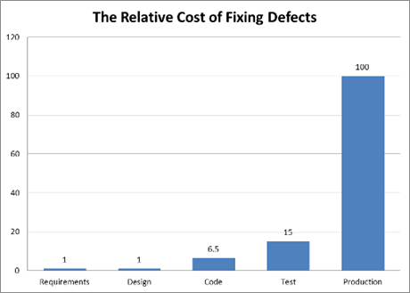
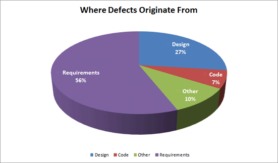

# 1 軟體測試基礎

**關鍵字**

覆蓋率（coverage）， 除錯（debugging）， 缺陷（defect），錯誤（ error），
失效（failure）， 品質（quality）， 品質保證（quality assurance），根本原因（
root cause）， 測試分析（test analysis）， 測試依據（test basis），
測試用例（test case）， 測試完成（test completion），測試條件（ test
condition）， 測試控制（test control）， 測試數據（test data）， 測試設計（test
design）， 測試執行（test execution）， 測試執行進度（test execution
schedule）， 測試實現（test implementation）， 測試監視（test monitoring），
測試對象（test object）， 測試目標（test objective）， 測試準則（test oracle），
測試計劃（test planning）， 測試規程（test procedure）， 測試套件（test
suite）， 測試（testing）， 測試件（testware）， 可追溯性（traceability），
確認（validation）， 驗證（verification）

**軟體測試基礎的學習目標**

**1.1 什麽是測試**

FL-1.1.1 (K1)辨識典型的測試目標

FL-1.1.2 (K2)區分測試和除錯

**1.2 為什麽需要測試**

FL-1.2.1 (K2)舉例說明為什麽測試是必須的

FL-1.2.2 (K2)描述測試和品質保證的關系，並舉例說明測試如何提高品質

FL-1.2.3 (K2)區分錯誤、缺陷和失效

FL-1.2.4 (K2)區分缺陷的根本原因和它的影響

**1.3 七個測試原則**

FL-1.3.1 (K2)解釋七個測試原則

**1.4 測試過程**

FL-1.4.1 (K2)解釋測試過程的上下文的影響

FL-1.4.2 (K2)描述測試過程中的活動和相關任務

FL-1.4.3 (K2)區分支持測試過程的工作產品

FL-1.4.4 (K2)解釋維護測試依據和測試工作產品之間的可追溯性的價值

**1.5 測試心理學**

FL-1.5.1 (K1)辨識影響測試成功的心理因素

FL-1.5.2 (K2)解釋測試活動和開發活動所需要的思維的不同

## *1.1 什麽是測試*

從商業應用（例如：銀行）到消費類產品（例如：汽車），軟體系統已經成為人們生活的一部分。很多人都經歷過軟體沒有按照預期工作的情況。軟體沒有正常工作會導致各種各樣的問題，例如：金錢、時間或者商譽的損失，更有甚者會導致人員的傷亡。軟體測試是評估軟體並降低軟體在運行過程中發生失效風險的一種方法。

對測試的一個常見誤解是認為測試只包括測試執行，即執行軟體並檢查結果。正如1.4節中所描述的，軟體測試是由多個不同測試活動組成的過程，測試執行（包括結果檢查）只是這些活動中的一個。測試過程還包括很多活動，例如：測試計劃、分析、設計和實現，報告測試進度和結果，以及評估測試對象的品質。

如果測試涉及被測試單元或系統的執行，該測試稱為動態測試。如果測試不涉及被測試單元或系統的執行，這樣的測試稱為靜態測試。因此，測試也包括評審工作產品，例如：需求、用戶故事和源程式碼等。

對測試的另外一個常見誤解是它只關注需求、用戶故事或者其它規格說明的驗證。雖然測試確實涉及檢查系統是否滿足特定的需求，但是測試還涉及確認，即檢查系統是否滿足用戶和其它利益相關者在其運行環境下的要求。

不同生命周期中，測試活動的組織和執行是不同的（見2.1節）。

### 1.1.1 典型的測試目標

軟體測試在過去幾十年裡有了長足的發展。整個歷史可以追溯到計算機起源的時候。根據David和Bill在1988年的文章的總結，軟體測試的歷史可以分為以下幾個時期：

-   1956年前 --
    以除錯為目的：這個時期，測試並沒有被單獨從開發活動中區分開來，和測試相關的活動更多的以除錯的形式出現的；

-   1957年到1978年 --
    以證明為目的：這個時期，測試和除錯已經分開了，測試的主要目的是為了證明軟體是能夠工作的；

-   1979年到1982年 --
    以破壞為目的：這個時期開始的標識是Myer出版的《軟體測試藝術》一書，在書中Myer明確提出發現缺陷是軟體測試的目的；

-   1983年到1987年 --
    以評估為目的：這個時期，測試用於對被測試的軟體或者系統進行評估，進而提供各種有用的信息；

-   1988年以後 --
    以預防為目的：這個時期開始，越來越多的測試活動前移，更多的從需求和設計階段就開展相關的測試活動。

David Gelperin， Bill Hetzel， THE GROWTH OF SOFTWARE TESTING， 1988

從不區分測試和除錯，到通過測試來預防缺陷，軟體測試得到了非常大的發展，期間各種測試技術、工具和思想大量湧現。

從測試目標這個角度來說，了解了上面的軟體測試的歷史後，我們應該可以更好的理解測試目標的多樣性。不同的項目中測試的目標可能是不同的。即使同一個項目中，測試也可以有多個目標。針對任何給定項目，其測試目標可能包括：

-   評估工作產品，例如：需求、用戶故事、設計和程式碼

-   驗證是否已滿足所有描述的需求

-   確認測試對象是否完整，並按照用戶和其它利益相關者的預期工作

-   建立對測試對象品質層級的信心

-   預防缺陷

-   發現失效和缺陷

-   為利益相關者提供足夠的信息幫助他們做出合適的決定，尤其是考慮測試對象的品質層級

-   降低軟體品質低下的風險層級（例如：運行環境中出現了之前未被發現的失效）

-   符合合同、法律或者法規的需求或者標準，和/或驗證測試對象符合這些需求或者標準

測試的目標可以有所不同，這取決於被測單元或系統的上下文、測試層級和軟體開發生命周期模型。例如：

-   單元測試時，一個目標可能是發現盡可能多的失效，以便及早辨識和修覆潛在的缺陷。另一個目標可能是增加單元測試的程式碼覆蓋率。

-   驗收測試時，一個目標可能是確認系統按照預期工作並滿足要求。測試的另一個目標可能是向利益相關者提供在指定時間發布系統的風險信息。

### 1.1.2 測試和除錯

軟體除錯（debug）是軟體實現過程的一部分，與軟體編碼過程同步進行。軟體除錯的目的是保證程式正常運行，排除編碼的語法、語義和邏輯錯誤，保證程式穩定運行，並符合設計要求。軟體除錯的特點包括：

-   軟體除錯主要是程式員自己參與，對程式（設計、編碼）進行修改、排除錯誤，主要是在開發階段；

-   具體的除錯任務沒有辦法提前計劃，具有隨機性，不受時間約束，是開發人員為了程式可運行而進行的，其進度不可度量；

-   除錯的對像只能是程式碼；

-   除錯從未知的條件開始，其結局不可預知；

-   除錯時，開發人員能利用的工具主要是除錯器；

-   除錯必須由了解詳細設計的開發人員完成。 

軟體測試（test）是檢驗程式的手段，在軟體編碼基本完成後進行，分模組測試和整體測試。目的是保證程式的功能符合要求，排除設計錯誤，對程式進行系統全面的檢查，保證程式整體的功能、性能和可靠性等。相對於軟體除錯，軟體測試的特點包括：

-   軟體測試是軟體測試人員和程式員都參與的一項工作，是貫穿整個生命周期的；

-   軟體測試可以計劃，可以預先制定測試用例和過程，工作進度可以度量；

-   測試的對像可以是文檔和程式碼；

-   軟體測試從一個已知的條件開始，有預知的結局；

-   大量的測試的執行和設計可以由工具支持；

-   測試經常是由獨立的測試組完成。

## *1.2 為什麽需要測試*

### **1.2.1 測試對成功的貢獻**

由軟體缺陷所導致的事故在人們的生活中並不少見，網站承受不了大量用戶訪問而奔潰；ATM機由於提款機內部軟體缺陷導致用戶提款操作失敗，但是帳戶上的余額卻被意外的扣除；還有大家非常熟悉的手機，由於手機軟體缺陷導致手機經常死機或者通話中斷的現象比比皆是，不僅影響了用戶的正常使用，而且一定程度上降低了商家的信譽度。可見，日常生活中軟體缺陷無處不在，由它導致的不良後果也在時刻影響著人們的方方面面，因此，軟體測試的重要性不容忽視。

2013年美國聯邦政府的在線保險網站已經成為IT領域出錯的一個典型事件。這次事件已經不單單是一次簡單的停機事件。該故障導致了一系列的硬中斷和軟中斷，最終使該網站的功能幾乎全部喪失。聯邦政府曾嘗試增加更多硬體設施來做彌補，但該網站在十二月初直到奧巴馬管理的“IT團隊”正確定位軟體和解決數據瓶頸時才恢覆其功能。之後，又通過正式成立醫療改革法案以及政治審查，該網站的性能才趨於完備。恢覆之後的網站在一些會導致系統崩潰的關鍵點上加強了防備。

http://server.zdnet.com.cn/server/2014/0103/3007608.shtml，2013年度全球市場十大服務器宕機事件

在IT的整個歷史中，軟體和系統投入運行後，由於存在缺陷，隨後導致故障或無法滿足利害關系方的需要，這種現象很常見。但是，使用適當的測試技術可以減少這種有問題交付的頻率，只要這些技術是在適當的測試技能、適當的測試層級和軟體開發生命周期的適當時間點上應用的。例如：

-   測試人員參與需求評審或用戶故事優化能夠發現這些工作產品中的缺陷。辨識並移除需求中的缺陷能夠降低開發錯誤或者功能出問題的風險。

-   在系統設計時，測試人員與系統設計人員緊密合作，可以提高雙方對設計和如何測試的理解。這種理解的增加可以減少基本設計出現缺陷的風險，並能在早期辨識相關的測試。

-   在開發程式碼時，測試人員與開發人員緊密合作，可以提高各方對程式碼的理解和掌握如何測試程式碼。這種理解的增加可以降低程式碼和測試中出現缺陷的風險。

-   測試人員在發布前驗證和確認軟體能夠發現可能被遺漏的缺陷，並為解決導致失效的缺陷相關的過程（例如：除錯）提供支持。這樣可以提高軟體滿足利益相關者的要求和滿足需求的可能性。

除了上述例子，滿足定義的測試目標（見1.1.1節）有助於整個軟體開發和維護的成功。

### 1.2.2 品質保證和測試

在招聘網站上，我們經常看到招聘測試工程師和品質保證工程師的職位描述幾乎是一樣的。很多公司把測試人員和品質保證人員的職責等同起來。這種稱呼其實是不準確的。軟體測試人員的一項重要任務是提高軟體品質，但不等於說軟體測試人員就是軟體品質保證人員，因為測試只是軟體品質保證工作中的一個環節。軟體品質保證和軟體測試是軟體品質工程的兩個不同層面的工作。

軟體品質保證的重要工作是通過預防、檢查與改進來保證軟體品質。在軟體品質保證的活動中也有一些測試活動，但所關注的是軟體品質的檢查與測量。軟體品質保證的工作是在軟體生命周期中管理以及檢查軟體是否滿足規定的品質和用戶的需求，因此主要著眼於軟體開發活動中的過程、步驟和產物，而不是對軟體進行剖析找出問題或評估。軟體品質保證的另一個工作是幫助建立軟體品質標準、評審的過程和方法以及測試過程的建立。同時跟蹤、審計和評審軟體開發和測試過程中發現的問題，從而幫助改進開發過程和測試過程。品質保證的主要工作內容包括：

-   建立軟體品質保證活動的實體

-   制訂軟體品質保證計劃

-   堅持各階段的評審和審計，跟蹤其結果，並進行合適的處理

-   監控軟體產品的品質

-   收集和分析軟體品質保證活動的數據

-   度量軟體品質保證活動

軟體測試關心的不是過程的活動，而是對過程的產物以及開發出的軟體產品進行剖析。測試人員對軟體產品進行動態測試，以及對過程中的工作產品，比如需求文檔、設計文檔和源程式碼進行靜態測試，以找出問題，從而評估軟體產品品質。測試人員必須假設軟體存在潛在的問題，測試中所作的操作是為了找出更多的問題，而不僅僅是為了驗證每個功能或者需求條目是否正確。對測試中發現的問題的分析、跟蹤與回歸測試也是軟體測試中的重要工作。軟體測試的主要階段包括：

-   測試計劃

-   測試監控

-   測試分析

-   測試設計

-   測試實現

-   測試執行

-   測試結束

通過測試可以發現軟體系統在各方面存在的缺陷，包括功能和非功能需求方面的缺陷。當測試發現很少或者沒有發現缺陷的時候，就會對軟體的品質充滿信心。一個設計正確、合理的測試完成並順利通過，可以降低整個系統存在問題的風險。而對測試過程中發現的缺陷進行修正，則可使軟體系統的品質提高。所以說，軟體測試是提高軟體品質的一個重要手段。

### 1.2.3 錯誤、缺陷和失效

這一節主要是描述ISTQB中涉及到的三個術語，錯誤、缺陷和失效之間的區別。一說起術語，大家可能就頭疼。感覺這個是偏理論，沒什麽用處。剛開始的時候，很多人都有這樣的想法。但是學習多了後發現，在有些時候術語還是有用的。有了術語和它的定義，能夠保證大家在聊一些話題的時候，避免了“雞同鴨講”的情況。例如：“性能測試”，大家可以互相問問看。不同的人理解可能都是不同的。回到這節的主題，我們來看一下這三個術語之間到底有什麽區別。

每個人都會犯錯誤（Error、Mistake），而錯誤會導致在軟體程式碼或者其他一些相關工作產品中引入缺陷（defect、fault或bug）。導致在一個工作產品中引入缺陷的錯誤可以觸發另外一個導致相關工作產品中引入缺陷的錯誤。例如：需求引發的錯誤會導致需求缺陷，進而引起編程錯誤導致程式碼中存在缺陷。

程式碼中的缺陷如果被執行，可能會導致一個失效，但並不是所有情況都是這樣的。例如：有些缺陷需要特定輸入或前提條件才會觸發失效，因此極少甚至從來沒有發生。

很多原因都會導致錯誤的發生，例如：

-   時間壓力

-   人類的易錯性

-   沒有經驗或者技能不足的項目參與者

-   項目參與者之間溝通不暢，包括需求和設計的錯誤溝通

-   程式碼、設計、架構、待解決的問題和/或使用的技術的的覆雜性

-   錯誤理解系統間和系統內的介面，尤其是在系統內和系統間交互頻繁時

-   新的、不熟悉的技術

除了程式碼中的缺陷會導致失效外，環境因素也會導致失效。例如：輻射、電磁場和汙染會導致固件中的缺陷，或者通過改變硬體條件影響軟體的執行。

並非所有非預期的測試結果都是失效。由於測試執行的方式錯誤，或者由於測試數據、測試環境或其他測試件的缺陷，或由於其他原因，也可能會發生誤報（假陽性False
Positives）。反之亦然，也可能會導致漏測（假陰性False
Negatives）。漏測是測試沒有發現它應該發現的缺陷；而誤報是報告的缺陷實際上不是真正的缺陷。

### 1.2.4 缺陷、根本原因和影響

缺陷的根本原因是導致缺陷的那些最早出現的行動或者條件。通過分析缺陷辨識他們的根本原因，可以減少將來出現類似缺陷的可能性。通過關注最重要的根本原因，根本原因分析可以觸發流程改進進而很好的預防未來的缺陷的引入。

對缺陷根本原因的分析是一個刨根問底的過程。很多時候，我們對缺陷的分析可能還是停留在表象，沒有真正獲得最早的引起缺陷的問題。舉個生活中的例子，當某個小學生數學考試分數不高，在進行考後分析的時候，我們經常會發現，很多計算題不是不會做，而是因為”粗心“。看起來”粗心“是一個非常明顯的造成數學計算錯誤的原因。但是”粗心“真的是根本原因嗎？為什麽有的同學”粗心“多，有的”粗心“少？簡單的十以內的加減法為什麽不粗心，而100以內的加減法就粗心多呢？再深究的話，你可能會發現，可能是小朋友題目做的少了，需要更多的練習，準確率自然就可以提升了；當然也可能是，小朋友做的題目超過了他這個年齡能夠接受的難度了。

在我們平時的測試中，針對發現的缺陷，也同樣有一個刨根問底的過程。例如：假設由於一行錯誤程式碼導致錯誤的支付了利息，從而引起客戶的抱怨。由於產品負責人錯誤的理解利息的計算方法，造成了相關的用戶故事描述不清，而這段程式碼就是針對該用戶故事的。如果在利息計算中存在大量的缺陷，而這些缺陷的根本原因都是由於類似的誤解，那麽產品負責人應該通過參加利息計算相關的培訓，從而減少將來產生類似缺陷。

這個例子中，客戶抱怨就是影響。錯誤的利息支付是失效。程式碼中不合適的計算是缺陷，該缺陷來源於模糊不清的用戶故事這個初始的缺陷。這個初始缺陷的根本原因是產品負責人缺乏相關知識，從而導致他在編寫用戶故事時犯了錯誤。根本原因分析的流程在ISTQB-ETM專家級測試管理大綱和ISTQB-EITP專家級改進測試流程大綱進行了討論。

## *1.3 七個測試原則*

在過去的50年裡，有很多關於測試原則的建議，它們為所有的測試提供了通用的指導。

**1. 測試顯示缺陷的存在，而不是顯示不存在缺陷**

當剛開始看到這個原則的時候，第一反應可能是：這個原則不是廢話嘛！測試肯定可以顯示缺陷的存在啊！測試了，發現缺陷了，自然就顯示了缺陷的存在；同時測試當然不可能說明系統不存在缺陷了，缺陷是沒辦法全部消滅的。但是如果看一下這個原則的由來，可能有會有不同的想法。

這個原則最早是由Edsger W. Dijkstra在1969年提出來的（https://en.wikiquote.org/wiki/Edsger_W._Dijkstra）。

他還獲得過圖靈獎。由於離現在的時間太久，我們可能很難理解當時對於測試的看法。但要是告訴你，提出發現缺陷是軟體測試的一個主要目的，是在1979年的話，你可能會有不同的感受。這個原則提出的時候，整個測試領域都還沒有把發現缺陷作為主要目的之一，在20世紀60年代，整個軟體工程對於測試的理解還遠遠沒有現在這麽透徹的情況下，能提出這樣的原則是非常有前瞻性的。

測試能夠顯示缺陷的存在，但是不能證明不存在缺陷。測試降低了軟體中遺留的缺陷未被發現的可能性，但是即使沒有發現缺陷，也不能證明軟體是完全正確的。

Dijkstra (1969) J.N. Buxton and B. Randell， eds， Software Engineering
Techniques， April 1970， p. 16. Report on a conference sponsored by the NATO
Science Committee， Rome， Italy， 27–31 October 1969.

**2. 窮盡測試是不可能的**

現在的各種軟體系統越來越龐大，功能也越來越覆雜，我們非常容易就可以理解到窮盡測試是不可能的。

就以最簡單的一個用戶名和密碼登錄為例吧。很多網站都需要通過用戶名和密碼登錄，如果我們要窮盡測試需要多少個測試用例？

-   用戶名和密碼可以是英文字母、數字、各種符號，英文字母還可以分大小寫，還可能支持中文

-   需要測試字母、數字、符號和中文的各種組合

-   需要針對不同的長度的用戶名和密碼進行組合

-   還要測試各種異常情況，就算密碼只支持8位，那麽9位、10位，甚至65535位，有機會的話這些異常情況是否也應該測試呢

這麽一算，要想窮盡測試，這裡要測試的測試用例用”億“做單位都覺得太渺小了。現實生活中比用戶名和密碼還簡單的測試恐怕不多了。

這個原則非常重要，它不僅告訴我們可能的測試很多，我們沒有辦法窮盡它，還告訴我們根據這個原則測試團隊應該不斷的對測試活動進行改進，以利用現有資源盡可能的進行最有價值的測試。很多軟體測試的思想和技術都是由這個原則引起的：

-   風險分析：相對於測試所有的可能，通過風險分析，讓測試關注在高風險的地方，從而達到投資回報最優

-   各種測試技術：對輸入數據進行等價類的劃分，區分白盒中的不同的覆蓋率（語句覆蓋、分支覆蓋等）

-   各種開發實踐：使用更好的編程規範，例如：盡量減少用戶輸入不可控的字符，而是用選擇框來取代，典型的像輸入日期，相對於讓用戶可以輸入的文字框，下拉列表顯然更好的避免了各種錯誤格式的輸入

**3. 盡早測試以節約時間和成本**

為盡早發現缺陷，應該盡可能早的在軟體開發生命周期的前期開始靜態和動態測試。盡早測試有時稱為前移。在軟體生命周期的早期進行測試有助於減少或者消除高成本的變更（見3.1節）。

很多數據都說明在早期發現並修覆缺陷的成本較低。圖1.3-1就是其中之一。我們不用糾結於產品發布後發現修覆缺陷的成本是否正好是需求階段發現和修覆缺陷的一百倍。但是憑借我們的常識就可以認識到盡早測試對於缺陷發現和修覆成本的降低是非常有意義的。假如在需求評審時發現一個缺陷，可能只需要對文字進行更詳細的補充說明就可以了，甚至一個人一小時的工作量都不要；但是如果需求階段的缺陷，遺留到客戶現場，可能造成用戶的損失、客戶支持費用、開發的返工等，恐怕都不是以人天為單位來計算了。

圖1.3-1 不同階段修覆缺陷的相對成本

Rosenberg， L.， Hyatt，L.， Hammer， T.， Huffman， L. and Wilson， W. (1998)
Testing Metrics for Requirement Quality， presented at the Eleventh
International Software Quality Week， San Francisco， CA.

盡早測試的另外一個原因是，很多缺陷其實都是來自於需求，可能是需求不完整、遺漏等。根據圖1.3-2所示的統計數據，有超過一半的缺陷其實都是來源於需求，真正在程式碼階段引入的缺陷只有7%。所以測試必須盡早開展，從需求階段就應該開始靜態測試。

圖1.3-2 缺陷的來源

Ramachandran， M. (1996) Requirements-Driven Software Test: Process-Oriented
Approach， ACM SIGSOFT Software Engineering Notes， Vol. 21， Issue 4， pp. 66 –
70.

**4. 缺陷集群效應**

二八定律又名80/20定律、帕累托法則（Pareto‘s
principle）也叫巴萊特定律、朱倫法則（Juran's Principle）、關鍵少數法則（Vital
FeRule）、不重要多數法則（Trivial Many
Rule）最省力的法則、不平衡原則等，被廣泛應用於社會學及企業管理學等。是19世紀末20世紀初意大利經濟學家帕累托發現的。他認為，在任何一組東西中，最重要的只占其中一小部分，約20%，其余80%盡管是多數，卻是次要的，因此又稱二八定律。([https://baike.baidu.com/item/二八定律](https://baike.baidu.com/item/%E4%BA%8C%E5%85%AB%E5%AE%9A%E5%BE%8B))

在測試中也存在這樣的二八定律。即80%的缺陷集中在20%的模組中，這就是缺陷集群效應。這裡的80%和20%的概念沒有那麽絕對。但是這種集群效應確實是存在的。我們知道了缺陷的集群效應，可以：

-   事前預測，盡量預防：在產品測試之前，可以根據對開發人員、過程、業務覆雜度等方面進行分析，對可能存在缺陷集群的模組進行預測，一方面可以提前和開發人員一起，爭取盡早發現缺陷，一方面也可以提前針對可能存在缺陷集群的模組安排更多的測試；

-   事中分析，及時調整：事前的預測可能存在一定的偏差，在測試進行過程中，要不斷的對每個模組發現的缺陷進行分析，如果發現了新的缺陷集群，要及時調整測試資源，重點關注這些存在缺陷集群的模組；

-   事後分析，下次改進：整個產品測試完成後，對所有測試過程中發現的缺陷進行分析，對存在缺陷集群的模組，要找到造成缺陷集群的根本原因，從而避免以後的產品出現同樣的問題。

**5. 殺蟲劑悖論**

殺蟲劑悖論是Boris Beizer在他1990年出版的《Software Testing
Techniques》一書中最先提出來的。當農民發現農作物有病蟲害的時候，就需要噴灑殺蟲劑，以消除病蟲害。通常可以殺死絕大部分的害蟲，但是非常不幸的是，總會有少量的蟲子活下來。存活下來的蟲子對該殺蟲劑就產生了抗藥性，如果來年農民還是用同樣的殺蟲劑的話，那麽對害蟲的殺傷力將會大大降低。農民伯伯需要不斷地使用新的殺蟲劑來對付具有抗藥性的害蟲，否則農作物就會被害蟲吃掉。

殺蟲劑悖論對應到軟體測試也是一樣的。害蟲就是測試團隊要找到並消滅的缺陷。但是如果測試團隊一直使用相同的測試用例，那麽顯然隨著測試用例反覆的執行，這些測試用例發現缺陷的效果就會越來越差。當然不僅僅是測試用例存在這樣的問題，測試方法和策略也存在同樣的問題。隨著整個開發團隊的能力的不斷改進，被測試對象中存在的缺陷也會不斷變化，甚至越來越不容易發現。如果反覆執行同樣的測試，最終這些測試將無法發現任何新的缺陷。為了檢測新的缺陷，需要更新測試和測試數據，以及編寫新的測試用例。

上面提到的是測試用例，同樣的，相同的測試人員測試同一個模組（功能），因長時間測試，形成了思維定式，因此也容易產生懈怠，忽視一些缺陷的存在，也容易導致殺蟲劑悖論。解決辦法就是採用交叉測試，不同的測試人員，有不同的測試思路和技巧，容易發現被忽視的缺陷。

**6. 測試依賴於上下文**

有個專門的網站是介紹上下文驅動的測試（<http://context-driven-testing.com/>）。下面是其中提到的上下文驅動測試的七個原則：

1.  任何實踐的價值依賴於它的上下文。The value of any practice depends on its
    context.

2.  上下文中存在好的實踐，但是不存在最佳實踐。There are good practices in
    context， but there are no best practices.

3.  一起工作的人是任何項目上下文中最重要的環節。People， working together， are
    the most important part of any project’s context.

4.  隨著時間的推移，項目往往以不可預測的方式進行。Projects unfold over time in
    ways that are often not predictable.

5.  產品是一種解決方案。如果對應的問題沒有解決，那麽這個產品也就沒有起作用。The
    product is a solution. If the problem isn’t solved， the product doesn’t  work.

6.  好的軟體測試是一個對智力不斷挑戰的過程。Good software testing is a
    challenging intellectual process.

7.  只有在整個項目中綜合應用判斷和技能，我們才能夠在正確的時間做正確的事情以有效的測試我們的產品。Only
    through judgment and skill， exercised cooperatively throughout the entire
    project， are we able to do the right things at the right times to
    effectively test our products.

不同上下文需要進行不同的測試。例如：

-   安全關鍵的工業控制軟體的測試和電子商務移動APP的測試：這兩個測試的上下文不同，導致他們對測試技術的選擇，測試成本的考量等都會不同。工業控制軟體需要選擇更嚴格的測試技術，更好的覆蓋，而移動App可能對盡快上市有更高的要求；

-   敏捷項目中的測試和順序生命周期項目中的測試：順序模型中的測試雖然有不同的層級，但是每個層級通常只運行一次，而敏捷項目中每個層級的測試需要多次運行。其他更多的區別，參見2.1節。

**7. 沒有錯誤的謬論（Absence-of-errors is a fallacy ）**

有些組織期望測試人員能夠運行所有可能的測試並發現所有可能的缺陷，但是原則1和原則2告訴我們這是不可能的。此外，期望僅僅通過發現並修覆大量的缺陷來保證系統的成功是不現實的。例如：完整測試所有描述的需求並修覆所有發現的缺陷，仍然會製造出難以使用的系統，它無法滿足用戶的需要和期望，或比其他競爭類產品更差。

以當年的手機一哥諾基亞為例，曾經如日中天，在功能機的世界裡面無人能敵。但是當智能機出現後，很快諾基亞就迎來來災難性的銷量下滑。這種情況是因為諾基亞的測試人員不努力造成的嗎？顯然不是。網上有很多段子都是用來“調侃”諾基亞的手機品質很高的，怎麽用都不壞，甚至可以當磚頭用。但是就是這樣的品質，在新的時代到來後，沒有及時把握用戶需求的變化，沒有及時感知時代的變遷，結果在智能手機普及的過程中一敗塗地。

為了避免這種情況的發生，一方面測試團隊需要從客戶的角度來考慮產品，要盡可能的保證開發的產品是滿足用戶需求的；另外一方面，在整個產品開發過程中，要盡早並不斷的收集客戶反饋，避免只到整個產品都完成後才和最終用戶溝通的情況。敏捷開發在很大程度上就可以達到這個目的。

## *1.4 測試過程*

為實現既定的測試目標，一些通用的測試活動集合就是測試過程。

### 1.4.1 基於上下文的測試過程

影響組織測試過程的因素包括但不限於：

-   軟體開發生命周期和使用的項目方法

-   考慮的測試層級和測試類型

-   產品和項目風險

-   業務領域

-   運作時的限制，包括但不限於：

    -   預算和資源

    -   時間

    -   覆雜度

    -   合同和法規

    -   要求

-   組織的方針和實踐

-   要求的內部和外部標準測試過程

-   測試活動和任務

-   測試工作產品

-   測試依據和測試工作產品之間的可追蹤性

針對測試依據（包括所有測試層級或類型）定義良好的度量覆蓋率標準是非常有意義的。覆蓋率標準能夠作為關鍵績效指標（KPIs）有效的驅動實現軟體測試目標的活動。例如：針對移動應用，測試依據包括了需求列表和支持的移動設備列表。每個需求作為測試依據的一個元素，每個支持的設備也是測試依據的一個元素。覆蓋率標準可以要求測試依據的每個元素（及元素的笛卡爾乘積）至少有一個測試用例。一旦執行之後，這些測試結果可以告訴利益相關者具體的需求是否滿足，以及在支持的設備上是否發現了失效。

### 1.4.2 測試活動和任務

測試過程包括以下主要的活動組：

-   測試計劃

-   測試監控

-   測試分析

-   測試設計

-   測試實現

-   測試執行

-   測試結束

每組活動都由一系列的活動組成，每個活動組中的活動可以包括多個獨立的任務，這些任務在不同的項目或者發布中各有不同。此外，盡管很多時候這些活動組從邏輯上看是順序的，但是它們也常常是叠代實現的。例如：敏捷開發涉及軟體設計、構建和測試的小叠代，這些小叠代是基於持續的計劃活動基礎上持續發生的。因此，在這種開發方式中，測試活動也是叠代持續發生的。即使在順序開發中，邏輯上順序的活動也會有重疊、合並、並行或者忽略的情況，因此，通常需要在系統和項目的上下文中對這些主要活動進行裁剪。

**1. 測試計劃**

測試計劃涉及定義測試目標和在上下文約束下符合測試目標的方法（例如：指定合適的測試技術和任務，制訂滿足最後期限的測試進度）。測試計劃可以根據監控活動的反饋進行更新。

**2.測試監控**

測試監視包括使用測試計劃中定義的監控指標持續的將實際進度和計劃進度做比較。測試監控涉及采取必要的行動以滿足測試計劃的目標（隨著時間的推移可能會更新）。出口準則的評估可以為測試監控提供支持，出口準則評估在有些生命周期中被稱為“完成的定義”。

例如，作為某測試層級的一部分，測試執行的出口準則評估包括：

-   根據指定的覆蓋率標準檢查測試結果和日志

-   根據測試結果和日志評估單元或系統的品質層級

-   決定是否需要更多的測試（例如：如果原本要求達到一定產品風險覆蓋率的測試無法滿足覆蓋率要求，則需要編寫和執行額外的測試）

在測試進度報告中向利益相關者通報測試進度，包括與計劃的偏差，以及支持作出停止測試決定所需的信息。

**3.測試分析**

測試分析通過分析測試依據辨識可測試的特性並定義相關的測試條件，即測試分析根據可度量的覆蓋率標準確定“測試什麽”。

測試分析包括以下主要活動：

-   根據所考慮的測試層級分析測試依據，例如：

    -   合同附件/技術附件，例如功能需求、非功能需求；驗收測試需要以此為分析依據。

    -   需求規格說明，例如：業務需求、功能需求、系統需求、用戶故事、史詩故事、用例，以及類似的指定想要的功能或者非功能單元或系統行為的工作產品；任何測試層級都需要分析需求規格說明，特別是系統測試。

    -   設計和實現信息，例如：系統或軟體架構圖或文檔、設計規格說明、調用流程、建模圖（例如：UML或實體關系圖）、介面規格說明，以及類似的指定單元或系統結構的工作產品；單元測試、整合測試需要更多的關注設計和實現信息。

    -   單元或系統自身的實現，包括：程式碼、數據庫元數據和查詢，以及介面；單元測試和整合測試要更多關注單元的實現。

-   風險分析報告，其中會考慮單元或系統的功能、非功能和結構等方面

-   評估測試依據和測試條目辨識各種類型的缺陷，例如：

    -   歧義

    -   遺漏

    -   不一致

    -   不準確

    -   矛盾

    -   多余的語句

-   辨識要測試的特性和特性集

-   基於測試依據的分析定義每個特性的測試條件，並進行優先級排序，同時考慮功能、非功能和結構化的特征、其它的商業和技術因素以及風險的層級

-   獲得測試依據中每個元素和相關測試條件之間的雙向可追溯性

測試分析過程中使用黑盒、白盒和基於經驗的測試技術，有助於減少遺漏重要測試條件的可能性，同時也有助於定義更加準確的測試條件。

在有些情況下，測試分析生成的測試條件可以用作測試章程中的測試目標。測試章程是有些基於經驗的測試中典型的工作產品。當這些測試目標可以追溯到測試依據時，就可以度量基於經驗的測試能達到的覆蓋率。

測試分析過程中辨識缺陷是一個重要的潛在收益，尤其是在沒有使用其它評審過程和/或測試過程和評審過程緊密聯系時。測試分析活動不僅驗證需求是否一致、表達是否正確和完整，同時可以確認需求是否正確的反映客戶、用戶和其它利益相關者的需要。例如：像行為驅動開發（BDD）和驗收測試驅動開發（ATDD）這樣的技術，它們在編碼前根據用戶故事和驗收準則生成測試條件和測試用例，同時也驗證、確認和檢測用戶故事和驗收準則中的缺陷（見ISTQB初級敏捷測試大綱）。

**4.測試設計**

測試設計過程中逐步將測試條件生成概要測試用例、概要測試用例集合和其它測試件。因此，測試分析回答“測試什麽”的問題，而測試設計回答“如何測試”的問題。

測試設計包括如下主要活動：

-   設計測試用例和測試用例集並劃分優先級

-   辨識所需的測試數據以支持測試條件和測試用例

-   設計測試環境並辨識任何需要的架構和工具

-   獲得測試依據、測試條件、測試用例和測試規程之間的雙向可追溯性

測試設計過程將測試條件逐步生成測試用例和測試用例集時，通常會使用各種測試技術。

與測試分析一樣，測試設計也可能辨識測試依據中類似的缺陷類型。同樣，測試設計過程中辨識缺陷也是一個重要的潛在收益。

**5.測試實現**

測試實現過程將為測試執行創建和/或完成所需的測試件，包括測試規程中測試用例的順序。因此，測試設計回答“如何測試”的問題，而測試實現回答“運行測試需要的所有東西現在都有了嗎？”的問題。

測試實現包括以下主要活動：

-   開發測試規程並劃分優先級，創建自動化測試腳本

-   根據測試規程和自動化的測試腳本創建測試套件

-   在測試執行進度表中安排測試套件以保證高效的測試執行

-   構建測試環境（包括測試用具、虛擬化服務、模擬器和其它基礎設施），並驗證所需的東西都已正確搭建

-   準備測試數據，並確保它正確的加載到測試環境中

-   驗證和更新測試依據、測試條件、測試用例、測試規程和測試套件之間的雙向可追溯性。

測試設計和實現任務經常整合在一起。

在探索性測試和其它基於經驗的測試中，測試設計和實現可能會發生在測試執行中，並記錄為測試執行的一部分。探索性測試可以基於測試章程（測試分析輸出的一部分），同時探索性的測試在它們設計和實現後立刻執行。

**6.測試執行**

測試執行時，測試套件按照測試執行進度表的安排運行。

測試執行包括以下主要活動：

-   記錄測試條目或測試對象、測試工具和測試件的標識和版本

-   通過手工或者測試執行工具執行測試

-   比較實際結果和期望結果

-   分析異常以找到可能的原因（例如：由於程式碼中的缺陷導致的失效，但也可能是誤報）

-   根據觀察到的失效報告缺陷

-   記錄測試執行的輸出（例如：通過、失敗、被阻塞）

-   作為針對異常采取的行動或者計劃中測試的一部分，重覆相關測試活動（例如：執行改正後的測試、確認測試和/或回歸測試）

-   驗證和更新測試依據、測試條件、測試用例、測試規程和測試結果之間的雙向可追溯性。

**7.測試結束**

測試結束活動從已完成的測試活動中收集數據，從而對各種經驗、測試件和其它相關信息進行固化。測試結束活動發生在項目里程碑點，例如：軟體系統發布時、測試項目完成（或取消）時、敏捷項目叠代完成時（例如：作為回顧會議的一部分）、測試層級完成時，或維護版本完成時。

測試結束包括以下主要活動：

-   檢查所有的缺陷報告是否已關閉，為測試執行結束時未解決的所有缺陷創建變更請求或者產品代辦列表

-   創建用於和利益相關者溝通的測試總結報告

-   最終確定並歸檔測試環境、測試數據、測試基礎設施和其它測試件，以便將來使用

-   將測試件移交給維護團隊、其它項目團隊，和/或其它能夠從中受益的利益相關者

-   從完成的測試活動中分析經驗教訓，並確定在將來的叠代、發布和項目中的變更

-   利用收集的信息改進測試過程的成熟度

### 1.4.3 測試工作產品

創建的測試工作產品屬於測試過程的一部分。就像組織實施測試過程的方式存在顯著差異一樣，測試過程中創建的工作產品、工作產品組織和管理的方式，以及工作產品的名稱也是千差萬別的。本大綱主要遵循上面提到的測試過程以及在本大綱和ISTQB術語表中描述的工作產品。ISO標準（ISO/IEC/IEEE
29119-3）可以作為測試工作產品的指南。

**1.測試計劃工作產品**

測試計劃工作產品通常包括一個或多個測試計劃。測試計劃包括測試依據的信息，而其他測試工作產品通過可追溯性信息與之關聯，以及在測試監控時用到的出口準則（或者完成的定義）。

**2.測試監控工作產品**

測試監控工作產品通常包括各種類型的測試報告，包括測試進度報告（持續或者定期生成）和測試總結報告（在各種完成的里程碑點時生成）。所有測試報告應提供與受眾相關的截至報告日期的測試進度細節，包括獲得測試執行結果後的總結。

測試監控工作產品還應考慮項目管理方面的問題，如任務完成、資源分配和使用以及工作量。

本書第5.3節進一步解釋了測試監控以及在這些活動期間生成的工作產品。

**3.測試分析工作產品**

測試分析工作產品包括定義並排好優先級的測試條件，理想情況下這些測試條件可以雙向追溯到具體測試依據的條目。針對探索性測試，測試分析可能包括創建測試章程。測試分析也可能發現並報告測試依據中存在的缺陷。

**4.測試設計工作產品**

通過測試設計得到測試用例和測試用例組以覆蓋測試分析辨識的測試條件。設計沒有輸入數據和預期結果的概要測試用例，通常是一個好的實踐。通過使用不同的具體數據，概要測試用例可以在多個測試周期中覆用，同時確保測試用例的範圍被充分文檔化。理想情況下，每個測試用例可以雙向追溯到它所覆蓋的測試條件。

測試設計的同時還包括設計和/或辨識必要的測試數據、設計測試環境的以及確定基礎設施和工具，但是文檔化這些結果的詳細程度差別很大。

測試分析過程中辨識的測試條件會在測試設計過程中得到進一步細化。

**5.測試實現工作產品**

測試實現工作產品主要包括：

-   測試規程和測試規程中的執行順序

-   測試套件

-   測試執行進度計劃

理想情況下，一旦測試實現完成，就可以通過測試用例和測試條件，以及測試規程和測試依據中的條目之間的雙向可追溯性，展示測試計劃中制定的覆蓋標準的實現。

在某些情況下，測試實現涉及使用工具創建工作產品或創建工具所使用的工作產品。例如，服務虛擬化和自動化測試腳本。

測試實現也包括測試數據和測試環境的創建和驗證。數據和/或環境驗證結果文檔化的完整性可能有很大差異。

測試數據用於確定測試用例的輸入和預期結果的具體的值。具體的值加上其用法可以將概要測試用例轉變成可執行的詳細測試用例。在測試對象的不同版本執行時，同樣的概要測試用例可以使用不同的測試數據。與詳細測試數據關聯的詳細預期結果，可以通過使用測試準則得到。

探索性測試中，盡管探索性測試（以及對測試依據中特定條目的可追溯性）的文檔化程度可能會有很大差異，但一些測試設計和實現工作產品仍會在測試執行階段生成。

測試分析階段辨識的測試條件，可能會在測試實現階段得到進一步的細化。

**6.測試執行工作產品**

測試執行工作產品主要包括：

-   文檔化每個測試用例或測試規程的狀態（例如：準備運行、通過、失敗、被阻塞、有意跳過等）

-   缺陷報告

-   文檔化測試過程中包含的測試條目、測試對象、測試工具和測試件

理想情況下，一旦測試執行完成，就可以通過與相關測試規程的雙向可追溯性來確定和報告測試依據中的每個條目狀態。例如：我們可以說哪些需求已經通過了所有計劃中的測試，哪些需求存在測試失敗和/或與之相關的缺陷，以及哪些需求還有計劃中的測試等待運行。這些有助於驗證否達到了覆蓋標準，並能夠以利益相關者可以理解的方式匯報測試結果。

**7.測試結束工作產品**

測試結束工作產品包括測試總結報告、後續項目或叠代的改進行動計劃（例如：在項目回顧之後）、變更請求或產品待辦條目，以及最終確定的測試軟體。

1.4.4 測試依據與測試工作產品的可追溯性

如第1.4.3節所述，測試工作產品和它們的名稱差別很大。不管如何變化，為了實施有效的測試監控，在整個測試過程中，必須在測試依據的每個元素和與該元素相關的各種測試工作產品之間建立和保持可追溯性。除了測試覆蓋率的評估，好的可追溯性還能支持：

-   分析變更影響：例如建立了從需求到測試用例的可追溯性後，一旦需求有變化，就能夠知道有哪些測試用例需要更新

-   使測試可審計

-   包含測試依據元素的狀態（例如：通過測試的需求、測試失敗的需求和延遲測試的需求），有助於提高測試進度報告和測試總結報告的易理解性

-   以利益相關者可以理解的方式關聯測試技術

-   根據業務目標，為評估產品品質、過程能力和項目進度提供信息

有些測試管理工具提供了測試工作產品的模板，該模板與本節概述的部分或全部測試工作產品相匹配。有些組織建立自己的管理系統來組織工作產品並提供他們所需要的信息可追溯性。

## *1.5 測試心理學*

在整個軟體生命周期中，有很多不同的活動，也涉及到很多流程和方法。雖然我們對各種活動進行了很詳細的定義，但是具體的執行過程中仍然避不開人的因素。所以測試人員在具體執行的過程中，需要考慮到人的因素，了解一些心理學的知識，對於測試人員理解並解決工作中碰到的一些困難是非常有幫助的。

### 1.5.1 人類心理學與測試

人類心理學中有個概念叫“確認偏差”（confirmation bias）。它指的是當一個人已經存在某種信仰或者假設，他會主動搜索、解釋和回憶那些有利於解釋這個信仰或者假設的信息，而忽略那些不利信息。這是一種認知偏差和歸納推理的系統性錯誤。

（參見https://en.wikipedia.org/wiki/Confirmation_bias）

人類心理學中存在的確認偏差，會使人們難以接受與目前所持信仰相悖的信息。例如：由於開發人員期望他們的程式碼是正確的，所以他們的確認偏差使得他很難接受程式碼是不正確的。這樣一方面開發人員自己測試自己程式碼的時候，經常有盲點；另一方面，當測試人員發現缺陷的時候，開發人員的第一反應就是抵觸。這裡提到開發人員的確認偏差，並不是要批評開發人員。而是希望測試人員能夠更好的面對開發人員的一些反應。其實測試人員自己也存在確認偏差，測試人員無論是制定測試計劃，還是編寫測試用例，或者提交缺陷報告的時候都同樣可能出現確認偏差。這是大部分人的一種正常心理狀態。想要完全避免是很困難的，我們要做的是更好的應對。

測試人員經常會提交各種缺陷，或者帶來很多關於產品品質的壞消息。這些都可能使得測試人員作為壞消息的傳遞者而受到指責。

為了應對工作中可能出現的各種負面影響，測試人員除了專心做事以外，也要註意“做人”方面的鍛煉。測試人員和測試經理需要有良好的人際交往技巧，以便能夠有效地溝通缺陷、失效、測試結果、測試進度和風險，並與同事建立積極的關系。良好的溝通方式包括以下例子：

-   以合作而非爭鬥的方式開始。提醒大家的共同目標是更高品質的系統。

-   強調測試的收益。例如：對作者而言，缺陷信息可以幫助他們改進他們的工作產品和技能。對組織而言，在測試過程中發現並修覆的缺陷將節省時間和金錢，降低產品品質的整體風險。

-   以中立、註重事實的方式傳達測試結果和其他發現，而不是批評引入缺陷的人。編寫客觀和基於事實的缺陷報告和評審意見。

-   設法了解對方的感受以及他們可能對信息作出消極反應的原因。

-   確認對方已理解所說的話，反之亦然。

前面討論了典型的測試目標（見1.1節）。明確定義正確的測試目標集具有重要的心理影響。大多數人傾向於將他們的計劃和行為與團隊、管理層和其他利益相關者設定的目標協調一致。測試人員以最小的個人偏見堅持這些目標也很重要。

### 1.5.2測試人員和開發人員的思維模式

通常認為軟體開發是建設性行為，他們的首要目標是設計和構建；而軟體測試則是破壞性行為，是尋找開發人員在設計和構建過程存在的問題。

“開發人員可以測試他們自己開發的程式麽？”是一個經常被問到的問題。對這個問題沒有一個標準的答案。理想情況當然最好是開發人員自己一個人同時完成開發和測試任務，開發人員首先利用建設性的思維設計並開發一個系統，然後用破壞性的思維來驗證和確認這個系統。不論這樣的人是否廣泛存在，但看前後從建設性思維到破壞性思維的切換，就可以想象要求一個開發人員做到這種程度是非常有挑戰的。這要求開發人員能夠不斷的自我顛覆，在一定程度上可以說這是違背人性的。又有誰願意去尋找自己辛辛苦苦開發出來的系統的錯誤呢？他們更多的寧願證明自己的源程式碼工作如何出色。

開發人員測試的最大弱點在於每個必須測試自己程式的開發人員往往過於樂觀。這樣就蘊含一種危險：由於開發人員對開發程式比測試更有興趣，或者測試進行得非常膚淺而忘記了執行合理的測試用例。

如果開發人員引入了一個基礎的設計錯誤，例如：他們對一個概念的描述有誤解，那麽他們很有可能無法檢測出自己的錯誤。甚至他們都不會想到合適的測試用例去揭示這樣的錯誤。減少這種“對自己錯誤視而不見”問題的一種可能方法是結對工作，即由同事來檢查自己的程式。

當然從另一方面來說，開發人員對自己的測試對象非常了解是它的一個優勢。測試時由於不需要再去了解測試對象，因而節省了時間。管理者必須決定是選擇對自己錯誤視而不見的不利條件，還是選擇節省時間這種優勢。這種決策必須對測試對象的重要程度和相關的失效風險進行綜合考慮。

一個獨立的測試團隊會提高測試的品質和對測試的理解力。測試人員可以毫無偏見的看待測試對象。因為這不是“他們”的產品，而且對於開發人員的可能的假設和誤解對測試人員不再是障礙。為了創建測試用例，測試人員會花費相應的時間成本來了解測試對象，然後測試人員具有比較深厚的測試知識基礎，這是開發人員一般不具備或者當需要時不得不臨時補充的知識。更多關於測試獨立性的內容，參加5.1.1節。

就像1.3節中提到的一個關於測試依賴於上下文的原則一樣，很多時候並不是一個非黑即白的問題。開發人員自測有自己的優勢，也存在一定的局限。所以最終開發人員和測試人員合作是一個非常好的解決方案。當然測試任務的這個平衡點是偏向開發人員一些還是偏向測試人員多一些，顯然要根據各個不同的項目場景來決定。
