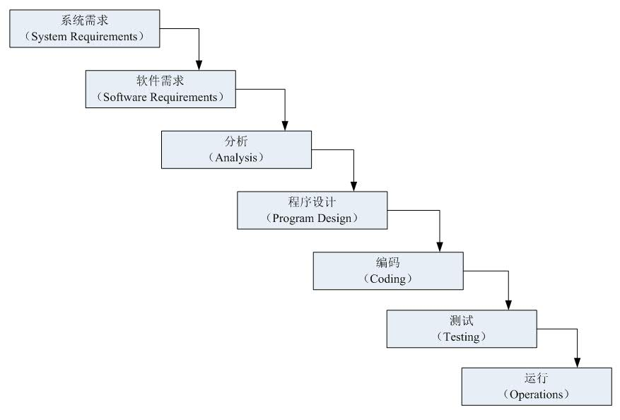
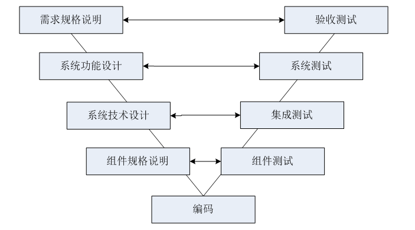
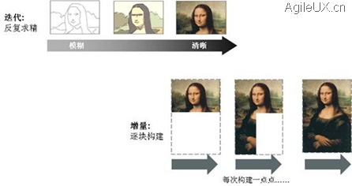
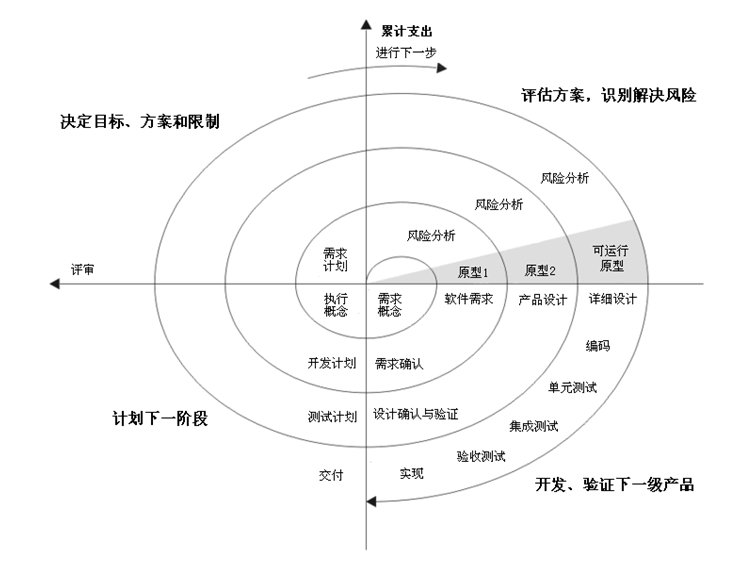
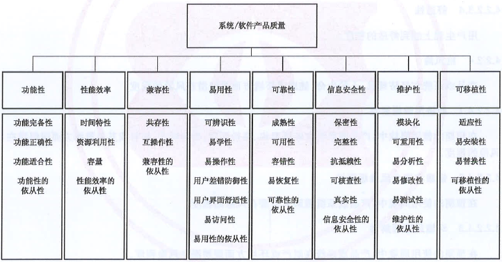
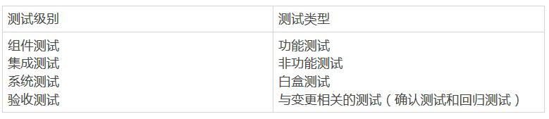

# 2. 貫穿軟體開發生命周期的測試

**關鍵字**

驗收測試(acceptance testing)， alpha測試 (alpha testing)， beta 測試(beta
testing)， 商業現貨軟體(commercial off-the-shelf (COTS))，
單元整合測試(component integration testing)， 單元測試(component testing)，
確認測試(confirmation testing)， 合同驗收測試(contractual acceptance testing)，
功能測試(functional testing)， 影響分析(impact analysis)， 整合測試(integration
testing)， 維護測試(maintenance testing)， 非功能測試(non-functional testing)，
運行驗收測試(operational acceptance testing)， 回歸測試(regression testing)，
法規驗收測試(regulatory acceptance testing)， 順序開發模型(sequential
development model)， 系統整合測試(system integration testing)， 系統測試(system
testing)， 測試依據(test basis)， 測試用例(test case)， 測試環境(test
environment)， 測試層級(test level)， 測試對象(test object)， 測試目標(test
objective)， 測試類型(test type)， 用戶驗收測試(user acceptance testing)，
白盒測試(white-box testing)

**貫穿軟體開發生命周期的測試的學習目標**

**2.1 軟體開發生命周期模型**

FL-2.1.1 (K2)解釋軟體開發活動與軟體開發生命周期中測試活動之間的關系

FL-2.1.2 (K1)辨識軟體開發生命周期模型必須適應項目和產品特點的原因

**2.2 測試層級**

FL-2.2.1 (K2)
從目標、測試依據、測試對象、典型缺陷和失效、方法和職責的角度比較不同的測試層級

**2.3 測試類型**

FL-2.3.1 (K2)比較功能測試、非功能測試和白盒測試

FL-2.3.2 (K1)認識到功能測試、非功能測試和白盒測試可以在任何測試層級進行

FL-2.3.3 (K2)比較確認測試和回歸測試的目的

**2.4 維護測試**

FL-2.4.1 (K2)總結維護測試的觸發因素

FL-2.4.2 (K2)描述維護測試中影響分析的角色

## *2.1 軟體開發生命周期模型*

### 2.1.1 軟體開發和軟體測試

為了能夠進行適當的測試活動，熟悉常見的軟體開發生命周期模型是測試人員職責的重要組成部分。

在任何軟體開發生命周期模型中，好的測試都有以下特點：

-   每個開發活動都有對應的測試活動

-   每個測試層級都有與該層級對應的特有測試目標

-   在相應的開發活動中開始對給定的測試層級進行測試分析和設計

-   測試人員參加討論，以確定和完善需求和設計，並在初稿完成後立即參與評審工作產品(如需求、設計、用戶故事等)

無論選擇哪種軟體開發生命周期模型，測試活動都應該在生命周期的早期階段開始，以遵循測試盡早介入的原則。

這裡將常見的軟體開發生命周期模型分類如下：

-   順序開發模型

-   叠代增量開發模型

順序開發模型將軟體開發過程描述為線性且按照順序的活動次序。這意味著開發過程的任何階段都應在前一階段完成時開始。理論上階段沒有重疊，但在實踐中，從下一階段得到早期反饋是有益的。

#### **2.1.1.1 順序開發模型**

**1.瀑布模型**

瀑布模型最早由Winston W.
Royce在1970年提出，在軟體工程中占有重要的地位，它提供了軟體開發的基本框架。從測試的角度而言，瀑布模型最大的缺點是，測試是軟體開發過程中的一個階段，測試被看做是對軟體產品的最終檢查，類似於製造業中將產品交付給客戶之前的檢查。

圖2.1.1-1顯示了一個傳統的瀑布模型，它將軟體開發生命周期劃分為系統需求(System
Requirment)、軟體需求(Software Requirement)、分析(Analysis)、程式設計(Program
Design)、編碼(Coding)、測試(Testing)和運行(Operations)七個基本階段，並且規定了它們自上而下、相互銜接的固定次序，如同瀑布流水，逐級下落。從本質來說，它是一個軟體開發架構，開發過程是通過一系列階段順序展開的，只有當一個開發階段完成後，下一個開發階段才會開始。 

圖2.1.1-1 瀑布模型

盡管瀑布模型由於存在一些缺點而招致很多的批評，但是它對很多類型的項目而言依然是有效的。如果瀑布模型能夠正確使用，可以節省大量的時間和金錢。是否採用瀑布模型，主要取決於是否能夠充分理解客戶的需求，以及在項目開發過程中這些需求是否經常發生變更。對於需求經常發生變更的項目，採用瀑布模型是不合適的，這時候就需要考慮其他類型的軟體開發生命周期模型。

Royce， W.， Managing the Development of Large Software Systems: Concepts and
Techniques， Proc. IEEE WESCON， 1970

**2.V模型**

與瀑布模型不同，V模型在整個開發過程中整合了測試過程，踐行了盡早測試的原則。此外，V模型還包括與每個相應開發階段對應的測試層級，這進一步支持了盡早測試（關於測試層級的討論見第2.2節）。在此模型中，與每個測試層級相關聯的測試的執行按照順序方式進行，但在某些情況下會發生重疊。

V模型是瀑布模型的變種，它體現的主要思想是：開發任務和測試任務是相互對等的活動且同等重要。V模型的左右兩側組成字母V的兩個邊，形象地體現了這一點。V模型的左側代表軟體開發過程，在軟體開發過程中，系統是逐步設計完善的，編碼是最後一步。V模型的右側描述了整合和測試的過程，通過不斷組合程式單元，形成更大的子系統（整合），並對它們的功能和非功能進行測試。根據這個模型，開發得到的整個系統將以驗收測試作為系統整合和測試活動的結束點。

圖2.1.1-2顯示了由開發活動和測試活動共同組成的一個V模型，V模型主要的開發活動有需求規格說明、系統功能設計、系統技術設計、單元規格說明和編碼，相應的測試層級有單元測試、整合測試、系統測試和驗收測試。在不同資料中，V模型的左邊各個活動可能略有不同，但是其思想都是一致的。其中，構成V模型左側的活動就是人們熟知的瀑布模型中的活動：

-   需求規格說明：從客戶或將來的系統用戶中收集，並對它們進行詳細描述，最終得到批準的要求和需求。需求規格說明定義了開發系統的目的和需要實現的特性和功能。

-   系統功能設計：將需求映射到系統的功能和框圖上。

-   系統技術設計：設計系統的具體實現方式。這個階段包括定義系統環境的介面，同時將整個系統分解成更小且容易理解的子系統（系統架構），從而可以對每個子系統進行獨立的開發。

-   單元規格說明：定義每個子系統的任務、行為、內部結構以及與其他子系統的介面。

-   編碼：通過編程語言實現所有已經定義的單元（例如：模組、單元、類）。

圖2.1.1-2 V模型

在V模型中，隨著整個構建階段的進行，軟體系統的描述越來越詳細。通常來說，在某個構建中引入的錯誤最容易在本構建階段中發現。因而，對於每個構建階段，V模型的右邊定義了相應的測試層級。在每個測試層級，都要檢查開發的輸出是否滿足具體的要求，或者是否滿足這些特定階段相關的要求。

-   單元測試：驗證軟體單元是否按照單元規格說明（詳細設計說明）正確執行，即保證每個最小的單元能夠正常運行。單元測試一般由開發人員來執行，首先設定最小的測試單元，然後通過設計相應的測試用例來驗證各個單元功能的正確性。

-   整合測試：檢查多個單元是否按照系統技術設計描述的方式協同工作。整合測試的主要關注點是系統能夠成功編譯，實現了主要的業務功能，系統各個模組之間數據能夠正常通信等。

-   系統測試：驗證整個系統是否滿足需求規格說明。

-   驗收測試：從用戶的角度檢查系統是否滿足合同中定義的需求或者用戶需求。

ANDREAS SPILLNER，TILO LINZ，HANS SCHAEFER，SOFTWARE TESTING
FOUNDATIONS，人民郵電出版社，2008-4-1

#### 2.1.1.2 增量開發模型

順序開發模型交付的軟體包含了全套的功能，但通常需要幾個月或幾年的時間才能交付給利益相關者和用戶。增量開發涉及到建立需求、設計、構建和測試部分系統，這意味著軟體的特性逐漸增加。這些特性逐步增加的大小各不相同，有些方法增加的大一些，有些方法小一些。增加的特性可以小到對一個用戶介面界面的修改或者一個新的查詢選項。

這裡面首先要說一下“增量”和“叠代”的區別。叠代，就是在實現軟體的每一功能時反覆求精的過程，是提升軟體品質的過程，是從模糊到清晰的過程；而增量，則是強調軟體在發布不同的版本時，每次都多發布一點點，是軟體功能數量漸增地發布的過程。二者的對比如圖2.1.1-3所示。

圖2.1.1-3 增量和叠代的區別

https://blog.csdn.net/l12345678/article/details/5642851

現在大部分軟體開發其實都是既有增量又有叠代。在日常工作中，這兩個概念混用的比較多。

叠代開發發生在多個特性在一系列周期中一起被指定、設計、構建和測試的時候，通常是固定的時間周期。叠代可能涉及到對早期叠代中開發的特性的更改，以及項目範圍的更改。每次叠代都交付工作軟體，這是整個特性集中不斷增長的一個子集，直到最終軟體交付或開發停止。

叠代開發的例子包括：

-   Rational統一過程RUP：每次叠代相對較長（例如：兩到三個月），特性增加相應較大，例如兩組或三組相關特性

-   SCRUM：每次叠代都較短（例如：幾個小時、幾天或幾個星期），相應的特性增加較小，例如一些增強和（或）兩三個新特性

-   看板：實現時使用或不使用固定長度的叠代，這種叠代可以在完成時交付單個增強或特性，也可以將特性組合在一起立即發布

-   螺旋式（或原型）：包括創造實驗性增量，其中一些可能被大量返工，甚至在後續的開發工作中被放棄

[螺旋模型](http://zh.wikipedia.org/wiki/)

由Barry W.Boehm 於1988年提出。螺旋模型是增量叠代開發模型的一種，如圖2.1.1-4所示，它兼顧了快速原型叠代的特征以及瀑布模型的系統化與嚴格監控。螺旋模型最大的特點在於引入了其他模型不具備的風險分析，使軟體在無法排除重大風險時有機會停止，以減小損失。在每個叠代階段構建原型是螺旋模型用以減小風險的途徑。螺旋模型更適合大型的系統級的軟體應用。

圖2.1.1-4 螺旋模型

螺旋模型中一個典型的叠代包括以下步驟：

>   1.   明確本次叠代的目標、備選方案以及應用備選方案的限制；

>   2.   對備選方案進行評估，明確並解決存在的風險，建立原型；

>   3.   當風險得到很好的評估與解決後，應用瀑布模型進行本次叠代的開發與測試；

>   4.   對下一叠代進行計劃與部署；

>   5.   項目利益相關者對本次叠代的交付物進行評審，同時檢查下一階段的計劃。

螺旋模型的優點是它在引入了風險驅動方法的同時，兼顧了原型開發和瀑布模型等開發模型的優點。在一定條件下，螺旋模型能夠演變成其他的開發模型，例如：如果項目獲得錯誤用戶介面或無法滿足性能需求等方面的風險很低，而同時它在控制成本和進度方面的風險很高的情況，螺旋模型將會演化成瀑布模型。除了這個優點以外，螺旋模型還具有以下優點：

-   可以在項目前期考慮對已經存在的軟體進行重用；

-   在軟體產品開發過程中考慮了軟體品質目標；

-   關注於缺陷預防，並能夠盡早的發現缺陷；

-   更好的控制項目活動的資源和相關成本；

螺旋模型在很多領域得到了廣泛的引用，但是螺旋模型也存在一定的不足，包括：

-   過分依賴風險評估，一旦在風險管理過程中出現偏差將造成重大損失；

-   過於靈活的開發過程不適合開發者和客戶之間有明確合同約定的情況；

該模型本身的文檔化和推廣需要大量的工作量。

Barry W.Boehm， A spiral model of software development and enhancement ， ACM
SIGSOFT SOFTWARE ENGINEERING NOTES vol 11 no 4 ，Aug 1988

在整個開發過程中，使用這些方法開發的單元或系統往往涉及到測試層級的重疊和叠代。理想的情況是，每個特性在交付之前，在多個測試層級上進行測試。在某些情況下，團隊使用持續交付或持續部署，這兩者都涉及到作為其交付過程一部分的多個測試層級的大量自動化。許多使用這些方法的開發工作量還包括自組織團隊的概念，它可以改變測試工作的組織方式以及測試人員和開發人員之間的關系。

這些方法形成了一個不斷發展的系統，它可以按照特性、叠代，或者以更傳統的主版本發布方式交付給最終用戶。無論軟體增量是否發布給最終用戶，隨著系統的增強回歸測試變得越來越重要。

與順序模型不同，增量開發模型可以在幾周甚至幾天內交付可用的軟體，但只能在幾個月甚至幾年內交付全套需求產品。

有關敏捷開發背景下的軟體測試的更多信息，請參見ISTQB-AT基礎級敏捷測試擴展大綱。

### 2.1.2 基於上下文的軟體開發生命周期模型

前面的1.3節就提到一個測試原則“測試依賴上下文”。在軟體工程的發展歷史中，出現了很多的軟體開發模型，從剛開始的瀑布模型和V模型等線性模型，到後來的螺旋模型和Scrum等增量叠代模型等。目前有些觀點認為越是最新的開發模型越好，這種想法是錯誤的。不同的模型適合不同的上下文場景。軟體開發生命周期模型必須根據項目和產品的特點選擇和調整。應根據項目目標、正在開發的產品類型、業務重點(如市場要求時間)以及已辨識的產品和項目風險，選擇和調整合適的軟體開發生命周期模型。例如：小型內部管理系統的開發和測試，應與汽車制動控制系統等安全關鍵系統的開發和測試有所不同。另一個例子是，在某些情況下，組織和文化問題可能會阻礙團隊成員之間的交流，從而阻礙叠代開發。

根據項目的背景，可能需要合並或重組測試層級和/或測試活動。例如：為了將現成的商用現貨軟體產品整合到更大的系統中，購買者可以在系統整合測試層級（例如：與基礎設施和其他系統的整合)和驗收測試層級(功能測試和非功能測試，以及用戶驗收測試和操作驗收測試)
上進行互操作性測試。關於測試層級的討論見第2.2節，關於測試類型的討論見第2.3節。

此外，軟體開發生命周期模型本身也可以合並。例如：V模型可用於開發和測試後端系統及其整合，而敏捷開發模型可用於開發和測試前端用戶界面（UI）和功能。在項目早期可以使用原型，在試驗階段完成後採用增量開發模型。

物聯網（IoT）系統由許多不同的對象組成，如設備、產品和服務，通常為每個對象應用單獨的軟體開發生命周期模型。這對物聯網系統版本的開發提出了特殊的挑戰。另外，這些對象的軟體開發生命周期更強調在它們運行使用（例如：運行、更新和退役階段）之後的軟體開發生命周期的後期階段。

## *2.2測試層級*

測試層級是一組共同組織和管理的測試活動。每個測試層級都是測試過程的實例，由1.4節所述的活動組成，在特定軟體開發層級上開展，從單元或單元到完整的系統，或在特定情況下的綜合系統。測試層級按ISTQB大綱規定有：單元測試、整合測試、系統測試、驗收測試，這與V模型（如圖2.1.1-2所示）正好一致。

對於每個測試層級，都需要明確：測試的總體目標、測試的依據、測試的對象（即測試什麽）、發現的典型缺陷和失效、測試工具的支持（測試工具介紹見第六章）、專門的方法和職責等。

### 2.2.1 單元測試

單元測試，也就是我們常說的單元測試。首要得搞清楚單元的含義，根據項目和編程語言的不同，單元可能代表的內容也不同，可能是單元、類、函數、程式碼塊、數據結構等。更加清晰的說，單元可以理解成：實現獨立的、可測試的特定功能，其粒度根據應用的上下文可大可小，邊界也是隨著測試設計的深入可以調節。

單元測試的典型測試對象包括：

-   單元、單元或模組

-   程式碼和數據結構

-   類

-   數據模組

單元測試，最好是將單元隔離出來獨立測試，主要關注單元內部的行為，單元之間的介面在這一測試層級不受關注（整合測試考慮的範疇），在測試中，經常會使用到樁、驅動器和模擬器等，這些都不是軟體產品的組成部分，而且也是需要一定的開發費用；

單元測試的目標包括：

-   減少風險

-   驗證單元的功能和非功能行為是否符合設計和規定

-   建立對單元品質的信心

-   發現單元的缺陷

-   防止缺陷遺漏到更高的測試層級

單元測試依據主要是詳細設計，也可依據開發編寫的程式碼、數據模型或者單元規格說明。單元測試的主要關注點也是經常出現錯誤的點：

-   單元的介面參數：這是單元測試的基礎，只有數據能正確流入、流出單元，其他的測試才有意義，而且這也是實際測試中最容易忽略漏測的地方；

-   局部數據結構：例如，不正確或不一致的數據類型聲明、未賦值或初始化的變量、變量名拼寫錯誤或不符合編碼規範等；

-   獨立路徑：應對路徑進行覆蓋測試，例如，保證單元中每條語句至少執行一次，發現誤解或者用錯了算符優先級、混合類型運算等；

-   控制流相關：例如，不同數據類型對象間的比較、死循環等；

-   出錯處理：例如，出錯描述難以理解、異常處理不當或者沒有處理、顯示的異常與實際場景不符合等；

通常情況下，單元測試由開發人員執行，發現的缺陷也可以立即得到修覆，不需要正式的缺陷管理。但測試至少需要深入到被測程式碼中。開發人員可以將單元開發與發現和修覆缺陷交替進行。開發人員通常會在編寫了單元程式碼之後編寫和執行測試。然而，特別是在敏捷開發中，編寫自動化單元測試用例可能先於編寫應用程式程式碼。例如：考慮測試驅動開發（TDD）。測試驅動開發是高度叠代的，基於開發自動化測試用例，構建和整合小段程式碼，然後執行單元測試，再糾正任何問題並重構程式碼的循環。該過程一直持續到單元完全構建完成並且所有單元測試都通過為止。測試驅動開發是一個測試優先方法的例子。雖然測試驅動開發起源於極限編程（XP），但它已經推廣到了其他形式的敏捷以及順序生命周期（見ISTQB
-AT基礎級敏捷測試擴展教學大綱）。

### 2.2.2 整合測試

整合測試是對單元之間的介面進行測試，以及測試一個系統內不同部分的相互作用，比如操作系統、文件系統、硬體系統之間的介面。

本文描述的整合測試有兩個不同的層次，可以在不同規模的測試對象上進行，具體如下：

-   單元整合測試：通常單元整合測試在單元測試之後進行，也就是說整合測試開展前，單元測試已經完成。如果單元測試未完成或者測試不充分，遺留的問題將會在整合測試階段付出更大的代價，從而導致整合效果不佳。單元整合通常是自動化的。在叠代和增量開發中，單元整合測試通常是持續整合過程的一部分。

-   系統整合測試：對不同系統之間的相互作用進行測試，一般在系統測試之後。在這種情況下，開發組織/團體通常只能控制自己開發的這部分介面，所以變更可能是不穩定的。按照工作流執行的業務操作可能包含一系列系統，因此跨平台的問題對於系統整合測試至關重要。特別是如今的系統架構設計的越來越覆雜，為了業務隔離、容量、效率等考慮劃分的子系統以及對外的第三方系統越來越多，這類跨平台的端到端測試能力對功能測試人員提出來了更高的要求。

整合測試的目標主要揭示被整合部分之間的介面、配合或者衝突問題，驗證端點功能和非功能行為（介面的處理性能、容量等）是否符合設計和規定。

系統化整合的策略可以根據系統結構（例如自頂向下或自底向上）、功能任務集、事務處理順序或系統和單元的其他方面等來制定。為了減少在生命周期後期才發現缺陷而產生的風險，整合程度應逐步增加，而不是一下子將系統整合為“Big-Bang”來進行測試。

### 2.2.3 系統測試

系統測試關注的是在開發項目或程式中定義的一個完整的系統/產品的行為。系統測試的目的是驗證最終軟體系統是否滿足用戶規定的需求。

在系統測試中，測試環境應該盡量和最終的目標或生產環境相一致，從而減少不能發現和環境相關的失效的風險。

系統測試的測試目標：

-   減少風險

-   驗證系統的功能和非功能行為是否符合設計和規定

-   驗證系統是否完整並按預期工作

-   建立對整個系統品質的信心

-   發現缺陷

-   防止缺陷遺漏到更高的測試層級或生產環境

系統測試可能包含基於不同方面的測試：根據風險評估的、根據需求規格說明的、根據業務過程的、基於用例的、或根據其他對系統行為的更高層級描述的、根據與操作系統的相互作用的、根據系統資源的等。

系統測試一般由獨立的測試團隊進行。

### 2.2.4 驗收測試

驗收測試通常是由使用系統的用戶或客戶來進行，同時系統的其他利益相關者也可能參與其中。驗收測試是向未來的用戶表明系統能夠像預定要求那樣工作。

類似系統測試，驗收測試通常側重於整個系統或產品的行為和能力。驗收測試的目標包括：

-   建立對整個系統品質的信心

-   確認系統是否完整並將按預期工作

-   驗證系統的功能和非功能行為符合規定

驗收測試可以用來評估系統對於部署和使用的準備情況，但是驗收測試不一定是最後層級的測試。比如，可能會在某個系統驗收測試之後，進行大規模的系統整合測試

驗收測試可以在多個測試層級上進行，比如：

-   商業現貨軟體產品可以在安裝或整合時進行驗收測試

-   單元的可用性驗收測試可以在單元測試中進行

-   增加新功能的驗收測試可以在系統測試之前進行

驗收測試的內容取決於應用風險（徹底的驗收測試、簡單的驗收測試、互操作驗收等）。

驗收測試類型包括：

-   用戶驗收測試

-   操作驗收測試

-   合同和法規驗收測試

-   Alpha測試和Beta測試

上面提到的這些驗收測試類型看起來有點混亂，其實是從不同的維度分別來看驗收測試而引起的。這些驗收測試在具體的執行中，各有特點，但是他們的主要區別可以從以下方面考慮：

1.  誰來執行驗收測試：如果是用戶，那麽就是用戶驗收測試；如果是系統管理員，那麽就是操作驗收測試。用戶和系統管理員在驗收測試的關注點顯然是不同的。例如：我們作為微信的用戶，我們更關注微信面向終端用戶的功能是否能夠正常使用，是否好用；但是如果你是微信的管理員，那麽你可能就會更關注數據備份恢覆、系統性能、安全性和用戶管理等方面的測試。

2.  驗收測試的依據是什麽：合同和法規驗收測試這種就是從驗收測試依據這個維度來看驗收測試的。顧名思義，這種驗收測試是根據合同和法規來驗收的。

3.  驗收測試在什麽地方執行：Alpha測試和Beta測試最顯著的區別就是執行驗收測試的地點不同。Alpha測試在開發組織所在地點進行的，而Beta測試是潛在的或現有的客戶，和/或操作人員在他們自己所在地點進行。

上述三個維度可以幫助大家理解這幾個驗收測試內容的主要區別，更加具體的內容，可以參考大綱。

## *2.3測試類型*

### 2.3.1 功能測試

系統的功能測試也稱為行為測試，通常根據工作產品，如業務需求規格說明、用戶故事、用例或功能規格說明中對產品特性、操作描述等應執行的功能進行評估的測試。功能測試是為了確保程式以期望的方式運行，通過對系統的所有特性和功能進行測試以確保符合需求和規範。而非功能測試是用來評估系統和軟體的非功能性，是測試系統表現得“多好”。

功能測試既可以使用白盒技術，也可以使用黑盒技術。黑盒技術常用來獲取單元或系統功能的測試條件和測試用例，常見的黑盒測試技術有等價類劃分、邊界值分析、決策表測試、狀態轉換測試、錯誤推測法和綜合策略（詳見4.2節）。與黑盒測試相對應的是白盒測試，與黑盒測試不同的是，白盒測試需要考慮軟體產品的內部結構和處理過程，它是在已知產品的內部工作過程情況下，測試某種內部操作是否按照設計規格說明實現。常見的白盒測試技術有語句覆蓋測試、判定覆蓋測試。

功能測試應該在所有測試層級上執行，盡管每個測試層級的關注點不同。例如：基於單元測試規格說明的單元測試，其測試目標之一就是驗證單元的功能和非功能行為是否符合設計和規定；整合測試的測試目標之一，即驗證介面功能和非功能行為是否符合設計和規定。（詳見2.2節）

功能測試的完整性可以通過功能覆蓋來衡量。功能覆蓋是指某種類型的功能元素在多大程度上已通過測試得到檢查，並以所覆蓋的元素類型的百分比表示。例如：利用測試和功能需求之間的可追溯性，可以計算通過測試覆蓋需求的百分比，從而辨識覆蓋的差距。

功能測試設計和執行會涉及特殊技能或知識，例如對軟體所解決的特定商業問題的了解（例如石油和天然氣工業的地質建模軟體）或軟體所發揮的特定作用（例如提供互動娛樂的電腦遊戲）。

在《GB/T 25000.10-2016 系統與軟體工程
系統與軟體品質要求和評價（SQuaRE）第10部分：系統與軟體品質模型》（對應的國際標準是ISO/IEC
25010:2011， System and software enginerring-Systems and software Quality
Reuirements and Evaluation(SQuaRE)-System and software quality
models）中產品品質模型將系統/軟體產品品質屬性劃分成的8個特性中，功能性屬於功能品質特性。功能性是指在指定條件下使用時，產品或系統提供滿足明確和隱含要求的功能的程度。功能性品質特性包括:功能完備性、功能正確性、功能適合性和功能性的依從性。

1.功能完備性：系統/軟體產品對指定的任務和用戶目標提供一組相應功能的能力以及覆蓋程度。功能的完備性既包括軟體產品提供明確的功能的能力，也包括提供隱含要求的能力。明確的功能能力，如需求規格說明中描述的功能要求，根據功能要求分解所獲得的功能項的完成程度，若某些功能尚存在缺陷，則不能認為其功能已完成；隱含要求的能力，如需求規格說明中未明確說明的隱含需求功能項。

2.功能正確性：系統/軟體產品提供具有所需精度的正確的結果的程度。功能的正確性包括所測試功能的準確性和穩定性，如功能的精度要求、或數值計算的正確性，持續運行某一功能不出現異常、正確完成功能要求的能力。

3.功能適合性：系統/軟體產品為促使指定的任務和目標實現的程度。功能適合性包括測試環境的軟硬體要求、人員要求的適合性，以及所測試功能對輸入錯誤數據的處理能力。

4.功能性的依從性：系統/軟體產品遵循與功能性相關的標準、約定或法規以及類似規定的程度。例如：所測試功能不屬於軟體使用地區的法律法規所禁止的功能。

2.3.2 非功能測試

系統的非功能測試用來評估系統和軟體的非功能特性，是測試系統表現得“多好”，有一定的主觀性。

按照測試原則，越早介入越好，非功能測試也應該盡早介入，盡早完成。

非功能測試可以且經常在所有測試層級上執行。例如：在單元測試階段，單元介面的性能效率及可靠性要盡可能測試；程式碼的安全漏洞掃描、用戶差錯防禦性檢查要盡可能實施。做到性能從程式碼開始，安全從程式碼開始。

黑盒技術可用於獲取非功能測試的測試條件和測試用例。例如邊界值分析法，可以幫助定義壓力條件。

非功能測試的完整性可以通過非功能覆蓋來測量。非功能覆蓋是指某種類型的非功能元素在多大程度上已通過測試得到檢查，並以所涵蓋的元素類型的百分比表示。例如某系統需要測試X（種操作系統）×Y（種瀏覽器）×Z（種分辨率），或者某APP需要測試N（種機型），可以計算通過測試的百分比從而確定潛在的覆蓋差距。

非功能性測試的設計和執行會涉及到特殊技能或知識。例如信息安全性測試，可能會用到SQL註入、安全漏洞、內存溢出等技能或知識。

依據《GB/T 25000.10-2016》（ISO/IEC
25010:2011），品質模型包括使用品質模型及產品品質模型。一般在測試過程中，多採用產品品質模型。CNAS（中國合格評定國家認可委員會，英文名稱為：China
National Accreditation Service for Conformity Assessment
英文縮寫為：CNAS）軟體檢測實驗室也遵循這個標準。

產品品質模型將系統/軟體產品品質屬性劃分為8個特效：功能性、性能效率、兼容性、易用性、可靠性、信息安全性、維護性和可移植性。如圖2.3.2-1：

圖2.3.2-1 品質模型

除了功能性外，其他品質特性都可劃分到非功能品質特性。針對非功能品質特性的測試，可以稱之為非功能測試。大家經常提及的性能測試就是屬於非功能測試。接下來將結合實際工作探討非功能測試所包含的內容。

**1.性能效率**

主要測試某個業務/功能點的處理效率以及對應的消耗。性能效率指標的度量可反映系統和軟體目前達到的效率水平，性能與在指定條件下所使用的資源量有關。

-   時間特性：產品或系統執行其功能時，其響應時間、處理時間及吞吐率滿足需求的程度。

-   資源利用性：產品或系統執行其功能時，所使用資源（可包括其他軟體產品、系統的軟體和硬體配置、以及原材料）數量和類型滿足需求的程度。

-   容量：產品或系統參數（參數可包括存儲數據項數量、並發用戶數、通信帶寬、交易吞吐量和數據庫模式）的最大限量滿足需求的程度。容量特性主要反映系統能夠承受的最大並發用戶數、最大的請求極限以及系統可能存在的最大事務吞吐量、最大數據容量和數據處理容量。在何種極端的情況下，測試系統出現緩沖區溢出、訪問超時等問題。

**2.兼容性**

驗證在共享相同的硬體或軟體環境的條件下，產品、系統或單元能夠與其他產品、系統或單元交換信息，和/或執行其所需的功能的程度。

-   共存性：在與其他產品共享通用的環境和資源的條件下，產品能夠有效執行其所需的功能並且不會對其他產品造成負面影響的程度。共存性主要考察軟體產品安裝和運行時與正在運行的軟體之間的共存性約束。

-   互操作性：兩個或多個系統、產品或單元能夠交換信息並使用已交換的信息的程度。例如數據格式的可交換性：軟體互操作性表現為軟體之間共享並交換信息，以便能夠互相協作共同完成一項功能的能力，常見的測試點為導入導出；數據傳輸的交換介面：在與其他軟體進行通信時，對於規定的數據傳輸，交換介面的功能是否能正確實現，常見的測試點為打印。

**3.易用性**

隨著軟體的廣泛應用，越來越多的人在日常工作中大量的依賴於軟體。易用性也越來越受到重視。例如：人體工程學、建模、浸入式體驗等。

-   可辨識性：用戶能夠辨識產品或系統是否適合他們的要求的程度。可辨識性將取決於通過對產品或系統的初步印象和/或任何相關文檔來辨識產品或系統功能的能力。產品或系統提供的信息可包括演示、教程、文檔或網站的主頁信息。常見的測試點如Logo，布局色系等。

-   易學性：在指定的使用周境中，產品或系統在有效性、效率、抗風險和滿意度特性方面為了學習使用該產品或系統這一指定的目標可為指定用戶使用的程度。易學性既可以被當作在指定使用周境中產品或系統在有效性、效率、抗風險和滿意度特性方面為了學習使用該產品或系統這一指定的目標被指定用戶使用的程度，也可以通過相當於ISO
    9241-110中定義的學習的適宜性的產品屬性來進行指定或測量。常見的測試點如在線幫助等。

-   易操作性：產品或系統具有易於操作和控制的屬性的程度。評估用戶能否操作和控制系統或軟體。產品或系統的提示信息易於理解，便於用戶糾正使用中的錯誤。

-   用戶差錯防禦性：系統預防用戶犯錯的程度。常見的測試點如刪除操作是否有提示。

-   用戶界面舒適性：用戶界面提供令人愉悅和滿意的交互的程度。體驗經濟的支撐。

-   易訪問性：在指定的使用周境中，為了達到指定的目標，產品或系統被具有最廣泛的特征和能力的個體所使用的程度。能力的範圍包括與年齡有關的能力障礙。例如，有些人對特定的顏色無法正確辨識，軟體也需要考慮這樣的用戶。

**4.可靠性**

系統、產品或單元在指定條件下、指定時間內執行指定功能的程度。軍方產品的可靠性要求非常嚴格。

-   成熟性：系統、產品或單元在正常運行時滿足可靠性要求的程度。成熟性這個概念可以被用於其他品質特性中，以表明它們在正常運行時滿足需求的程度。

-   可用性：系統、產品或單元在需要使用時能夠進行操作和訪問的程度。可用性可以通過系統、產品或單元在總時間中處於可用狀態的百分比進行外部評估。

-   容錯性：盡管存在硬體或軟體故障，系統、產品或單元的運行符合預期的程度。在用戶文檔集陳述的限制範圍之內對產品或系統進行操作，不應丟失數據。輸入違反句法條件的信息，產品或系統給出提示信息，並且不能作為許可的輸入加以處理。

-   易恢覆性：在發生中斷或失效時，產品或系統能夠恢覆直接受影響的數據並重建期望的系統狀態的程度。

**5.信息安全性**

隨著網絡安全的重要性越來越大，信息安全性被單獨列為一個品質特性，在ISO
25010之前的ISO
9126中，“安全保密性”作為功能性的一個子特性。驗證產品或系統保護信息和數據的程度，以使用戶、系統產品或系統具有與其授權類型和授權基本一致的數據訪問度。

-   保密性：產品或系統確保數據只有在被授權時才能被訪問的程度。

-   完整性：系統、產品或單元防止未授權訪問、篡改計算機程式或數據的程度。

-   抗抵賴性：活動或事件發生後可以被證實且不可被否認的程度。

-   可核查性：實體的活動可以被唯一地追溯到該實體的程度。

-   真實性：對象或資源的身份標識能夠被證實符合其聲明的程度。

**6.維護性：**

產品或系統能夠被預期的維護人員修改的有效性和效率的程度。

-   模組化：由多個獨立單元組成的系統或計算機程式，其中一個單元的變更對其他單元的影響最小的程度。

-   可重用性：資產能夠被用於多個系統，或其他資產建設的程度。

-   易分析性：可以評估預期變更（變更產品或系統的一個或多個部分）對產品或系統的影響、診斷產品的缺陷或失效原因、辨識待修改部分的有效性和效率的程度。

-   易修改性：產品或系統可以被有效地、有效率地修改，且不會引入缺陷或降低現有產品品質的程度。

-   易測試性：能夠為系統、產品或單元建立測試準則，並通過測試執行來確定測試準則是否被滿足的有效性和效率的程度。

**7.可移植性**

系統、產品或單元能夠從一種硬體、軟體、或者其他運行（或使用）環境遷移到另一種環境的有效性和效率的程度。

-   適應性：產品或系統能夠有效地、有效率地適應不同的或演變的硬體、軟體、或者其他運行（或使用）環境的程度。適用性包括內部能力（例如屏幕域、表、實物量和報告格式等）的可伸縮性。

-   易安裝性：在指定環境中，產品或系統能夠成功地安裝和/或卸載的有效性和效率的程度。如果系統或產品能被最終用戶所安裝，那麽易安裝性會影響到所產生的功能合適性和易操作性。

-   易替換性：在相同的環境中，產品能夠替換另一個相同用途的指定軟體產品的程度。軟體產品的新版本的易替換性在升級時對於用戶來說是重要的。易替換性可包括易安裝性和適應性的屬性。

### 2.3.3 白盒測試

白盒測試也稱結構測試，除此之外有時也被稱為透明盒測試、邏輯驅動測試或基於程式碼的測試。當然稱為基於程式碼的測試其實不夠準確，因為內部結構包括系統內的程式碼、架構、工作流和/或數據流(見4.3節)。白盒測試不僅基於程式碼，也可以基於架構或者工作流等。白盒測試按照程式內部的結構測試程式，通過測試來檢測產品內部動作是否按照設計規格說明書的規定正常進行，檢驗程式中的每條通路是否都能按預定要求正確工作。

軟體的白盒測試是基於過程細節的封閉檢查。通過提供檢查特定條件集合（或）循環的測試用例，測試貫穿軟體的邏輯路徑和構建間的協作。

白盒測試用例設計方法，利用作為構件層設計的一部分而描述的控制結構來生成測試用例。利用白盒測試方法，軟體工程師設計的測試用例可以：

-   保證一個模組中的所有獨立路徑至少被執行一次

-   對所有的邏輯值均需測試真（true）和假（false）

-   在上下邊界及可操作的範圍內執行所有的循環

-   檢驗內部數據結構以確保有效性

（from：軟體工程實踐者的研究方法 原書第6版）

### 2.3.4 與變更相關的測試

軟體在整個生命周期中不是一氣呵成的，期間會不斷的有各種變更。這裡的變更可能是為了修覆缺陷，也可能是功能的新增或加強。這些變更都會觸發相應的測試。和變更相關的測試主要有下面兩種：

-   確認測試：又稱為再測試，缺陷修覆後，所有因該缺陷而失敗的測試用例都需要在軟體中進行測試，並在新的軟體版本上重新執行。確認測試通常是在軟體修覆了發現的缺陷後，執行之前沒有通過的測試用例，以確認原來的缺陷已經被成功修覆。但是有些缺陷的修覆涉及到增加新的功能，這時候也可能會需要增加相應的測試用例。

-   回歸測試：程式碼中某個部分的變更，無論是修覆還是其他類型的變更，都有可能影響到程式碼其他部分的行為，不管是在同一個單元中，在同一系統的其他單元中，還是在其他系統中。變更包括環境的變化，例如操作系統或數據庫管理系統的新版本。這種意外的影響叫做回歸。回歸測試包括運行測試以檢測這種意外的影響。

確認測試和回歸測試都屬於和變更相關的測試。確認測試和回歸測試可以在所有測試層級開展。但是兩者的目的是不同的。確實測試的主要目的是驗證之前發現的缺陷被成功修覆；而回歸測試是驗證軟體變更對已有軟體中其他部分是否有影響。

隨著增量叠代開發生命周期的廣泛應用，與變更相關的測試越來越受到重視。新功能、已有特性的更改以及程式碼重構都會導致程式碼頻繁變更，這也需要與變更相關的測試。和變更相關的測試的工作量越來越大。尤其是回歸測試工作量隨著叠代的不斷進行，對測試團隊的挑戰越來越大。隨著叠代的不斷進行，每個叠代新增加的功能g規模可能是類似的，但是由於之前叠代積累的已有功能越來越多，回歸測試的工作量隨著叠代的進行也會越來越大。

回歸測試套件通常需要運行多次，同時還會緩慢增加，因此回歸測試非常適合進行自動化。這些測試的自動化應在項目早期就開始（見第6章）。談到回歸測試，就不可避免的面臨回歸測試用例的選擇。如何選擇合適的回歸測試用例體現了測試團隊對變更影響的理解。完美狀態是，所有上一個叠代中的測試用例都能再重新運行一遍。在個別軟體中，自動化程度很高，利用多個測試環境並行回歸測試，可以實現所有測試用例都運行一遍。但是很多軟體都做不到實際上，一個完整的回歸測試通常非常耗時間，而且成本很高。因而需要尋找一些方法以幫助選擇合適的測試用例，並能最大程度的減少系統存在缺陷的風險。在測試過程中，這通常意味著風險和成本的平衡。決定這種平衡的最好的辦法就是對變更進行詳細的風險分析，盡量確定負面影響可能在哪發生以及造成的影響。回歸測試的範圍可以根據軟體修改引起的風險程度來決定。常用的方法有：

-   只重覆執行測試計劃中的高優先級的測試用例。

-   只針對系統的特定配置開展測試，比如針對英文版產品的測試或者針對一個操作系統版本的測試。

-   只針對特定子系統或測試層級的測試。

這些列出的策略通常主要針對系統測試。在更低的測試層級，回歸測試策略可以同樣基於設計或架構文檔（例如，類繼承）的測試層級。

### 2.3.5 測試類型和測試層級

這裡將上面講到的測試層級和測試類型總結如表2.3.5-1所示。

表2.3.5-1 測試層級和測試類型

這裡羅列的所有測試類型都可以在任何測試層級開展。對於這個論述，很多人可能會有疑問。其中疑問比較多的地方有：

-   非功能測試不是在高層級的測試中進行嗎？在實際的測試過程中，很多測試團隊只有在像系統測試和驗收測試中才會進行非功能測試，在前面的單元測試中只會進行功能測試。這並不是一個好的實踐。我們都知道應該盡可能早的去發現缺陷，我們有什麽理由讓非功能相關的缺陷留到系統測試才發現呢？為什麽不盡早在單元測試就開始進行非功能測試呢？成熟測試團隊通常在需求階段就關注非功能測試，而不是等到系統測試才開始非功能測試。否則就會出現在系統測試發現一些非功能的缺陷，例如：性能無法滿足需求，但是受到系統設計和程式碼實現的限制，後期再修改的成本太高而不得不放棄。

-   白盒測試不是只用於單元測試嗎？在系統測試中也可以用嗎？如果我們看白盒測試的另外一個叫法，可能更容易理解。白盒測試也稱為基於結構的測試。那麽什麽算是結構呢？程式碼當然算是一種結構，函數調用關系也算結構，系統測試中界面中菜單的導航也是一種結構。這裡的白盒測試不僅僅針對程式碼，所有的結構都可以使用白盒測試，所以說白盒測試可以用於所有測試層級。

通過對上面兩個經常出現的疑問的分析，我們應該可以更容易的理解測試層級和測試類型。他們是從兩個不同的維度來劃分測試活動，所以才會出現說這些測試類型都可以在任何測試層級上開展這樣的說法。

下面以銀行應用程式為例，描述功能測試、非功能測試、白盒測試和與變更相關測試在所有測試層級中的應用。首先從功能測試開始：

-   對於單元測試，測試的設計是基於單元是如何計算利息的。

-   對於單元整合測試，測試的設計是基於用戶界面捕獲的帳戶信息如何傳遞到業務邏輯中。

-   對於系統測試，測試的設計是基於賬戶持有人如何在其支票賬戶上申請信貸額度。

-   對於系統整合測試，測試的設計是基於系統如何使用外部微服務來檢查賬戶持有人的信用評分。

-   對於驗收測試，測試的設計是基於銀行如何處理批準或拒絕信貸申請。

以下是非功能測試的例子：

-   對於單元測試，性能測試的設計旨在評估執行覆雜的總利息計算所需的CPU周期的數量。

-   對於單元整合測試，安全測試的設計是針對從用戶界面傳遞到業務邏輯的數據所產生的緩沖區溢出漏洞。

-   對於系統測試，移植性測試的設計旨在檢查表示層是否適用於所有支持的瀏覽器和移動設備。

-   對於系統整合測試，可靠性測試的設計用來評估在信用評分微服務沒有響應時系統的健壯性。

-   對於驗收測試，易用性測試的設計旨在評估銀行信貸處理界面對殘疾人的無障礙性。

以下是白盒測試的例子：

-   對於單元測試，測試的設計是為所有進行財務計算的單元實現完整的語句和判定覆蓋（見第4.3節）。

-   對於單元整合測試，測試的設計是為了檢查瀏覽器介面中的每個屏幕如何將數據傳遞到下一個屏幕和業務邏輯。

-   對於系統測試，測試的設計是為了覆蓋信用額度應用中出現的網頁序列。

-   對於系統整合測試，測試的設計是為了檢查所有可能的查詢類型發送到信用評分微服務。

-   對於驗收測試，測試的設計是為了覆蓋銀行對銀行轉賬所支持的所有財務數據文件結構和價值範圍。

最後，以下是與變更相關的測試的例子：

-   對於單元測試，為每個單元構建自動回歸測試，並將其納入持續整合框架。

-   對於單元整合測試，測試的設計是為了確認與介面相關的缺陷已得到修覆，當修覆已整合到程式碼庫時。

-   對於系統測試，假如工作流上的任何屏幕發生變更，則相關工作流的所有測試都將重新執行。

-   對於系統整合測試，每天重新進行應用程式與信用評分微服務之間交互的測試，並作為該微服務持續部署的一部分。

-   對於驗收測試，在驗收測試中發現的缺陷得到修覆後，所有先前失敗的測試都將重新執行。

雖然本節提供了各個層級的不同測試類型的示例，但對於所有軟體來說，沒有必要讓每個層級包括所有測試類型。但是，必須在每個層級上運行適用的測試類型，特別是特定測試類型發生的最早層級。

## *2.4維護測試*

要想弄明白維護測試首先需要搞清楚它的定義：針對運行系統的更改，或者新的環境對運行系統的影響而進行的測試。這個定義裡面涉及到一個“運行系統”（operational
system)。所謂“運行系統“指的是這個系統已經在用戶或者客戶環境中使用了。那麽相對應的，如果這個系統還只是在開發階段，沒有部署到客戶環境中，那麽就不是”運行系統“。一旦運行系統需要進行變更，或者運行系統的環境發生了變化，那麽就需要進行維護測試。

所以純粹從理論上來判斷一個測試是否屬於維護測試的關鍵是看被測試對象是否已經是運行系統。這裡大家可以看到維護測試是一個新的測試活動維度，是從被測試對象是否是運行系統來區分的。這個維度和我們上面提到的測試類型和測試層級又是不同的。搞清楚他們的觀察點不同後，我們可以很容易的知道：維護測試中可以用到上面提到的所有測試類型和測試層級。

根據維護版本的範圍，維護測試可能需要在多個測試層級上進行各種測試類型的測試。維護測試的範圍取決於：

-   變更的風險程度，例如：軟體的變更區域與其他單元或系統通信的程度

-   已有系統的規模

-   變更的規模

### 2.4.1 維護的觸發

針對一個運行的系統，什麽時候會觸發維護呢？常見的原因分類如下：

-   修改：計劃中的增強改進(例如：基於版本的)、糾正和緊急變更、運行環境的改變(例如：計劃中的操作系統或數據庫升級)、COTS軟體升級以及缺陷和漏洞的補丁；

-   移植：例如從一個平台遷移到另一個平台，這可能需要對新環境和已變更的軟體進行操作測試，或者將來自另一個應用程式的數據遷移到正在維護的系統時進行數據轉換測試；

-   退役，如應用程式到其生命周期結束時，當應用程式或系統退役時，如果需要較長的數據保存時間，則可能需要測試數據遷移或存檔。可能還需要在長時間保存後進行恢覆規程的測試。此外，可能需要進行回歸測試，以確保任何仍在使用的功能依然有效。

對於物聯網系統，維護測試可能是由於在整個系統中引入了全新的或經過修改的東西，如硬體設備和軟體服務。這類系統的維護測試特別強調不同層面的整合測試(例如網絡層面、應用層面和安全方面)，特別是與個人數據有關的方面。

### 2.4.2 維護的影響分析

影響分析針對維護版本的變更進行評估，以確定變更的預期後果以及變更的可能的副作用，並確定系統中將受變更影響的領域。

影響分析會很困難，常見的一些挑戰包括：

-   規格說明（如業務需求、用戶故事、架構）過時或缺失

-   測試用例沒有文檔化或過時

-   沒有維護測試與測試依據之間的雙向可追溯性

-   工具支持薄弱或不存在

-   參與的人員不具備領域和/或系統知識

-   開發過程中對軟體的可維護性關注不夠

為了更好的進行維護的影響分析，可以分別從下面兩個方面來考慮：

-   從對已有的業務方面：這個方面的分析主要是從技術方向，針對變更，一方面對新修改、增加的地方進行全面測試；另一方面是分析這些變更對已有的系統的影響，從而確定需要回歸測試的範圍和深度；

-   從對已經在使用的用戶方面：維護版本發布時，已經有用戶在使用該系統了，那麽就需要測試系統的變更對已經使用該系統的用戶是否造成了不必要的影響。例如，需要對用戶數據進行向前兼容等。