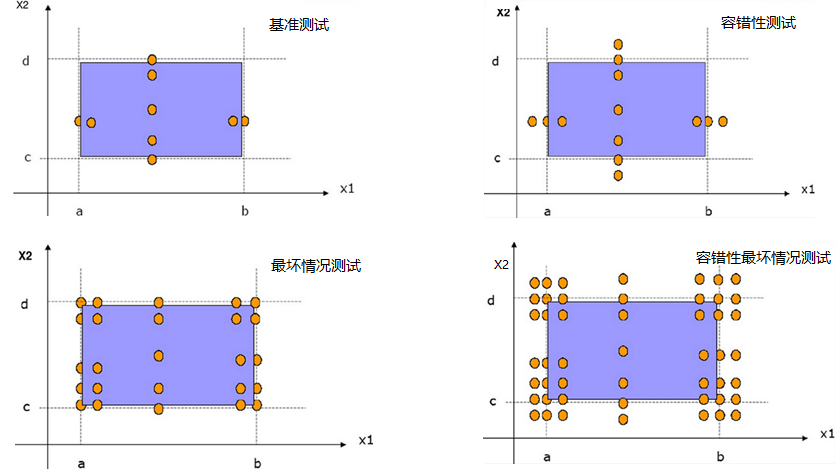
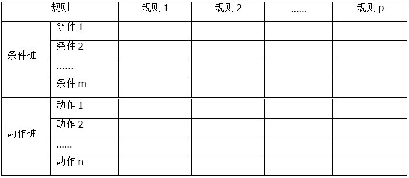
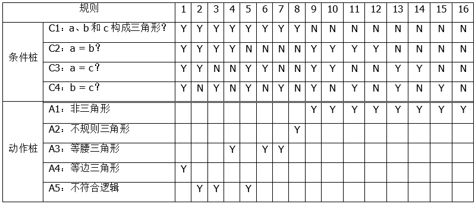
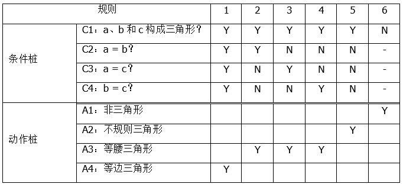
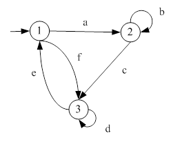
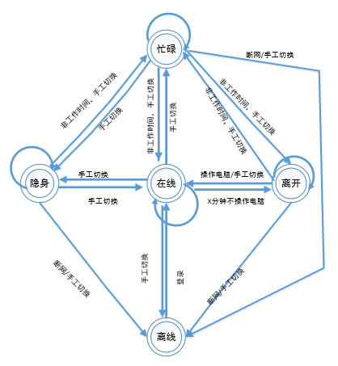
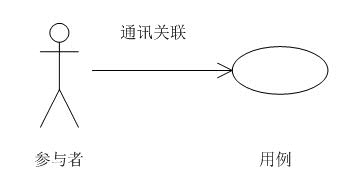
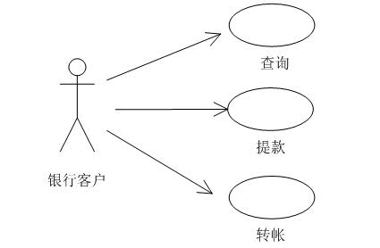
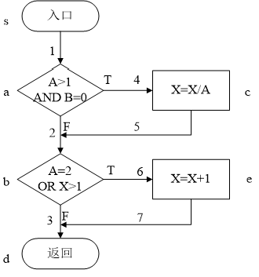
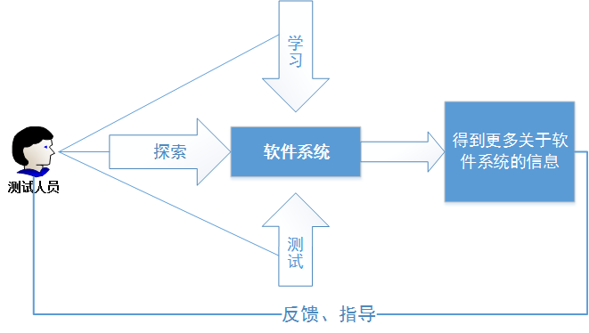

# 4 測試技術

**關鍵詞**

黑盒測試技術(black-box test technique)， 邊界值分析(boundary value analysis)，
基於檢查表的測試(checklist-based testing)， 覆蓋(coverage)， 判定覆蓋(decision
coverage)， 決策表測試(decision table testing)， 錯誤推測(error guessing)，
等價類劃分(equivalence partitioning)， 基於經驗的測試技術(experience-based test
technique)， 探索性測試(exploratory testing)， 狀態轉換測試(state transition
testing)， 語句覆蓋(statement coverage)， 測試技術(test technique)，
用例測試(use case testing)， 白盒測試技術(white box test technique)

**測試技術的學習目標**

**4.1測試技術的分類**

FL-4.1.1
(k2)解釋黑盒測試技術、白盒測試技術和基於經驗的測試技術之間的特征、共同點和區別

**4.2黑盒測試技術**

FL-4.2.1 (k3)應用等價分從給定的需求中導出測試用例

FL-4.2.2 (k3)應用邊值分析從給定的需求中導出測試用例

FL-4.2.3 (k3)應用決策表測試從給定的需求中導出測試用例

FL-4.2.4 (k3)應用狀態轉換測試從給定的需求中導出測試用例

FL-4.2.5 (k2)解釋如何從用例推導出測試用例

**4.3白盒測試技術**

FL-4.3.1 (k2)解釋語句覆蓋

FL-4.3.2 (k2)解釋判定覆蓋

FL-4.3.3 (k2)說明語句覆蓋和判定覆蓋的價值

**4.4基於經驗的測試技術**

FL-4.4.1 (k2)解釋錯誤推測

FL-4.4.2 (k2)解釋探索性測試

FL-4.4.3 (k2)解釋基於檢查表的測試

## *4.1 測試技術分類*

### 4.1.1 測試技術分類和特性

本章主要討論黑盒測試技術、白盒測試技術和基於經驗的測試技術這三類。這三個類別和其中包含的具體測試技術如表4.1.1-1所示。

黑盒測試技術（又稱行為或基於行為的技術）基於對適當的測試依據的分析（例如正式的需求文檔、規格說明、用例、用戶故事或業務流程），所以有些地方也把黑盒測試技術稱為基於規格說明的技術。這些技術既適用於功能測試，也適用於非功能測試。黑盒測試技術關注在測試對象的輸入和輸出上，而不關注其內部結構。

白盒測試技術（又稱結構或基於結構的技術）基於對測試對象的架構、詳細設計、內部結構或程式碼的分析。與黑盒測試技術不同，白盒測試技術關注在測試對象的內部結構和處理。

基於經驗的測試技術利用開發人員、測試人員和用戶的經驗來設計、實現和執行測試。這些技術通常與黑盒和白盒測試技術結合在一起。

表4.1.1-1 測試技術分類

| **測試技術分類**   | **測試技術**                                           |
| ------------------ | ------------------------------------------------------ |
| 黑盒測試技術       | 等價類劃分 邊界值分析 決策表測試 狀態轉換測試 用例測試 |
| 白盒測試技術       | 語句測試 判定測試                                      |
| 基於經驗的測試技術 | 錯誤推測 探索性測試 基於檢查表的測試                   |

黑盒測試技術的共同特點包括：

-   測試條件、測試用例和測試數據來自於以下測試依據：軟體需求、規格說明、用例和用戶故事等

-   測試用例可用來發現需求與需求實現之間的差距，以及與需求之間的偏離情況

-   覆蓋率的度量基於測試依據中被測試的條目和應用於測試依據的技術

白盒測試技術的共同特點包括：

-   測試條件、測試用例和測試數據來自於以下測試依據：程式碼、軟體架構、詳細設計或任何其他有關軟體結構的信息來源

-   覆蓋率的度量基於選定結構（例如程式碼或介面）內被測試的條目

-   規格說明常常被用作額外的信息來源，以確定測試用例的預期結果

基於經驗的測試技術的共同特點包括：

-   測試條件、測試用例和測試數據來自於以下測試依據：測試人員、開發人員、用戶和其他利益相關者的知識和經驗

上面的分析，可以說明黑盒、白盒和基於經驗的測試技術在測試依據的來源上有本質的區別，從而導致它們對應的覆蓋率相關的度量也是不同的。基於經驗的測試技術由於和相關人員的經驗有關，在可度量方面最弱。但是基於經驗的技術可以和其他兩種相結合，在進行基於經驗的測試時，可以靈活的使用黑盒或者白盒技術。

### 4.1.2 選擇測試技術

本章講到的各種測試技術產生的歷史都很悠久，都是非常基礎的測試技術。很多讀者看到這些技術會覺得非常熟悉，理解起來也很簡單。但是在實際應用中，很多人都會發現這些技術都用不上，進而就覺得這些技術沒有用。很多人再學習了一些測試技術後，很快又回到了他們沒有學習之前的狀態。

這些技術有用嗎？答案是肯定的。在實際測試中，這些技術不好用。一方面是因為，很多人還沒有能夠靈活的掌握這些技術，不能做到活學活用；另外也需要認識到，沒有一種技術是可以包治百病的，每種技術都有它適合的場景。

下面是一段關於銀行借記卡轉賬的費用描述：

櫃台、ATM：

跨行轉賬手續費：每筆0.2萬元以下(含0.2萬元)，收費2元;0.2萬—0.5萬元(含0.5萬元)，收費5元;0.5萬—1萬元(含1萬元)，收費10元;1萬—5萬元(含5萬元)，收費15元;5萬元以上，按轉賬匯款金額的0.03%收取，最高收費50元。

網上銀行：

跨行轉賬手續費：每筆0.2萬元以下(含0.2萬元)，收費1元;0.2萬—0.5萬元(含0.5萬元)，收費2.5元;0.5萬—1萬元(含1萬元)，收費5元;1萬—5萬元(含5萬元)，收費7.5元;5萬元以上，按轉賬匯款金額的0.015%收取，最高收費25元。2014年8月1日-2015年6月30日，同城普通跨行轉賬每筆按1元收費。

上面的這段描述的費用說明，並不是特別覆雜。在各種紛繁覆雜的銀行業務中，這個應該是比較容易測試的。拿到這段需求以後，測試人員如何測試用例呢？大家不妨拿出筆來自己親手設計一下。這段簡短的說明，要想測試的比較充分，顯然需要用到後面講到的等價類、邊界值和決策表等方法。

一般應該根據如下各種不同的情況來具體選擇不同的技術：

-   測試對象類型：不同的程式，它們的覆雜度也截然不同。應該根據測試對象選擇合適的測試技術。比如，程式中的判定是由多個原子條件組合而成的，那麽分支覆蓋測試是不充分的，應該選擇合適的測試技術來檢查程式中的條件，例如條件組合覆蓋。具體選擇哪種技術依賴於失效情況下的風險。

-   文檔和工具的可用性：如果有詳細的規格說明或者模型信息，這些就可以直接作為測試設計的輸入，從而得到具體的測試用例。這樣就可以極大地減少測試設計的工作量。

-   符合標準的要求
    ：行業標準和法律法規會要求使用特定的測試技術和覆蓋準則，特別是安全關鍵系統或者高完整性層級的軟體。

-   測試人員的經驗：
    具有不同經驗的測試人員會選擇不同的測試技術。例如，測試人員會傾向使用以前找到過嚴重失效的技術。

-   客戶的期望：客戶可能會要求採用特殊的測試技術和達到一定的測試覆蓋率（當使用白盒測試設計技術的時候）。這是種比較好的做法，因為它一般能降低測試工作量，保證在客戶或驗收測試時，殘留更少的缺陷。

-   風險分析：通過風險分析來指導測試工作，即選擇具體測試技術和確定測試執行的強度。對於高風險的區域應該進行更徹底的測試。

-   其他因素：比如規格說明和其他文檔的可用性，測試人員的知識、技能和個性，時間和預算的限制，測試層級和以前的經驗，如哪些缺陷發生的比較頻繁，通過什麽測試技術發現了這些缺陷等。這些都會很大程度地影響測試技術的選擇。

## *4.2黑盒測試技術*

### 4.2.1 等價類劃分

等價類劃分是把所有可能的輸入數據，即程式的輸入域劃分成若幹部分（子集），然後從每一個子集中選取少數具有代表性的數據作為測試用例。該方法是一種重要的，常用的黑盒測試用例設計方法。

等價類是指某個輸入域的子集合。在該子集合中，各個輸入數據對於揭露程式中的錯誤都是等效的，並合理地假定：測試某等價類的代表值就等效於對這一類中其它值的測試。因此，可以把全部輸入數據合理劃分為若幹等價類，在每一個等價類中取一個數據作為測試的輸入條件，就可以用少量代表性的測試數據取得較好的測試結果。等價類通常包括有效等價類和無效等價類：

-   有效等價類：是指對於程式的規格說明來說是合理的，有意義的輸入數據構成的集合。利用有效等價類可檢驗程式是否實現了規格說明中所規定的功能和非功能特性。

-   無效等價類：與有效等價類的定義恰巧相反，該等價類中包括的是程式認為無效的數據。

設計測試用例時，要同時考慮這兩種等價類。因為軟體不僅要能接收合理的數據，也要能經受意外的考驗。這樣的測試才能確保軟體具有更高的可靠性。

**1.劃分等價類的方法**

下面給出六條確定等價類的原則：

-   在輸入條件規定了取值範圍或值的個數的情況下，則可以確立一個有效等價類和兩個無效等價類。例如：網站上某商品的庫存範圍為1到99，那麽針對商品庫存的有效等價類是1到99，兩個無效等價類分別是小於1和大於99。

-   在輸入條件是一個布爾量的情況下，可確定一個有效等價類和一個無效等價類。
    有效等價類是真和假，其他所有輸入構成了無效等價類。

-   在規定了輸入數據的一組值（假定n個），並且程式要對每一個輸入值分別處理的情況下，可確立n個有效等價類和一個無效等價類。例如：公園門票針對老人、成年人和小孩分別有不同的票價，那麽就可以生成3個有效等價類（老人、成年人和小孩），以及一個無效等價類（不屬於上述三類人）

-   在規定了輸入數據必須遵守的規則的情況下，可確立一個有效等價類（符合規則）和若幹個無效等價類（從不同角度違反規則）。例如：某公司規定服務年限大於五年的女性員工在婦女節那天可以放假一天，那麽有效等價類顯然就是同時滿足服務年限大於5年並且是女性的員工，而無效等價類有兩個，一個是服務年限沒有超過5年，另外一個是女性員工。

在確知已劃分的等價類中各元素在程式處理中的方式不同的情況下，則應再將該等價類進一步的劃分為更小的等價類。

**2.設計測試用例**

在確立了等價類後，可建立等價類表，列出所有劃分出的等價類。初始的表格如表4.2.1-1所示。

>   表4.2.1-1 等價類初始表格

| 輸入條件 | 有效等價類 | 無效等價類 |
| -------- | ---------- | ---------- |
|          |            |            |
|          |            |            |

例如：為了覆蓋所有的有效等價類和無效等價類，可以從劃分出的等價類中按以下三個原則設計測試用例：

①為每一個等價類規定一個唯一的編號。

②設計一個新的測試用例，使其盡可能多地覆蓋尚未被覆蓋地有效等價類，重覆這一步。直到所有的有效等價類都被覆蓋為止.。

③設計一個新的測試用例，使其僅覆蓋一個尚未被覆蓋的無效等價類，重覆這一步。直到所有的無效等價類都被覆蓋為止。

**3.等價類案例**

某商店為購買不同數量商品的顧客報出不同的價格，其報價規則如表4.2.1-2所示。

表4.2.1-2 等價類案例描述

| **購買數量**                | **單價（單位：元）** |
| --------------------------- | -------------------- |
| 前5件（第1件到第5件）       | 20                   |
| 第二個5件（第6件到第10件）  | 18                   |
| 第三個5件（第11件到第15件） | 15                   |
| 超過15件                    | 12                   |

如買8件需要支付5\*20+3\*18=154元，買20件需要支付5\*20+5\*18+5\*15+5\*12=325元。現在該商家開發一個軟體，輸入為商品數C（1≤C≤50），輸出為應付價錢P。採用等價類劃分法為該軟體設計測試用例（不考慮C為非整數的情況）。

表4.2.1-3 利用等價類獲得的輸入數據

| 序號 | 輸入C                              | 輸出P |
| ---- | ---------------------------------- | ----- |
| 1    | 0（任意小於1的數）                 | N/A   |
| 2    | 80（任意大於50的數）               | N/A   |
| 3    | 3（任意大於等於1小於等於5的數）    | 60    |
| 4    | 8（任意大於等於6小於等於10的數）   | 154   |
| 5    | 12（任意大於等於11小於等於15的數） | 220   |
| 6    | 18（任意大於等於16小於等於50的數） | 301   |

等價類劃分法是把程式的輸入域按規則劃分為若幹子集，然後從每個子集中選取一具有代表性的數據作為測試用例。上例規定了C的取值範圍（1
≤C≤50)，按規則可以劃分為一個有效等價類{C\|1 ≤C ≤50}和兩個無效等價類{C\|C\<
1}、{C\|C\>
50}。表中對C取不同值有不同的處理，因此上述有效等價類還可以進一步細分為4個等價類{C\|1
≤C ≤5}、{C\| 6 ≤C ≤10}、{C\|11 ≤C ≤15}、{C\|16 ≤C
≤50}。這樣一共得到6個等價類，包括4個有效等價類{C\|1 ≤C ≤5}、{C\| 6 ≤C
≤10}、{C\|11 ≤C ≤15}、{C\|16 ≤C
≤50}和兩個無效等價類{C\|C\<1}、{C\|C\>50}。設計用例時從這6個等價類中任選一個代表數據即可。

### 4.2.2 邊界值分析

邊界值分析（Boundary Value
Analysis）方法的理論基礎，是假定大多數的錯誤是發生在各種輸入條件的邊界上，如果在邊界附近的取值不會導致程式出錯，那麽其它的取值導致程式錯誤的可能性也很小。

當測試對象的輸入條件明確了一個值的取值範圍，規定了值的個數，或者明確了一個有序集合，我們就可以使用邊界值分析方法。

邊界值是一種非常重要的測試技術，它有如下的特點：

-   價值：邊界值分析技術可以顯著的減少測試用例數量。邊界值上是最容易發現缺陷的地方；邊界值分析技術應該和等價類劃分技術緊密結合使用。

-   局限/困難：精確性取決於等價類劃分的精確性，它的局限和困難與等價類相仿。必須註意有效數據和無效數據的增幅以便於精確地定義測試數據。只有有序的等價類可以做邊界值分析，但這並不妨礙對某個範圍內有效輸入的分析。例如，測試電子表格支持的單元格數量，一個包含可以允許的最大單元格數量（邊界）的等價類，而另一個等價類則從超過這個邊界1
    個單元格（超過邊界）開始 。

-   覆蓋率：等於測試的邊界條件總數除以辨識的邊界條件總數（二值測試法或三值測試法）。這就提供了邊界測試的覆蓋百分率。

邊界值分析總能發現邊界的位移或遺漏，也可能會發現額外的邊界情況。這種技術可用於發現處理邊界值，尤其是小於和大於邏輯錯誤（即位移）的缺陷。它也可以用來尋找非功能性缺陷，例如負載限制的容差（如，系統支持10,000個並發用戶）。

有兩種邊界值分析法：二值測試法、三值測試法。二值測試法，就是在邊界上取兩個值，分別在不同的等價類裡面。例如，如果等價類的值域是1到10，步長是0.5，上界的邊界值為10和10.5，下界的邊界值為1和0.5。三值測試法，就是找到邊界，邊界值加上最小步長，以及邊界值減去最小步長。在上面的例子中，上界為
9.5、10和10.5，下界為：1.5、1 和
0.5。採用二值測試法還是三值測試法取決於被測項的風險大小。風險高的採用三值測試法。

**1.設計原則：**

-   如果輸入條件規定了值的範圍，按照二值法，則應取剛達到這個範圍的邊界的值，以及剛剛超越這個範圍邊界的值作為測試輸入數據。例如：如果軟體的規格說明中規定：“重量在10公斤至50公斤範圍內的郵件，其郵費計算公式為……，重量精確到小數點後2位”。設計基於邊界值的測試用例，如果採用二值法，我們應取10、50，還應取9.99及50.01等。

-   如果輸入條件規定了值的個數，在二值法的情況，則用最大個數,最小個數,比最小個數少1，比最大個數多1的數作為測試數據。例如：一個輸入文件可存儲1\~255個記錄。測試用例可取1和255，還應取0及256等。

-   盡量選擇非常龐大的數據結構、列表和表格等作為邊界值分析的數據。例如：那些能使內存溢出、文件和數據存儲到達邊界的數據，來檢查測試對象在這種極端情形下的行為。

-   對於列表和表格，空列表和滿列表以及列表的第一個元素和最後一個元素都是應該作為分析的對象，因為測試它們常常可以發現由於編程錯誤而導致的失效。

**2.設計步驟**

邊界值分析使用與等價類劃分法相同的劃分，只是邊界值分析假定錯誤更多地存在於劃分的邊界上，因此在等價類的邊界上以及兩側的情況設計測試用例。

-   將軟體的輸入或者輸出參數進行等價類劃分

-   在等價類的基礎之上進行邊界值分析。一般情況下，假如邊界值已經由等價類劃分覆蓋，則可以不予考慮

-   將邊界值進行組合，作為測試用例的輸入數據

**3.漸進健壯**

在利用邊界值分析技術的時候，大部分情況面對的都是兩個或兩個以上的變量。那麽情況比只有單個變量要覆雜。同時，在進行了基本的邊界值分析的基礎上，可以根據情況適當增加更多的測試。圖4.2.2-1展示的是兩個變量X1,X2。它們的有效取值區間分別為[a,b]，[c,d]。除了基準測試之外，還可以進行其他各種更進一步的測試。

圖4.2.2-2 邊界值分析的漸進健壯

**對於有n個輸入變量的程式，基準測試邊界值分析的測試用例個數為4n+1。**

前面講到的邊界值測試分析採用了可靠性理論的單缺陷假設。

-   優點：簡便易行；生成測試數據的成本很低

-   局限性：測試用例不充分；不能發現測試變量之間的依賴關系；不考慮含義和性質；

-   結論：只能作為初步測試用例使用

容錯性/健壯性是指在異常情況下，軟體還能正常運行的能力。健壯性考慮的主要部分是預期輸出，而不是輸入。健壯性測試是邊界值分析的一種簡單擴展。除了變量的5
個邊界分析取值還要考慮略超過最大值（max）和略小於最小值（min）時的情況。健壯性測試的最大價值在於觀察處理異常情況，它是檢測軟體系統容錯性的重要手段。如圖4.2.2-1所示。

**對於有n個輸入變量的程式，健壯性測試的測試用例個數為6n+1。**

**對於有n個輸入變量的程式，最壞情況測試的測試用例個數為5\^n。**

**對於有n個輸入變量的程式，健壯最壞情況測試的測試用例個數為7\^n。**

**4.次邊界**

對系統越了解，你就越能發現系統的邊界；對相關的背景知識越了解，你就能越能發現系統的“次邊界”。次邊界是由具體實現產生的，例如，計算機本身的限制，數據存儲的限制，協議的限制，操作系統的限制等。例如，在32位操作系統中，整形的最大值65536，支持的內存最大4GB；電話線傳輸速率小於光纖傳輸速率等。

### 4.2.3 決策表測試

決策表可以方便的獲取特定的系統需求和記錄測試對象的內部實現，可以用來記錄測試對象的各種覆雜規則，同時它可以有效的指導測試用例的設計。盡管決策表測試對於測試人員而言非常重要，但是許多測試人員並不熟悉這種技術。

決策表是分析和表達多邏輯條件下執行不同操作的表格。決策表能夠將覆雜的問題按照各種可能的情況全部列舉出來，以避免測試需求的遺漏。因此，利用決策表可以設計出比較完整的測試用例集合。決策表測試技術特別適用於下面的使用場景：針對不同的邏輯條件的組合，測試對象需要執行不同的操作。

決策表有四個部分組成，分別是條件樁（Condition Stub）、動作樁（Action
Stub）、條件項（Condition Entry）和動作項（Action
Entry），具體格式如表4.2.3-1所示。決策表四個組成部分的含義如下：

-   條件樁：列出了測試對象的所有條件。一般情況下，列出的條件的次序不會影響測試對象的動作。

-   動作樁：列出了測試對象所有可能執行的操作。一般情況下，這些執行的操作沒有先後順序的約束。

-   條件項：列出針對特定條件的取值，即條件的真假值。

-   動作項：列出在不同條件項的各種取值組合情況下，測試對象應該執行的動作。

UDO W. POOCH,Translation of Decision Tables,Computing Surveys, Vol. 6, No. 2,
June 1974

表4.2.3-1 決策表模板

使用決策表進行測試的步驟為：

（1）列出所有的條件樁和動作樁

（2）填入條件項

（3）填入動作項，制定初始判定表

（4）簡化、合並相似規則或者相同動作

下面通過具體的案例分析，闡述決策表測試的基本概念和步驟。

**三角形類型的判斷**

測試對象從輸入對話框中讀取三個整數值a、b和c，這三個整數值代表了三角形三條邊的長度。測試對象根據輸入的三個整數顯示提示信息，指出這樣的三條邊構成的是不規則三角形、等腰三角形、等邊三角形還是非三角形。要求測試人員針對該場景，應用決策表測試技術設計相應的測試用例。

該三角形的例子生成的決策表如表4.2.3-2所示。

表4.2.3-2 三角形完整決策表

首先我們看規則9到規則16，這8條決策表是可以合並成一條的。就是當C1為N的時候，不管其他條件是什麽，得到的都是A1：非三角形。

這樣決策表經過上面這個8合一的優化後就變成9條規則了。

這個裡面還需要去掉規則2、規則3和規則5這三條不符合邏輯的，因為這三條規則不符合邏輯，無法根據這些規則生成測試用例，所以去處。

這樣經過8合一並去掉三個不符合邏輯的規則後，優化後的決策表就只有6條了。優化後的決策表如表4.2.3-3所示。

表4.2.3-3 三角形優化後的決策表

### 4.2.4 狀態轉換測試

很多情況下，測試對象的輸出和行為方式不僅受當前輸入數據的影響，同時還與測試對象之前的執行情況，或者之前的事件以及之前的輸入數據有關。為了說明測試對象和歷史數據之間關系，引入了狀態圖。狀態圖是進行狀態轉換測試設計的基礎。

狀態轉換測試方法，是一種黑盒測試技術。其應用模式是被測單元擁有多個狀態，各個狀態之間的轉換由事件來觸發，各個狀態之間的轉換還可能導致一些動作的產生。在面向對象系統的測試尤其有用，因為在面向對象系統中，對象可以有不同的狀態，操作對象的方法必須能根據不同的狀態做出相應的反應。同時這種測試技術也常常用於嵌入式軟體行業中。

>   **1、狀態轉換圖的組成**

-   狀態：以圓圈表示，開始和結束是特殊狀態；

-   轉換：由於事件的驅動，系統從一個狀態到另一個狀態；

-   事件：以系統的相關介面觸發，和特定的轉換關聯；

-   活動：活動由狀態轉換觸發；

-   條件：說明狀態轉換只有在滿足這個條件後進行。

>   **2、適用場景**

-   涉及多種狀態，最好是針對一個對象的多個狀態。否則把多個對象的多個狀態都放在一個模型中，容易引起混淆；

-   各種狀態間可以由於某種事件的發生相互轉換；

-   用於測試有定義的狀態和引起狀態轉換的事件（比如變化的屏幕）的軟體。嵌入式軟體，web軟體和任何類型的狀態轉換軟體都是這類測試技術的理想候選對象。控制系統，比如交通信號控制系統，也是這類測試的理想對象；

-   可以用於任一測試層級。

>   **3、覆蓋策略**

狀態轉換測試中的覆蓋率還會涉及到“N-Swtich”的概念（中文通常翻譯成“N-切換”）。狀態轉換測試的覆蓋率可以是1-Switch、2-Switch，可以一直深入取更大的N以達到更好的覆蓋率，當然測試的工作量也會更大。N-Swtich是由TSUN
S.
CHOW在1978年提出的，他將N-Switch定義為程式圖中長度為n+1的連續的邊或弧線（通常在狀態圖中表示循環）的序列。所以單獨的一條邊（或者轉換）就是一個0-Switch，兩條連續的邊的序列就是1-Switch。

下面以圖 4.2.1-1所示的狀態機分別說明0-Switch和1-Switch的概念和區別。

圖 4.2.4-1 狀態機示例圖

如圖4.2.4-1所示的狀態機示例，其中圓圈表示狀態，帶箭頭的邊表示轉換，同時為每個轉換定義了一個英文字母的標識。根據0-Switch的定義，該狀態機對應的所有的0-Switch為：a、b、c、d、e、f。再來看一下1-Switch。根據1-Switch的定義，該狀態機對應的所有1-Switch為：ab、ac、bb、bc、cd、ce、dd、de、ea、ef、fd、fe。

TSUN S. CHOW, Testing Software Design Modeled by Finite-State Machines, Software
Engineering, IEEE Transactions on Volume: SE-4 , Issue: 3, 1978.

使用狀態轉換測試時，可以根據項目情況選擇合適的覆蓋，例如：

-   覆蓋每個狀態和每一個轉換。100％的轉換覆蓋（又稱100％的0-切換覆蓋或100％的邏輯分支覆蓋）將保證訪問了每個狀態和遍歷每個狀態轉換，除非系統設計或狀態轉換模型（圖或表）有缺陷。根據狀態和轉換之間的關系，它可能需要不止一次穿越一些轉換以執行一次其他轉換。

-   “N-切換覆蓋”指覆蓋狀態轉換的數目。比如：100%的1-切換覆蓋要求每個由兩次成功轉換組成的有效序列至少被測試了一次。這樣的測試可以發現100%的0-切換覆蓋遺漏的失效。

-   “往返覆蓋”在轉換序列形成循環的情況下適用。實現100％往返覆蓋意味著從任何狀態出發又回到原來相同狀態的所有循環被測試到。這必須測試循環中包含的所有狀態。

-   嘗試包括所有無效的轉換可以達到一個更高的覆蓋率。覆蓋要求和狀態轉換測試的覆蓋集必須確定是否包括無效的轉換。

如果測試對象有很多狀態和狀態轉換，這就需要更多的測試工作量，在可能的情況下應該尋找對策來簡化測試對象。

>   **4、應用步驟**

>   1）繪制狀態轉換圖

>   2）使用“N-SWITCH”覆蓋方式生成用例

>   3）擴展用例

>   **5、舉例：**QQ通訊工具的狀態切換：在線，忙碌，離開，隱身，離線

>   1）將各狀態之間事件畫出來。完成的狀態轉換圖如圖4.2.4-1所示。

圖4.2.4-1 QQ狀態轉換圖

>   2）列出穿越0個狀態的測試用例（狀態自身的）

>   根據圖4.2.4-1中的狀態轉換圖，可以生成如表4.2.4-1所示的狀態轉換表。

表4.2.4-1 QQ狀態轉換表

| **編號** | **前提** | **事件**                 | **結果** |
| -------- | -------- | ------------------------ | -------- |
| 1        | 忙碌     | 手工切換忙碌             | 忙碌     |
| 2        | 忙碌     | 斷網或手工切換離線       | 離線     |
| 3        | 忙碌     | 非工作時間手工切換離開   | 離開     |
| 4        | 忙碌     | 手工切換在線             | 在線     |
| 5        | 忙碌     | 手工切換隱身             | 隱身     |
| 6        | 隱身     | 非工作時間手工切換忙碌   | 忙碌     |
| 7        | 隱身     | 手工切換在線             | 在線     |
| 8        | 隱身     | 斷網或手工切換離線       | 離線     |
| 9        | 隱身     | 手工切換隱身             | 隱身     |
| 10       | 在線     | 手工切換在線             | 在線     |
| 11       | 在線     | 非工作時間手工切換忙碌   | 忙碌     |
| 12       | 在線     | X分鐘不操作電腦          | 離開     |
| 13       | 在線     | 手工切換離線             | 離線     |
| 14       | 在線     | 手工切換隱身             | 隱身     |
| 15       | 離開     | 手工切換離開             | 離開     |
| 16       | 離開     | 手工切換在線或操作電腦   | 在線     |
| 17       | 離開     | 非工作時間，手工切換忙碌 | 忙碌     |
| 18       | 離開     | 斷網或手工切換           | 離線     |
| 19       | 離線     | 登錄                     | 在線     |

>   3）列出穿越1個狀態的（一個狀態，兩個事件）

這裡的穿越1個狀態指的是從狀態A開始，經過狀態B，到達狀態C。由於這個裡面涉及到了從狀態A到狀態B，又涉及到了從狀態B到狀態C。這樣的情況也可以稱為“1
Switch”（也稱為“1切換”）。（這部分內容在ISTQB高級測試分析師中有更詳細的描述）

表4.2.4-2 QQ狀態1 Switch測試（部分用例）

| **編號** | **前提** | **測試用例描述**                                             | **預期結果** |
| -------- | -------- | ------------------------------------------------------------ | ------------ |
| 1        | 忙碌     | 處於忙碌狀態下，處於非工作時間手工切換離開，到達**離開**狀態，再通過非工作時間手工切換**忙碌** | 忙碌         |
| 2        | 忙碌     | 處於忙碌狀態下，處於非工作時間手工切換離開，到達**離開**狀態，手工切換在線或操作電腦，到**在線**狀態 | 在線         |
| 3        | 忙碌     | 處於忙碌狀態下，處於非工作時間手工切換離開，到達**離開**狀態，斷網或手動切換至離線狀態 | 離線         |
| 4        | 在線     | 處於在線狀態下，X分鐘不操作電腦，到達**離開**狀態，斷網或手動切換至**離線**狀態 | 離線         |
| 5        | 在線     | 處於在線狀態下，X分鐘不操作電腦，到達**離開**狀態，手工切換**在線**或操作電腦 | 在線         |
| 6        | 在線     | 處於在線狀態，X分鐘不操作電腦，到達**離開**狀態，通過非工作時間手工切換**忙碌** | 忙碌         |

>   **6、局限/困難：**

定義狀態表或狀態圖時確定狀態往往是最困難的部分。當軟體有一個用戶界面，為用戶顯示的各種畫面經常被用來定義狀態。嵌入式軟體，狀態可能會依賴於硬體所處的狀態。

>   **7、註意事項**

-   開始寫規格說明的時候，就從測試的角度來評估測試對象的狀態轉換圖

    -   假如測試對象有很多狀態和狀態轉換，表明需要更多的測試工作量，可能的情況下應該尋找對策簡化測試對象

-   檢查規格說明，確保測試對象狀態容易辨識，且這些狀態不是由大量不同變量組合構成的；保證從外部可以比較容易地訪問狀態變量。

-   在測試過程中如能使用設置狀態/重設狀態函數以及讀取狀態值函數等將會給測試帶來很大益處。

-   定義狀態需要考慮的信息

    -   狀態轉換之前的狀態

    -   觸發狀態轉換的觸發事件

    -   在狀態轉換時觸發的期望反應

    -   接下來的期望狀態

>   **8、總結：**

-   狀態是一個抽象的概念

-   狀態是由事件觸發一個轉換

-   前一個狀態或當前條件影響下一個狀態

-   如果一個事件，觸發來自相同狀態的兩個或多個不同的轉換，會有一個守護條件作限制

-   狀態圖中只顯示有效的轉換，會排除無效的轉換

-   測試用例要覆蓋一個典型的狀態序列，包含有效的或無效的

### 4.2.5 用例測試

說到用例測試，那麽首先要了解用例以及基於用例的開發。隨著面向對象軟體開發方法應用的增多，統一建模語言UML的使用越來越頻繁（UML定義了可以在軟體開發過程中使用的10多種圖形符號）。其中用例是UML規範中標準化的需求表述體系，用例方法最早是由Iva
Jackboson博士提出的。

Pan-Wei Ng， Ivar Jacobson，December 2004，Aspect-Oriented Software Development
with Use Cases

用例是描述系統需求的一種方法，使用用例的方法來描述系統需求的過程就是用例建模。用例方法可以解決傳統的需求描述方式（例如：需求規格說明）的一些缺點，例如：傳統的需求規格說明非常容易混淆需求和設計的界限，導致不知道系統需求應該詳細到何種程度；另一個缺點是需求分割了各個系統功能的應用環境，使人很難了解到這些功能是如何相互關聯來實現一個完整的系統服務。

從用戶的角度來看，他們並不想了解系統的內部結構和具體設計，用戶更關心的是系統所能夠提供的服務，也就是被開發出來的系統將是如何使用的，這就是用例方法的核心思想。用例模型主要由以下模型元素組成：

-   參與者（Actor）：存在於被定義系統外部，並與該系統發生交互的人或者其他系統，他們代表的是系統的使用者或者使用環境。

-   用例（Use
    Case）：用於表示系統所提供的服務，它定義了系統是如何被參與者所使用的，它描述的是參與者為了使用系統所提供的某個功能而與系統之間發生的一段“對話”。

-   通訊關聯（Communication
    Association）：用於表示參與者和用例之間的對應關系，它表示參與者使用了系統中的哪些服務（用例），或者說系統所提供的服務（用例）是被哪些參與者所使用。

這三種元素在UML中的表述如圖4.2.5-1所示。

圖4.2.5-1 UML基本元素

以銀行的自動取款機ATM為例，它的主要功能可以由圖4.2.5-2來表示。ATM的主要使用者是銀行客戶，銀行客戶主要使用ATM進行銀行賬號的查詢、提款和轉賬交易等。

圖4.2.5-2 ATM用例圖

用例包括其基本行為的可能變化，同時也可以包括異常行為和錯誤處理（系統對編程、應用和通信錯誤的響應和恢覆，例如：觸發錯誤消息）。測試可以從用例中推導出來。設計的測試是為了驗證已定義的行為（基本的、異常的或替代的，以及錯誤處理）。基於用例的測試在測試典型的用戶系統相互作用方面非常有用。

## *4.3白盒測試技術*

白盒測試技術是根據被測對象的結構系統化設計測試用例的一種方法，關注軟體產品的內部細節和邏輯結構。如程式碼的結構（控制流圖），數據的結構，菜單的結構，模組間相互調用的結構，業務流程的結構等。它把測試對象看作一個打開的盒子，盒子對應的是被測試的程式，測試人員通過全面了解程式內部邏輯結構，設計或選擇測試用例，對所有邏輯路徑進行測試，通過在不同點檢查程式的狀態，確定實際的狀態是否與預期的狀態一致。

（from：軟體測試方法和技術 第3版 朱少民）

4.3.1 語句測試和覆蓋

語句測試使用程式碼中的可執行語句。覆蓋率以測試執行的語句數除以測試對象中可執行語句的總數來衡量，通常以百分比表示。

**1.語句覆蓋**

選擇足夠多的測試數據，使被測程式中每個語句至少執行一次。

在保證每條語句都運行的前提下，測試用例應盡量少。

**2.源程式**

PRCEDURE  EXAMPLE(A，B:REAL; VAR X:REAL);

    READ
    
    BEGIN
    
    IF  (A\>1)  AND  (B=0)
    
          THEN    X:=X/A;
    
    IF  (A=2)   OR  (X\>1)
    
          THEN    X:=X+1;
    
    END;

**3.流程圖**

針對上面的源程式碼可以生成如圖4.3.1-1所示的控制流程圖。

圖4.3.1-1 控制流程圖

**4.語句覆蓋的測試用例**

表4.3.1-1是語句測試的測試用例。執行表中的測試用例，可以達到100%的語句覆蓋。

表4.3.1-1 語句的測試用例

| 測試用例序號 （項目編號-項目版本號-模組號-測試用例編號） | 測試數據      | 說明                 | 覆蓋路徑 |
| -------------------------------------------------------- | ------------- | -------------------- | -------- |
| XX-V1-101-001                                            | A=2，B=0，x=4 | 兩個判定表達式都取真 | sacbed   |

### 4.3.2 判定測試與覆蓋

判定測試使用程式碼中的判定，並測試基於判定結果執行的程式碼。測試用例遵循從判定點出發的控制流(例如：對於IF語句，一個用於真的結果，一個用於假的結果；對於一個CASE語句，所有可能的結果都需要測試用例，包括默認結果）。

覆蓋率通過測試執行的判定結果的數量除以測試對象中判定結果的總數來測量，通常以百分比表示。

**1.判定覆蓋**

不僅每個語句必須至少執行一次，而且每個判定的每種可能的結果都應該至少執行一次，也就是每個判定的每個分支都至少執行一次。

**2.源程式**

PRCEDURE  EXAMPLE(A，B:REAL; VAR X:REAL);

    READ
    
    BEGIN
    
    IF  (A\>1)  AND  (B=0)
    
          THEN    X:=X/A;
    
    IF  (A=2)   OR  (X\>1)
    
          THEN    X:=X+1;
    
    END;

**3.流程圖**

**4.判定覆蓋的測試用例**

表4.3.1-2是判定覆蓋的測試用例。執行表中的測試用例，可以達到100%的判定覆蓋。當然滿足100%判定覆蓋的測試用例集合不是唯一的。

表4.3.1-2 判定覆蓋的測試用例

| 測試用例序號  | 測試數據      | 說明                           | 覆蓋路徑 |
| ------------- | ------------- | ------------------------------ | -------- |
| XX-V1-101-001 | A=3，B=0，X=3 | 第一個判定表達式為真第二個為假 | sacbd    |
| XX-V1-101-002 | A=2，B=1，X=1 | 第一個判定表達式為假第二個為真 | sabed    |

### 4.3.3 語句與判定測試的價值

當實現100%的語句覆蓋時，它確保程式碼中的所有可執行語句至少已測試過一次，但無法保證所有判定邏輯都已測試過。

當達到100%的判定覆蓋率時，便會執行所有的判定結果，包括測試真的結果和假的結果，即使沒有明確的假的語句（例如：沒有ELSE的IF語句）。語句覆蓋有助於發現程式碼中其他測試沒有執行到的缺陷（如：有助於發現不可達程式碼）。判定覆蓋有助於發現程式碼中的缺陷，在這些缺陷中，其他測試沒有同時覆蓋判定為真和假的情況。

達到100%的判定覆蓋可以保證達到100%的語句覆蓋（反之則不然）。

當然除了語句和判定覆蓋之外，還有其他很多覆蓋，在高級大綱中會覆蓋。例如：條件覆蓋。針對判定IF 
(A\>1)  AND 
(B=0)，雖然執行了表4.3.1-2中得測試用例，可以測試到該判定分別取真和假的情況，但是我們是否發現裡面還有一些情況沒有覆蓋，那就是
(A\>1) 以及 (B=0）這兩個條件的真和假是否都覆蓋了呢？顯然沒有。

## *4.4基於經驗的測試技術*

基於經驗的測試技術，顧名思義，就是憑借測試人員的直覺和經驗設計測試用例的一種測試技術。測試人員在採用基於經驗的測試技術設計測試用例時，帶有一定的隨機性，應用以往在類似應用或領域的知識，自由發揮、放開思路、靈活的設計測試用例。運用基於經驗的測試技術，能夠發現運用系統化的測試方法不能發現的問題，此技術實現的覆蓋率和有效性也截然不同。基於經驗的測試技術，往往難以評估覆蓋率，也很難度量。在測試依據文檔，如需求規格說明書不全、模糊，甚至沒有任何需求文檔的情況下，基於經驗的測試將是一種比較適合的測試策略。

下面將分別介紹3種常用的基於經驗的測試技術。

### 4.4.1 錯誤推測

錯誤推測法是測試人員在測試時，根據經驗或直覺推測程式中可能存在的各種錯誤，從而有針對性地編寫檢查這些錯誤的測試用例的方法。錯誤推測法的基本思想是，列舉出程式中所有可能存在的錯誤和容易發生錯誤的特殊情況，根據它們選擇設計測試用例。例如，在單元測試時曾列出的許多在模組中常見的錯誤，以前產品測試中曾經發現的錯誤等，
這些就是經驗的總結。

基於測試人員的知識和經驗，利用錯誤推測法來預測錯誤、缺陷和失效發生的技術，包括：

-   應用程式在過去是如何運作的；

-   開發人員傾向於犯什麽樣的錯誤；

-   其他應用程式中已經發生的失效。

錯誤推測法的一種系統化方法是創建一個可能的錯誤、缺陷和失效列表，設計測試以發現失效以及導致失效的缺陷。這些錯誤、缺陷和失效列表的構建可以是基於經驗、缺陷和失效數據，也可以建立在對軟體失敗原因的常識基礎上。

利用錯誤推測法設計測試用例的常見工作依據有：

-   在單元測試時陳列出的許多在模組中常見的錯誤；

-   以前測試過程中曾經發現的錯誤；

-   已發現缺陷的測試方法的推廣；

-   容易發生錯誤的情況，如：輸入或輸出為0的情況，輸入為空格或輸入表格只有一行，共享參數同時使用在幾個模組中等；

-   補充等價類和邊界值法遺漏的一些等價類組合；

-   一些位置使用了共享變量，設計測試用例，修改一個共享變量，看其他位置有沒有同時做修改。

### 4.4.2 探索性測試

探索性測試是基於經驗測試技術的一種類型，更強調測試人員的個人自由、主觀能動性和職責，拋棄繁雜的測試計劃和測試用例設計過程，強調在碰到問題時及時改變測試策略。探索性測試在測試執行期間動態的設計、執行、記錄和評估非正式的測試結果，並將設計、執行和結果分析作為並行且相互支持的測試活動。對探索性測試更加直白的定義就是：同時設計測試和執行測試。探索性測試強調測試設計和測試執行的同時性，測試人員通過測試來不斷學習被測系統，並把學習到的關於軟體系統的更多信息通過綜合的整理和分析，創造出更多的關於測試的主意。這個過程可以用圖4.4.2-1來形象的描述。

圖4.4.2-1 探索性測試的過程

探索性測試分為自由式探索性測試、基於場景的探索性測試、基於策略的探索性測試和基於反饋的探索性測試，有時也會使用基於會話的測試來構建測試活動。在基於會話的測試中，探索性測試是在規定的時間內進行的，測試人員使用包含測試目標的測試章程來指導測試。測試人員可使用測試會話表記錄所采取的步驟和發現。探索性測試的測試結果一般不容易度量，更多的是為了了解單元或系統，並為可能需要更多測試的區域創建測試。

Kaner, Cem; Bach, James; Pettichord, Bret (2001). Lessons Learned in Software
Testing. John Wiley & Sons

探索性測試一般適用於以下場景：

-   當測試人員是新手，可以一邊訓練一邊測試

-   需要快速的對被測對象進行評估

-   在傳統的測試腳本中發現新的問題需要快速驗證

-   當有需要去確認另一位測試人員的工作狀況

-   當團隊內有熟悉相關領域知識的測試人員

-   當需要做冒煙測試

-   當被測對象設計完成後沒有預先規劃並準備好測試腳本

-   當項目採用敏捷軟體開發過程

-   被測對象很覆雜並且難以理解

-   當想要針對某個軟體缺陷進行深入調查

-   當想要擴大腳本測試的多樣性時 

-   當被測對象的規格說明很少或不充分的時候

-   當測試時間壓力大的情況下

Itkonen, J.; Mäntylä, M. V.; Lassenius, C. (2013-05-01). "The Role of the
Tester's Knowledge in Exploratory Software Testing". IEEE Transactions on
Software Engineering. 39 (5): 707–724.

探索性測試是其他測試技術的有效補充，可以與其他黑盒、白盒和其他基於經驗的技術結合使用。其優缺點如下：

-   優點

    -   鼓勵創造性

    -   可增加機會找到新的、未知的缺陷

    -   允許測試人員花較多的時間去測試一些有趣或覆雜的狀況

    -   可較快速的對被測軟體系統做出評估

    -   可讓你知道被測對象是否容易使用

    -   可變通的，有彈性的

    -   它比腳本測試有趣，因為它不會一成不變

-   缺點

    -   不容易被協調及調整

    -   無法對被測對象作全面性的測試

    -   提供有限的測試可信度

    -   非常依靠測試人員的領域知識以及技術

    -   無法保證最重要的軟體缺陷一定能被發現

    -   不適用要執行很久的測試（例如執行一整個晚上的測試）

https://baike.baidu.com/item/探索性測試/

### 4.4.3 基於檢查表的測試

在基於檢查表的測試中，測試人員設計、實現和執行測試，以覆蓋檢查表中的測試條件。在測試人員設計測試之前，可以創建一個新的檢查表或基於現有的檢查表進行擴展，以滿足本產品或項目的檢查項，若現有檢查表已符合被測對象的檢查要求，測試人員也可以直接使用現有的檢查表，不做任何修改。

檢查表一般建立在經驗、了解什麽對用戶是重要的，或者理解軟體為什麽以及如何失敗的基礎之上，檢查表中每一個檢查項都需要確保是有效、可測量且有意義的。檢查表可以支持各種測試類型，包括功能測試和非功能測試，需要對工作中的每一項都進行評估和測量。

在缺乏詳細測試用例的情況下，基於檢查表的測試可以提供指南和一定程度的一致性。由於這些是概要性的檢查表，實際測試中可能會出現一些變化，從而擴大覆蓋率，但降低重覆性。例如：基於檢查表的測試，可以包括如下檢查點：對輸入、編輯功能的驗證檢查點，查詢功能檢查點，刪除功能檢查點，上傳附件檢查點，影響操作性能的檢查點，以及業務、數據流轉檢查點等。