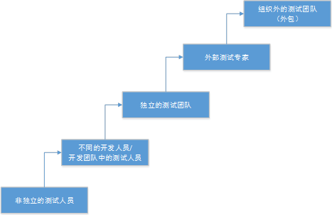
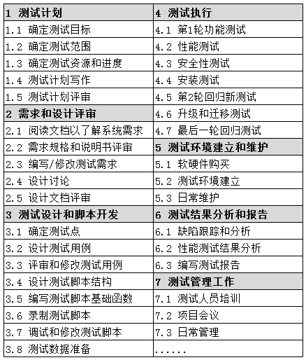
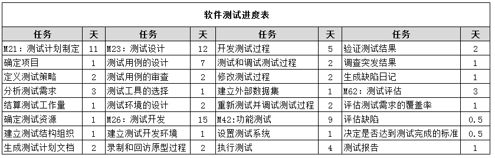
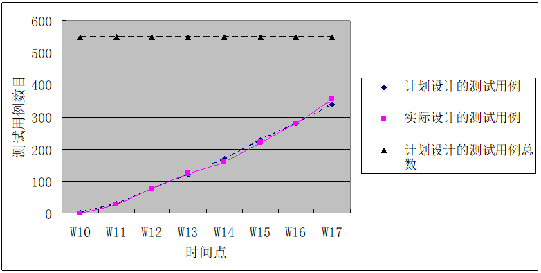
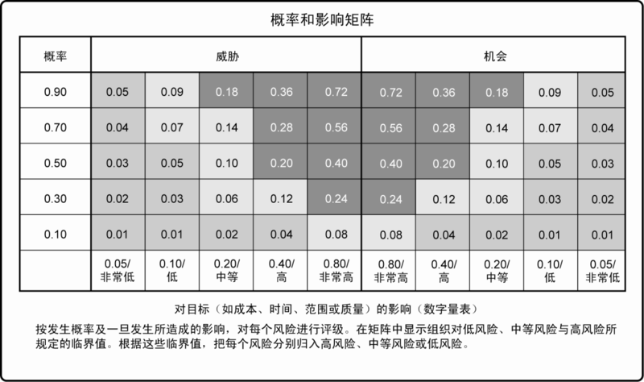
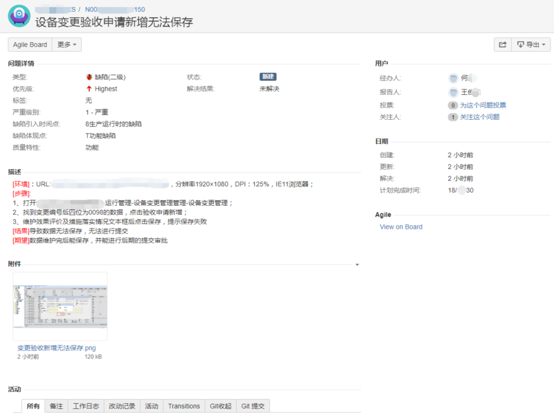
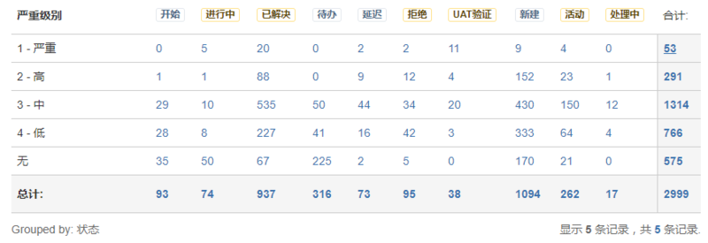
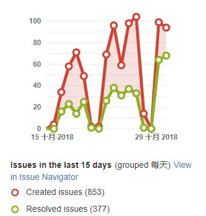

# 5 測試管理

**關鍵詞**

配置管理(configuration management)， 缺陷管理(defect management)，
入口準則(entry criteria)， 出口準則(exit criteria)， 產品風險(product risk)，
項目風險(project risk)， 風險(risk)， 風險層級(risk level)，
基於風險的測試(risk-based testing)， 測試方法(test approach)， 測試控制(test
control)， 測試估算(test estimation)， 測試經理(test manager)， 測試監視(test
monitoring)， 測試計劃(test plan)， 測試規劃(test planning)， 測試進度報告(test
progress report)， 測試策略(test strategy)， 測試總結報告(test summary report)，
測試人員(tester)

**測試管理的學習目標**

**5.1測試組織**

FL-5.1.1 (k2)解釋獨立測試的優點和缺點

FL-5.1.2 (k1)辨識測試經理和測試人員的任務

**5.2測試規劃和估算**

FL-5.2.1 (k2)總結測試計劃的目的和內容

FL-5.2.2 (k2)區分各種測試策略

FL-5.2.3 (k2)舉例說明可能的入口和出口準則

FL-5.2.4
(k3)應用優先級知識、技術和邏輯依賴關系，為給定的一組測試用例安排測試執行進度

FL-5.2.5 (k1)確定影響測試工作量的因素

FL-5.2.6 (k2)解釋兩種估算技術的區別：基於度量的技術和基於專家的技術

**5.3測試監視和控制**

FL-5.3.1(k1)記住用於測試的度量

FL-5.3.2(k2)總結測試報告的目的、內容和受眾

**5.4配置管理**

FL-5.4.1 (k2)總結配置管理是如何支持測試的

**5.5風險和測試**

FL-5.5.1 (k1)基於可能性和嚴重程度定義風險層級

FL-5.5.2 (k2)區分項目風險和產品風險

FL-5.5.3 (k2)通過舉例說明產品風險分析如何影響測試的完備性和範圍

**5.6 缺陷管理**

FL-5.6.1 (k3)編寫缺陷報告，以覆蓋測試中發現的缺陷

## *5.1測試組織*

測試活動貫穿於軟體開發的整個生命周期，保障測試活動與開發活動的緊密配合、協作，測試活動與開發團隊的介面統一、透明，是建立卓越測試組織的重要任務之一。本章將闡述組建測試團隊的方式、測試團隊內的不同角色和工作職責、獨立測試的優缺點，以及測試經理和測試人員的任務。

### 5.1.1 測試的獨立性

軟體開發生命周期中的測試活動，與開發活動不同，有其獨特的測試方法。測試工作可以由組織內特定角色的人員來完成，也可以由其他角色的人（如客戶）來完成。一定程度的測試獨立性(測試人員與開發/需求人員認知上的不一致)，可以使測試人員更有效地發現系統/軟體產品的缺陷。然而，獨立性不是完全替代性，並不是說開發人員就不用測試自己的程式碼了，相反的，開發人員通過自測，可以高效地在自己的程式碼中發現許多缺陷，有時甚至是比較隱蔽的缺陷。因此，需要根據組織的具體情況，選擇合適的獨立測試類型。

如圖5.1.1-1所示，測試活動的獨立性程度由低到高包括：

（1）沒有獨立的測試人員：開發人員負責測試，開發人員測試自己的程式碼。開發人員根據自己的理解對自己編寫的程式碼進行測試，一旦發現缺陷，開發人員立即修覆缺陷，這可以大大縮短解決問題的時間。但由於開發人員更願意花更多的時間在開發活動上，所以留給測試的時間將很少，測試活動的品質無法得到有效的保障。例如，Gelperin和Hetzel模型，在初始的時期測試是被描述成面向調試的，在這個時期大多數的軟體開發組織不清楚測試和調試的區別。測試是個模糊的活動，它跟調試一起是用來從程式中去除錯誤的。

（2）開發團隊或項目團隊中的獨立開發人員或測試人員：測試活動被獨立執行，但執行者是開發人員或者開發團隊/項目團隊中的測試人員。開發人員之間互相交叉測試其它同事開發的產品。測試活動的執行與管理均隸屬於開發團隊或者項目團隊。

（3）組織內獨立的測試團隊：測試活動被獨立執行，且執行者來自於獨立的測試團隊，測試團隊向項目或組織匯報。

（4）來自業務部門或用戶群體的獨立測試人員，或專門從事特定類型測試的人員：如易用性、安全性、性能、監管/合規性或可移植性，即我們通常說的安全測試工程師、性能測試工程師等。此類型的測試活動，通常有其特定的測試目標，測試活動圍繞測試目標執行。

（5）組織外部的獨立測試人員，在現場工作(內包)，或在外部工作(外包)。此類型的測試活動，通常運用在軟體的驗收測試層級中。

圖5.1.1-1 測試人員獨立性

對於大多數的項目類型，通常情況下最好有多個測試層級，其中一些層級由獨立測試人員測試。開發人員應參與測試，特別是在測試層級比較低的時候，以便對自己的工作品質進行控制。但是開發人員往往缺乏測試的目的性和專業的測試技術、測試方法，這在一定程度上會限制開發人員的測試效率。

測試獨立性的實現方式取決於軟體開發生命周期模型的不同。例如：敏捷開發中，測試人員可能是開發團隊的一部分。一些使用敏捷方法的組織中，測試人員也可能被認為是更大的獨立測試團隊的一部分。此外，在此類組織中，產品負責人（Product
owner）可以在每次叠代結束時執行驗收測試以驗證用戶故事的實現。

獨立測試的潛在優點包括：

（1）相對開發人員，獨立的測試人員可以從與開發人員不同的視角去分析和測試系統/軟體產品，由於不同的背景、技術視角和傾向，通常可以辨識不同類型的失效；

（2）獨立的測試團隊與測試人員，其更加註重系統/軟體產品的品質，盡可能多的發現缺陷是測試團隊最重要的目標之一。如果是開發人員自己測試，則更多的會出於對自己編寫程式碼的偏愛，而不會想方設法的去盡可能多的發現缺陷；

（3）獨立的測試團隊與測試人員，當發現系統/軟體產品的缺陷時，可以對發現的缺陷進行客觀的分析與評價，並給出合理的解決方案；

（4）獨立的測試團隊，由於整個團隊都負責測試活動，測試團隊可以從專業的視角去培養測試能力，使之成為專業的測試團隊；

（5）獨立的測試人員，可以利用專業的測試技能，核實、質疑或反駁利益相關者在系統規範和實現期間作出的假設。

對於龐大、覆雜，或者安全關鍵系統，最好由獨立的測試團隊進行多個層級的測試。

當然，獨立測試也有其潛在的缺點，包括：

（1）測試團隊與開發團隊隔離，從而導致缺乏合作，測試團隊在向開發團隊提供反饋方面可能會出現延誤，或與開發團隊形成敵對關系；

（2）開發人員可能會失去對品質的責任感；

（3）基於獨立測試團隊對品質的要求，獨立的測試人員常常被看作是延遲發布的瓶頸或受到指責；

（4）由於測試團隊獨立於開發團隊，測試人員的開發技能相對比較薄弱，對於系統的設計和程式碼的理解，往往需要投入更多的工作量；

（5）測試人員與開發人員，往往需要建立正式的溝通渠道，以解決發現缺陷後的溝通問題；

（6）獨立測試人員可能缺乏一些重要信息，例如：關於測試對象的需求、設計，以及實現邏輯相關的一些信息。這點在許多組織中，測試通過盡早介入往往可以避免。

在實際執行過程中，許多組織能夠成功地實現測試獨立性的優點，並同時避免這些缺點。

### 5.1.2 測試經理和測試人員的任務

獨立的測試團隊中，通常有測試經理和測試人員兩大角色。這兩個角色所執行的活動和任務取決於項目和產品背景、該角色的技能以及組織。

測試經理在不同的組織中，有時也被稱為測試組長或者測試協調人。測試經理作為測試管理角色，通常是測試團隊的領軍人物，其首要職責就是帶領測試團隊執行測試過程和測試活動，全面負責並保障測試過程和測試活動的成功；同時，測試經理還需要具備計劃能力、協調能力、創新能力、授權能力、指揮能力等，以身作則，為團隊帶去正面影響力，並為他人提升價值。

測試經理的角色可以由專業的測試經理，也可以由項目經理、開發經理或品質保證經理擔任。在比較大型的項目或組織中，可以分為多個測試小組，每個測試小組由測試組長或主要測試人員領導，多個測試小組團隊向測試經理報告。

測試經理的主要任務包括：

-   為本組織制定或評審測試方針和測試策略

-   通過考慮上下文和理解測試目標和風險來規劃測試活動。這可能包括選擇測試方法、估算測試時間、工作量和成本、獲取資源、定義測試層級和測試周期以及規劃缺陷管理

-   編寫和更新測試計劃

-   與項目經理、產品所有人和其他人協調測試計劃

-   與其他項目活動分享測試視角，例如整合規劃

-   開始分析、設計、實現和執行測試，監視測試進度和結果，並檢查出口準則(或已完成的定義)的狀態

-   根據收集的信息準備和提交測試進度報告和測試總結報告

-   根據測試結果和進度情況調整規劃(有時記錄在測試進度報告和/或記錄在測試總結報告中的其他已經完成的測試)，並為測試控制采取合適的行動

-   支持建立缺陷管理系統和針對測試件的適當的配置管理

-   採用合適的度量，測量測試進度，評估測試和產品的品質

-   支持工具的選擇和實施以支持測試過程，包括工具選擇(和可能購買和/或支持)所需的預算，為試點項目分配時間和工作量，並為工具的使用提供持續的支持

-   確定測試環境的實施

-   在組織內促進和激勵測試人員、測試團隊和測試專業化

-   發展測試人員的技能和職業(例如:通過培訓計劃、績效評估、輔導等)

測試經理的主要任務，與軟體開發生命周期模型有一定的關系，角色的執行方式取決於軟體開發生命周期的不同。例如：敏捷開發中，上面提到的一些任務是由敏捷團隊處理的，特別是那些與團隊內進行的日常測試有關的任務，通常是由團隊內的測試人員處理的。一些跨多個團隊或整個組織的任務，或與人事管理有關的任務，可由開發團隊以外的測試經理完成，他們有時被稱為測試教練或測試協調人。

測試人員的主要任務包括：

-   參與測試計劃評審，並提出可行性建議，協助測試經理保障測試計劃的完整性、可執行性；

-   參與需求評審，從測試的視角提出可行性建議；

-   對需求規格進行充分的分析，分解出各種類型的需求（功能性需求、性能要求、其他需求等）；

-   充分理解用戶故事和驗收準則、規格說明、可測試性模型（即測試依據），輸出測試需求；

-   辨識和文檔化測試條件，設計測試用例；

-   獲取測試用例、測試條件和測試依據之間的可追溯性；

-   設計、建立和驗證測試環境，並經常與系統管理員和網絡管理員協調；

-   執行測試用例和測試規程；

-   準備和獲取測試數據；

-   制定詳細的測試執行時間進度表；

-   執行測試，評估結果，並文檔化與預期結果之間的偏差；

-   使用適當的工具輔助、促進測試過程；

-   根據需要實現測試自動化（可能得到開發人員或測試自動化專家的支持）；

-   評估非功能性特性，如性能效率、可靠性、易用性、安全性、兼容性和可移植性等；

-   評審其他人員執行的測試；

-   參與測試總結會議，積累經驗與教訓。

從事測試分析、測試設計、特定測試類型或測試自動化工作的人可能是這些角色的專家。根據產品風險與項目風險，以及所選擇的軟體開發生命周期模型，不同的人會在不同的測試層級上承擔測試人員的角色。例如：在單元測試層級和單元整合測試層級，測試人員的角色通常由開發人員完成。在驗收測試層級，測試人員的角色通常由業務分析師、專家和用戶完成。在系統測試層級和系統整合測試層級上，測試人員的角色通常由獨立的測試團隊完成。在運行驗收測試層級，測試人員的角色通常由運維和/或系統管理人員完成。

## *5.2 測試規劃與估算*

### 5.2.1 測試計劃的目的與內容

軟體測試計劃是對測試過程的整體設計。通過收集項目和產品相關的信息，對測試範圍、測試風險進行分析，對測試用例、工作量、測試資源和時間等進行估算，對測試採用的策略、方法、環境、資源、進度等做出合理的安排。

軟體測試技術大全：測試基礎、流行工具、項目實踐（第3版）

當項目或測試計劃不斷向前演進時，就可以根據不斷獲得的細節，補充進測試計劃。所以測試計劃是一項持續工作，並貫穿於整個產品生命周期（註意，產品的生命周期可能會從項目交付階段延伸至運維階段）。測試活動中獲得的反饋可以用來辨識變更風險，進而對測試計劃進行調整。在設計測試計劃文檔時，可以分為主測試計劃及對應於各個測試層級的單獨測試計劃，例如系統測試與驗收測試。或者可以按不同的測試類型進行區分，例如可用性測試與性能測試。

**制定測試計劃的目的**

-   管理者能夠根據測試計劃做宏觀調控，進行相應資源配置等。

-   測試負責人可以根據測試計劃跟蹤測試進度。

-   測試人員能夠了解整個項目測試情況，以及項目測試不同階段需要進行的工作。

-   便於其他人員了解測試人員的工作內容，並配合測試的工作。

軟體測試管理與實踐 趙聚雪 楊鵬主編

**制定測試計劃的相關活動（部分可以寫入測試計劃的內容中）**

-   確定測試的範圍、目標和風險

-   確定測試的總體方法

-   將測試活動整合到整個軟體生命周期活動中並加以協調

-   確定測試什麽、進行各種測試活動所需的人員和其他資源，以及如何進行測試活動

-   按照特定的日期（例如：在順序開發中）或在每個叠代的上下文中，針對測試分析、設計、實現、執行和結束活動制訂時間進度表

-   選擇測試監視和控制相關的度量

-   確定測試活動預算

-   確定測試文檔的詳細程度和結構(例如：通過提供模板或示例文檔)

### 5.2.2 測試策略和測試方法

測試策略通常在產品或組織層級對測試過程進行了描述。常見的測試策略包括：

-   分析型：該類型測試策略基於對一些因素(例如需求或風險)進行分析。基於風險的測試是分析型方法的一個例子，根據風險層級設計測試並確定其優先級。

-   基於模型的：該類型的測試策略，測試的設計是基於產品某些方面的模型，如功能、業務流程、內部結構或非功能特性（如可靠性）。這類模型的例子包括業務流程模型、狀態模型和可靠性增長模型。

-   方法型：該類型的測試策略依賴於系統化使用一些預定義的測試集或測試條件，如常見或可能的失效分類，重要品質特性的列表，或全公司的手機應用程式或網頁的視覺和感覺標準。

-   符合過程(或標準)：該類測試策略基於外部規則和標準的測試分析、設計和實現測試，如特定行業標準，流程文檔，嚴格標識和使用的測試依據，或組織主動或被動強制的過程或標準。

-   指導型(或咨詢型)：該類測試策略主要通過利益相關者、業務領域專家或技術專家的建議、指導或指示驅動，他們可能來自測試小組或組織外。

-   回歸避免：該類型的測試策略的動機是希望避免現有能力的回歸。這個測試策略包括重用現有的測試件（特別是測試用例和測試數據）、回歸測試的廣泛自動化以及標準化測試套件。

-   應對型：該類型的測試策略是對正在測試的單元或系統以及在測試執行過程中發生的事件作出反應，而不是事先計劃好的（如前面的策略）。設計和實現的測試，可能會根據以前測試結果中獲得的知識立即得到執行。探索性測試是應對型策略中常用的一種技術。

這些典型的測試策略並不是孤立存在的。合適的測試策略通常是結合其中幾種類型的測試策略來創建的。例如：基於風險的測試（分析型測試）可與探索性測試（應對型策略）相結合；它們相輔相成，並可在一起使用時實現更有效的測試。組織選定的測試策略應符合其需要，並可根據其特定的業務或項目特點進行合理的裁剪。

測試策略提供了測試過程的廣義描述，而測試方法則針對特定項目或發布對測試策略進行裁剪。測試方法是選擇測試技術、測試層級和測試類型的起點，也是定義入口準則和出口準則（或分別是已準備的定義和已完成的定義）的起點。根據項目的覆雜性和目標、正在開發的產品類型以及產品風險分析作出的決定，對測試策略進行裁剪。選擇的方法取決於上下文，並考慮風險、安全、可用資源和技能、技術、系統特點(例如：定制與COTS)、測試目標和法規等因素。

### 5.2.3 入口準則和出口準則（已準備的定義和已完成的定義）

為了有效控制軟體和測試的品質，需要制定準則，定義特定測試活動何時開始，以及何時完成。入口準則（敏捷開發中通常稱為已準備的定義）：定義了進行特定測試活動的先決條件。如果不符合入口準則，則該活動很可能會更困難、更耗時、更昂貴和風險更大。出口準則（敏捷開發中通常稱為已完成的定義）：必須達到的條件，以聲明一個測試層級或一組測試已經完成。針對每個測試層級和測試類型，都應該定義入口準則和出口準則，並根據測試目標而有所不同。

典型的入口準則包括：

-   待測試的需求、用戶故事，和/或模型(例如：在採用基於模型的測試策略時)已準備好

-   已滿足上一個測試層級出口準則的測試項

-   測試環境已完備

-   所需測試工具已準備好

-   測試數據和其他必要資源已準備好

典型的出口準則包括：

-   完成已計劃測試的執行

-   已達到規定的覆蓋率(如需求、用戶故事、驗收準則、風險、程式碼)

-   未解決的缺陷數目在商定的範圍內

-   估計剩余的缺陷數量足夠低

-   對可靠性、性能效率、易用性、安全性和其他相關品質特性的評估得到的層級，已經滿足要求

即使沒有滿足出口準則，由於預算超支、計劃完成的時間耗完，和/或產品推向市場的壓力等原因，而減少測試活動也是常見的。如果項目利益相關者幹系人和業務負責人都已經評審並接受不再進一步測試所帶來的風險，此時結束測試是可接受的。

### 5.2.4 測試執行進度

測試執行是執行所有或部分選定的測試用例，並對結果進行分析的過程。測試執行活動是整個測試過程的核心環節，所有測試分析、測試設計、測試計劃的結果都將在測試執行中得到最終的檢驗。

（from:軟體測試管理與實踐 趙聚雪 楊鵬 主編）

測試執行的主要目標是盡可能地發現產品的缺陷，而不是達到測試計劃完成率。如果過分關注測試計劃完成率，而不重視測試執行的品質，則會導致雖然已經完成測試，但是仍然不能確保產品品質。此時需要進行補救，增加重覆測試，這樣不但加大了測試冗余度，還會造成整體測試進度的延遲，更嚴重的是會遺留很多本來應該發現的缺陷。

因此，測試用例執行過程中除了關注測試進度外，還要全方位觀察測試用例執行結果，加強測試過程的記錄，及時確認發現的問題，及時更新測試用例，處理好與開發的關系，促進缺陷的解決。

測試執行的主要任務主要包括以下六個方面。

**1）測試啟動評估：根據測試計劃和待測試對象評估此次測試是否達到入口準則。**

不同的測試目的，其測試入口準則評估的條件不盡相同，要根據實際情況進行設置。入口準則一般會在測試計劃中定義。

-   評估被測對象的完成程度以及品質能否達到測試啟動的標準。例如：

    -   計劃體現在發布版本上的功能模組以及所有項目整合在一起後的各功能點已實現，即需求已經100%完成；

    -   交付測試的版本已經完成所有基本的自動化測試，並且自動化測試腳本全部通過。

-   根據給定的版本測試時間及測試用例分配結果，結合測試執行能力，評估本輪測試需達到的覆蓋率

-   根據覆蓋率確定本輪應發現缺陷的階段目標

-   評估各特性用例分配情況是否合理，是否存在極不均衡的現象，是否存在過度測試，是否存在部分特性無法完成測試

-   評估測試執行計劃中時間安排的合理性

**2）指定測試用例：根據測試的階段、任務選擇執行全部或部分測試用例。**

**3）測試用例分配：將測試用例分配給測試工程師。**

-   辨識此次要執行的測試用例的集合

-   考慮特性之間的交互關系

-   考慮測試用例的優先級

**4）執行測試：執行測試用例，記錄原始數據，及時報告發現的缺陷。**

在執行過程中，測試用例是核心。為了方便統計和管理，測試用例在執行中有不同的狀態。例如：

-   等待執行狀態：測試用例等待執行

-   阻塞狀態：由於其他原因導致測試用例暫時不能執行。比如某個功能模組不能啟動，則該功能模組所有用例被阻塞；管理員賬號登錄失敗，則所有管理員權限用例被阻塞

-   正在執行狀態：測試用例正在執行中

-   通過狀態：測試用例執行通過

-   失敗狀態：測試用例執行失敗，此時要提交相應的缺陷

-   免執行狀態：表示本次測試不執行該測試用例

**5）狀態監控：根據測試執行情況以及缺陷情況，監控測試執行的進度以及遇到的問題，並及時解決測試中阻礙執行進度的相關問題。**

監控的任務和目的：

-   記錄和管理測試用例的執行狀態

-   根據當前的執行狀態，判定測試用例的品質和執行效率

-   根據已發現缺陷的分布，判定結束測試的條件是否成熟

-   根據缺陷的數量、種類等信息評估被測試軟體的品質

-   根據缺陷的分布、修覆缺陷的時機、回歸測試發現的缺陷梳理等評估開發過程的品質。

主要監控的內容包括：

-   控制進度監控：監控測試執行的進度與預期的偏差，及時分析原因並進行計劃調整

-   用例品質監控：測試用例的有效性，能否發現關鍵問題等

-   測試覆蓋度監控：測試是否全面

-   執行效率監控：測試執行的效率

-   研發品質監控：被測產品的品質如何

**6）及時匯報：及時向管理層匯報測試的進度、發現的主要問題等。**

一旦生成各種測試用例和測試規程（有些測試規程是自動化的）並組成測試套件，測試套件就可以安排在定義了它們執行順序的測試執行進度中。測試執行進度應考慮到諸如優先級、依賴關系、確認測試、回歸測試以及執行測試的最有效順序等因素。理想情況下，測試用例應該是按照其優先級順序進行執行的，通常是先執行優先級最高的測試用例。但是，如果測試用例具有依賴關系或正在測試的特性之間具有依賴關系，那該實踐會不起作用。如果優先級較高的測試用例依賴於優先級較低的測試用例，則必須先執行優先級較低的測試用例。

同樣，如果測試用例之間存在依賴關系，則必須適當地對它們進行排序，而不管它們的相對優先級如何。確認測試和回歸測試也必須根據變更的快速反饋，進行優先級排序，但這裡同樣受依賴關系的影響。

在某些情況下，可能存在各種不同的測試順序，不同的順序之間的效率是不同。在這種情況下，必須在測試執行效率與優先級之間作出平衡。

### 5.2.5 影響測試工作量的因素

測試工作量估算包括針對特定項目、發布或叠代的測試目標，預測與測試相關工作量。影響測試工作量的因素包括產品特點、開發過程特點、人員特點和測試結果。具體內容如下：

**產品特點**

-   產品相關的風險

-   測試依據的品質

-   產品的規模

-   產品領域的覆雜性

-   品質特性需求（例如安全性、可靠性）

-   測試文檔所需的詳細程度

-   遵守法律和法規的需求

**開發過程特點**

-   組織的穩定性和成熟性

-   正在使用的開發模型

-   測試方法

-   使用的工具

-   測試流程

-   時間壓力

**人的特點**

-   參與人員的技能和經驗，特別是類似項目和產品有關的技能和經驗（如領域知識）

-   團隊凝聚力和領導能力

**測試結果**

-   發現缺陷的數量和嚴重程度

-   需要的返工量

### 5.2.6 測試估算技術

在進行項目計劃時，就要確定資源需求和安排進度，而這些工作依賴於對測試範圍和工作量的估算。最常用的兩種技術是：

-   基於度量的技術：根據以前類似項目的度量，或根據典型值估算測試工作量

-   基於專家的技術：根據測試任務責任人或專家的經驗估算測試工作量

除此之外，估算技術還有很多，例如：經驗估算法、對比分析法、工作任務分解方法和數學建模方法等。將良好的歷史數據與系統化的技術結合起來能夠提高估算的精確度。

下面分別從測試工作量估算、工作結構分解表、測試資源安排、測試里程碑和進度表幾個方面來闡述測試估算。

**1.測試工作量估算**

測試的工作量是根據測試範圍、測試任務和開發階段來確定的。測試範圍和測試任務是測試工作量估算的主要依據。測試任務是由品質需求、測試目標來決定的，品質要求越高，越要進行更深、更充分的測試，回歸測試的次數和頻率也要加大，測試的工作量也要增加。

處在不同的開發階段，測試的工作量差異也很大。新產品的第一個版本的開發過程，相對於以後的版本來說，測試的工作量要大一些。但也不是絕對的。例如，第1個版本的功能較少，在第2、3個版本中，增加了較多的新功能，雖然新加的功能沒有第1個版本的功能多，但是在第2、3個版本的測試中，不僅要完成新功能的測試，還要完成第1個版本的功能回歸測試，以確保原有的功能正常。

在一般情況下，一個項目要進行兩三次回歸測試。所以，假定一輪（Round）功能測試需要100個人日，則完成一個項目所有的功能測試肯定就不止100個人日，往往需要200-300多個人日。可以採用以下公式計算：

W=Wo + Wo X R1 +Wo X R2 + Wo X R3

（1）W為總工作量，Wo為第一輪測試的工作量。

（2）R1、R2、R3為每輪的遞減系數。

受不同的程式碼品質、開發流程和測試周期等影響，R1、R2、R3的值是不同的。

對於每一個公司來說，可以通過歷史積累的數據獲得經驗值。

測試的工作量還受自動化測試程度、軟體品質、開發模式等多種因素影響。在這些影響的因素中，軟體品質是主要的。軟體品質越低，測試的重覆次數可能就越多。回歸測試的範圍，在這三次中可能各不相同，這取決於測試結果，即測試缺陷的分布情況。如果缺陷多且分布很廣，所有的測試用例都要被再執行一遍。缺陷少且分布比較集中，可以選擇部分或少數的測試用例作為回歸測試所要執行的範圍。

軟體品質相對較低的情況下，假定R1、R2、R3的值分別為80%、60%、40%。若一輪功能測試的工作量是100個人日，則總的測試工作量為280個人日。如果程式碼品質高，一般只需要進行兩輪回歸測試，R1、R2值也將為60%、30%，則總的測試工作量為190個人日，工作量減少了32%以上。

工作量的估計比較覆雜，針對不同的應用領域、程式設計技術、編程語言等，其估算方式是不同的。其估算可能要基於一些假定或定義：

-   效率假設：即測試隊伍的工作效率。對於功能測試，這主要依賴於應用的覆雜度、窗口的個數、每個窗口中的動作數目。對於容量測試，主要依賴於建立測試所需數據的工作量大小。

-   測試假設：目的是驗證一個測試需求所需測試的動作數目，包括估計的每個測試用例所用的時間。

-   階段假定：指所處測試周期不同階段（測試設計、腳本開發、測試執行等）的劃分，包括時間的長短。

-   覆雜度假定：應用的覆雜度指標和需求變化的影響程度決定了測試需求的維數。測試需求的維數越多，工作量就越大。

-   風險假定：一般考慮各種因素影響下所存在的風險，將這些風險帶來的工作量設定為估算工作量之外的10%-20%。

**2.工作分解結構表方法**

要做好測試工作量的估算，需要對測試任務進行細化，對每項測試任務進行分解，然後根據分解後的子任務進行估算。通常來說，分解的粒度越小，估算精度越高。可以再加上10%-15%的浮動幅度，來確定實際所需的測試工作量。比較專業的方法是工作分解結構表（Work
Breakdown Structure，WBS），它按以下三個步驟來完成。

（1）列出本項目需要完成的各項任務，如測試計劃、需求和設計評審、測試設計、腳本開發、測試執行等。

（2）對每個任務進一步細分，可進行多層次的細分，直到不能細分為止。如針對測試計劃，首先可細分為：

-   確定測試目標

-   確定測試範圍

-   確定測試資源和進度

-   測試計劃寫作

-   測試計劃評審

（3）列出需要完成的所有任務之後，根據任務的層次給任務進行編號，就形成了完整的工作分解結構表。如表5.2.6-1所示

**表5.2.6-1 測試工作分解結構表**

WBS除了用表格的方式表達之外，還可以採用結構圖的方式，那樣會更直觀、方便。

當WBS完成之後，就擁有了制定日程安排、資源分配和預算編制的基礎信息，這樣不僅可獲得總體的測試工作量，還包括各個階段或各個任務的工作量，有利於資源分配和日程安排。所以，WBS方法不僅適合工作量的估算，還適合日程安排、資源分配等工作。

**3.測試人力資源安排**

資源管理的目的不僅要保證測試項目有足夠的資源，同時，應能充分有效地利用現有資源，進行資源的優化組合，避免資源浪費。測試項目的資源，主要分為人力資源、系統資源（硬體和軟體資源）以及環境資源。每一類資源都有4個特征來說明：資源描述、可用性說明、需要該資源的時間以及該資源被使用的持續時間。後兩個特征可以看成是時間窗口，對於一個特定的窗口而言，資源的可用性必須在開發的最初期就建立起來。完成測試工作量估算之後就能基本確定一個軟體測試項目所需的人員數量，並寫入測試計劃中。但是，僅知道人員數量是不夠的，因為軟體測試項目所需的人員和要求在各個階段是不同的。

（1）在初期，也許只要測試組長介入進去，為測試項目提供總體方向、制定初步的測試計劃，申請系統資源。

（2）在測試前期，需要一些資深的測試人員，詳細了解項目所涉及的業務和技術，分析和評估測試需求，設計測試用例、開發測試腳本。

（3）在測試中期，主要是測試執行。如果測試自動化程度高，人力的投入沒有明顯的增加；如果測試自動化程度低，需要比較多的執行人員，他們也需要事先做好一定的準備。

（4）在測試後期，可以抽出部分資深的測試人員去準備新的項目。

從經驗看，人力資源的管理難度主要有以下三個方面。

（1）資源需求的估計，依賴於工作量的估計和每個工程師的能力評估。

（2）資源的應急處理，預留10%的資源作為人力儲備（Buffer）。

（3）資源在各個階段或項目間平衡的藝術。

**4.測試里程碑和進度表**

里程碑（Milestone）是項目中完成階段性工作的標志，即將一個過程性的任務用一個結論性的標志來描述任務結束的、明確的起止點，一系列的起止點就構成引導整個項目進展的里程碑。
一個里程碑標志著上一個階段結束、下一個階段開始，也就是定義當前階段完成的標志（Exit
Criteria）下個階段啟動的條件或前提（Entry Criteria）。里程碑還具有下列特征：

（1）里程碑也是有層次的，在一個父里程碑內可以定義多個子里程碑；

（2）不用的項目，可能設置不同類型或不同數量的里程碑；

（3）不同規模項目的里程碑，其數量多少是不一樣的，里程碑可以合並或分解。

例如，在軟體測試周期中，建議定義6個父里程碑、十幾個子里程碑。具體里程碑如下。

>   **M1：需求分析和設計的審查**

>   M11：市場/產品需求審查

>   M12：產品規格說明書的審查

>   M13：產品和技術知識傳遞

>   M14：系統/程式設計的審查

>   **M2：測試計劃和設計**

>   M21：測試計劃的確定

>   M22：測試計劃的審查

>   M23：測試用例的設計

>   M24：測試用例的審查

>   M25：測試工具的設計和選擇

>   M26：測試腳本的開發

>   **M3：程式碼（包括單元測試）完成**

>   **M4：測試執行**

>   M41：整合測試完成

>   M42：功能測試完成

>   M43：系統測試完成

>   M44：驗收測試完成

>   M45：安裝測試完成

>   **M5：程式碼凍結**

>   **M6：測試結束**

>   M61：為產品發布進行最後一輪測試

>   M62：寫測試和品質報告

對每個里程碑，如果需要更加嚴格的控制，還可以定義更細的里程碑。

表5.2.6-2 是一個軟體測試進度表的例子。

表5.2.6-2 軟體測試進度表

## *5.3測試監控*

測試監控這裡面其實包括兩部分的內容。一個是監視，另外一個是控制。測試監視的目的是收集信息，並為測試活動提供反饋和可見性。測試控制是根據收集和（可能）報告的信息和度量，采取相應的指導或糾正行動。

測試監視需要通過手工或自動方式收集各種度量數據，這些數據可以用於評估測試進度、測試出口準則，或評估與敏捷項目的已完成定義相關的測試任務是否已完成，如達到產品風險、需要或驗收準則的覆蓋率要求。

一旦在測試監視過程中，發現當前的狀態和期望的或計劃的不符，就需要采取一定的控制活動。例如：

-   當辨識的風險發生時重新確定測試的優先級(例如：軟體延遲交付)

-   根據測試環境或其他資源是否可用，改變測試時間進度

-   重新評估某項測試項返工後是否還符合入口或出口準則

### 5.3.1 測試使用的度量

為了更好的進行測試監視，必須選擇合適的度量指標。很多人對度量指標到底有哪些非常感興趣。但是其實一套大而全的度量指標並不能解決測試監視的所有問題。相反，在面對很多度量指標可以選擇的時候，如何選擇合適自己當前組織或者項目的度量指標反而更有挑戰。在日常工作中，一定要避免為了度量而度量的這種舍本求末的情況。所有的度量都是為了控制服務的，如果僅僅度量出來數據，但是根據這些數據，測試團隊無法獲得任何有用的信息，那麽這個度量其實就是資源的浪費。

測試活動期間或結束時可以收集的度量包括：

-   時間進度和預算：用於評估當前的進度

-   測試對象的當前品質：品質是一個比較廣泛的概念，測試團隊需要進行細化，例如按照ISO
    25010中品質模型進行分類度量

-   測試方法的充分性：是否使用了各種不同的測試方法以達到測試目的，不同的測試方法涉及到測試技術、測試層級和測試類型等的選擇，詳細內容可以參考5.2.2節

-   基於目標的測試活動有效性：這裡的度量和特定的目標相對應的，例如：如果為了通過程式碼評審減少系統測試中發現的基本功能存在的缺陷

通用測試度量包括：

-   測試用例準備階段完成的已計劃工作的百分比(或測試用例已實現占已計劃的百分比)

-   測試環境準備階段完成的已計劃工作的百分比

-   測試用例執行(例如：運行/未運行的測試用例數目、通過/失敗的測試用例數目，和/或通過/失敗的測試條件數目)

-   缺陷信息（如缺陷密度、發現和修覆的缺陷、失效率和確認測試結果）

-   需求、用戶故事、驗收準則、風險或程式碼的覆蓋率

-   任務完成、資源分配和使用以及工作量

-   測試成本，包括發現下個缺陷的收益成本與執行下個測試的收益成本之間的比較

每個度量指標最終都要明確需要收集的數據和計算方法。例如：

-   測試用例執行的進度：測試用例執行的進度=已執行的數目/總數目。此數據只表明測試的執行進度，不表示測試的成功率。

-   缺陷的存活時間：缺陷的存活時間=缺陷從打開到關閉的時間（或者是從發現到解決的時間）。此數據表明修改缺陷的效率。

-   缺陷的趨勢分析：按照測試執行的時間順序（以月、周、天為時間單位），查看發現的缺陷數量的分布。一般說來是發現的缺陷越來越少。如果實際中發現的缺陷越來越少，趨近於0，則考慮結束測試執行。相反，如果發現缺陷的數量發生非正常波動，則說明可能存在以下的問題：程式碼修改引發新的缺陷；前一版本的測試存在覆蓋率的問題；新的測試發現了原來未發現的缺陷；必須先修改某些缺陷後才能繼續測試，然後才發現其他的缺陷。

-   缺陷分布密度：缺陷分布密度=某項需求的總缺陷數/該項需求的測試用例總數（或者功能點總數）。如果發現過多的缺陷集中在某項需求上，則要對需求進行分析和評估，然後根據分析結果進行測試調整。比如，該功能需求是否過於覆雜，該項的需求設計、實現是否有問題，分配給該項的開發資源是否不足。需要註意的是，在分析缺陷的分布密度時要考慮缺陷的優先級和嚴重程度。

-   缺陷修改品質：缺陷修改品質=每次修改後發現的缺陷數量（包括重現的缺陷和由修改所引起的新缺陷）。該數據可以用來評價開發部門修覆缺陷的品質，如果數值較高，測試部門應當及時通知開發部門查找原因，確保產品品質。

測試監控過程中，很多度量數據都會以圖表的形式展示。圖5.3.1-1是某項目測試用例設計進度。

圖5.3.1-1 項目測試用例設計進度

從測試度量數據結果來看（圖5.3.1-1），當前（第17周）的測試用例設計比計劃完成的測試用例還多一些，表明當前測試設計總體進度情況良好。而且從歷史趨勢來看，實際進度和計劃的進度偏差不大，從側面說明實際的測試設計進度比較穩定，當前總體的測試用例設計進度比較可控。

### 5.3.2 測試報告的目的、內容和受眾

測試報告的目的是在測試活動期間和結束時（例如某測試層級），總結和交流測試活動的信息。ISO標準（ISO/IEC/IEEE
29119-3）指定了兩種類型的測試報告，測試狀態報告和測試完成報告（在ISTQB大綱中稱為測試進度報告和測試總結報告），並包含了這兩種不同類型報告的結構和示例。

測試活動期間準備的測試報告可稱為測試進度報告（對應ISO/IEC/IEEE
29119-3中的測試狀態報告），而在測試活動結束時編寫的測試報告可稱為測試總結報告（對應ISO/IEC/IEEE
29119-3中的測試完成報告）。

在測試監控期間，測試經理需定期為利益相關者發布測試進度報告。除了測試進度報告和測試總結報告中相同的內容外，典型的測試進度報告還可能包括：

-   對照測試計劃，當前測試活動和進度的狀態

-   阻礙進度的因素

-   針對下個匯報階段的計劃的測試

-   測試對象的品質

ISO/IEC/IEEE 29119-3中的測試狀態報告內容如下表5.3.2-1所示。

表5.3.2-1 測試狀態報告模板

| 章節 | 標題                 | 備註                                              |
| ---- | -------------------- | ------------------------------------------------- |
| 1    | 概述                 | 報告的概要描述                                    |
| 2    | 文檔相關信息         |                                                   |
| 2.1  | 概述                 |                                                   |
| 2.2  | 文檔標識             | 每個文檔都應該有一個唯一的標識                    |
| 2.3  | 發布組織             | 明確準備和發布該文檔的組織，也包括作者            |
| 2.4  | 審批者               | 評審和批準該報告的人                              |
| 2.5  | 變更歷史             | 描述文檔的歷史變更記錄                            |
| 3    | 介紹                 |                                                   |
| 3.1  | 範圍                 | 描述該報告包括的內容、不包括的內容、假設和/限制等 |
| 3.2  | 參考資料             |                                                   |
| 3.3  | 術語                 |                                                   |
| 4    | 測試狀態             |                                                   |
| 4.1  | 報告的時間段         |                                                   |
| 4.2  | 與測試計劃對應的進度 |                                                   |
| 4.3  | 影響進度的因素       |                                                   |
| 4.4  | 測試度量             |                                                   |
| 4.5  | 新的和有變化的風險   |                                                   |
| 4.6  | 下階段的測試計劃     |                                                   |

當滿足出口準則時，測試經理將發布測試總結報告。該報告根據最新的測試進度報告和其他相關信息，對進行的測試做了總結。

典型的測試進度報告及測試總結報告可能包括：

-   測試執行的總結

-   測試期間所發生的信息

-   與計劃之間的偏離，包括測試活動的時間進度、持續時間或工作量的偏差

-   針對出口準則或已完成定義中的測試狀態和產品品質

-   曾經阻礙或繼續阻礙進度的因素

-   缺陷、測試用例、測試覆蓋率、活動進度和資源消耗的度量(如5.3.1所述)

-   剩余風險(見第5.5節)

-   生成的可重用的測試工作產品

ISO/IEC/IEEE 29119-3中的測試完成報告的內容如下表5.3.2-2所示。

表5.3.2-2 測試完成報告模板

| 章節 | 標題             | 備註                                              |
| ---- | ---------------- | ------------------------------------------------- |
| 1    | 概述             | 報告的概要描述                                    |
| 2    | 文檔相關信息     |                                                   |
| 2.1  | 概述             |                                                   |
| 2.2  | 文檔標識         |                                                   |
| 2.3  | 發布組織         |                                                   |
| 2.4  | 審批者           |                                                   |
| 2.5  | 變更歷史         |                                                   |
| 3    | 介紹             |                                                   |
| 3.1  | 範圍             | 描述該報告包括的內容、不包括的內容、假設和/限制等 |
| 3.2  | 參考資料         |                                                   |
| 3.3  | 術語             |                                                   |
| 4    | 執行的測試       |                                                   |
| 4.1  | 執行的測試的總結 |                                                   |
| 4.2  | 與計劃的偏差     |                                                   |
| 4.3  | 測試完成評估     |                                                   |
| 4.4  | 影響進度的因素   |                                                   |
| 4.5  | 測試度量         |                                                   |
| 4.6  | 遺留風險         |                                                   |
| 4.7  | 測試交付物       | 例如：各種測試文檔、腳本等                        |

測試報告的內容將根據項目、組織要求和軟體開發生命周期而有所不同。例如：相對於快速軟體升級，一個有許多利害相關者的覆雜項目或受監管的項目可能需要更詳細和更嚴格的報告。還例如：在敏捷開發中，測試進度報告可以被納入任務板、缺陷摘要和燃盡圖中，這些可以在每日的站立會議中討論（見ISTQB-AT基礎級敏捷測試人員擴展大綱）。

除了根據項目背景對測試報告進行裁剪之外，測試報告還應根據報告的受眾進行調整。針對技術受眾或測試團隊所包含的信息類型和數量，可能不同於針對管理層的總結報告中的內容。在前一種情況下，關於缺陷類型和趨勢的詳細信息可能很重要。而在後一種情況下，概要的報告（例如：按優先順序、預算、時間進度和通過/失敗/未測試測試條件的摘要狀態）可能更合適。

## *5.4配置管理*

測試管理與項目管理密不可分，配置管理也源於項目管理。

配置管理，是一種管理思維，它將項目中各個因素建立起關系，並持續更新與維護這種關系的完整性。無論是項目的範圍、時間、成本、人力資源等，都是可配置，可管理的對象。配置管理貫穿於項目產品的整個生命周期，從項目管理的角度來說，任何能夠影響到項目的因素皆屬於配置對象，都應進入配置管理系統進行有效的管理。

在軟體項目開發過程中，需求的變更是經常發生的，或者隨著對軟體對象的理解的不斷深入，需要對工作產品進行修改或者更新。這些變更，都會對測試工作產品產生影響。例如，不同的人對不同的文檔進行創建和修改，如何對不同文檔的版本進行控制將成為非常大的一個問題。下面舉兩個例子：

-   由於軟體系統的兩個功能需求發生了變更，需要測試人員A和B對相關的測試用例進行修改。測試經理將一個功能需求分配給了測試人員A，將另外一個功能需求分配給了測試人員B。他們需要對同一批測試用例進行修改。當測試人員A將修改的測試用例保存的時候，很不幸，將一天前測試人員B修改的內容覆蓋掉了。

-   測試人員開始了測試執行。測試人員在執行測試用例的過程中，發現軟體的輸出和測試用例中的期望結果不一致，因此測試人員提交了一個事件報告給開發人員。開發人員看了以後，直接就拒絕了這個缺陷，理由是測試用例中提到的需求已經變更，現在的系統就應該是這樣設計的。

以上的問題，在測試過程中會經常碰到。這就需要軟體配置管理，它也是項目管理的重要組成部分，利用配置管理來控制測試過程中的變更，以避免這些問題的發生。

為了正確地支持測試，配置管理需要確保：

-   所有測試項都是唯一的標識、版本控制、變更跟蹤和相互關聯

-   測試件的所有條目都唯一的標識、版本控制、變更跟蹤、相互關聯並與測試項的版本關聯，以便在整個測試過程中保持可追溯性

-   所有辨識的文檔和軟體項在測試文檔中明確引用

測試不是獨立的階段或者活動，它與項目管理緊密的關聯，因此配置管理在測試過程中及其重要，對測試起到支持和支撐的作用；應該將所有已辨識的所有文檔，環境、測試對象以及過程的產出物納入到管理範疇。所有文檔包含但不限於需求文檔、概要設計、詳細設計、程式碼、用例、部署手冊（環境或系統）；環境包含但不限於開發、測試、準生產以及生產環境。

配置管理，不斷向前推進記錄也可以回溯，查找問題。它是對整個項目的一個整體鏡像，是項目的產出，組織過程資產；也是對任意時刻的一個切片，記錄某一時刻各個元素的狀態屬性等。

在現在的項目中，通常會使用一些比較通用的管理系統來提供一個記錄功能，記錄用例、程式碼和文檔等的版本信息，常見的如項目管理平台、版本管理系統、用例管理平台和缺陷管理平台等。

## *5.5風險與測試*

### 5.5.1 風險定義

風險源於不確定性。風險涉及將來發生且具有負面後果的事件的可能性。該概念和PMBOK中的風險不太一致（項目風險是一種不確定的事件或條件，一旦發生，就會對一個或多個項目目標造成積極或消極的影響，如範圍、進度、成本和品質。風險可能有一種或多種起因，一旦發生就可能造成一項或多項影響。風險的起因可以是已知或潛在的需求、假設條件、制約因素或某種狀況，可能引起消極或積極結果）。

風險是一個概率，一種可能性，而且一定是將來的。已經發生的事件，不能稱之為風險。

風險層級由事件的可能性/概率和該事件的影響（損害）決定。圖5.5.1-1是一個概率和影響矩陣的例子。

>   圖片

>   圖5.5.1-1 概率和影響矩陣

只有事件的嚴重性，或者只有事件的可能性，是不能決定風險的層級。兩者缺一不可！

概率和影響矩陣，可以是數值，也可以是層級（例如非常高、高、中、低、非常低等定義）。

基於風險的測試，首先要辨識風險並評估風險的層級（概率×影響）；然後依據風險層級，分配相應的測試資源；在測試的過程中，重新辨識風險的層級；周而覆始。

已知風險是指已經辨識並分析過的風險，可以對這些風險規劃應對措施。已知但又無法主動管理的風險，要分配一定的應急儲備。未知風險無法進行主動管理，因此要分配一定的管理儲備。

### 5.5.2 產品和項目風險

產品風險涉及工作產品可能無法滿足其用戶和/或利益相關方的合法要求。當產品風險與產品的特定品質特性（八大特性，見圖2.3.2-1。功能性、性能效率、易用性、可靠性、兼容性、信息安全性、維護性、可移植性）相關聯時，產品風險也稱之為品質風險。例如：

-   軟體無法按照規格說明完成其預期的功能

-   軟體無法根據用戶、客戶和/或利益相關者的要求完成其預期功能

-   系統架構無法充分支持某些非功能性需求

-   在某些情況下，特定計算是錯誤的

-   循環控制結構編碼不正確

-   對高性能事務處理系統而言，響應時間不夠

-   用戶體驗反饋達不到產品預期

項目風險涉及的情況如果發生，會對項目實現其目標的能力產生負面影響。例如：

-   項目問題：

    -   在交付、任務完成或滿足出口準則或已完成的定義方面出現延遲

    -   不準確的估算，將資金重新分配給更優先的項目，或組織中的費用削減導致資金不足

    -   很晚的變更導致實質性的返工

-   組織問題：

    -   沒有足夠的技能、培訓和工作人員

    -   個人問題導致的衝突和問題

    -   由於業務優先級衝突，導致用戶、業務人員或專題專家的不可用

-   行政（Political）問題：

    -   測試人員無法充分表達他們的要求和/或測試結果

    -   開發人員和/或測試人員無法跟蹤測試和評審中發現的信息（例如：無法改進開發和測試實踐）

    -   對測試不恰當的態度或期望（例如：不重視在測試過程中發現缺陷的價值）

-   技術問題：

    -   需求沒有被很好的定義

    -   鑒於當前存在的限制，需求無法得到滿足

    -   測試環境沒有按時就緒

    -   數據轉換、遷移規劃及其工具支持出現延遲

    -   開發過程中的不足，影響項目工作產品的一致性或品質，如設計、程式碼、配置、測試數據和測試用例

    -   缺陷管理不善和類似問題導致缺陷的不斷積累和其他技術債務

-   供應商問題：

    -   第三方無法提供必要的產品或服務

    -   破產、合同問題給項目帶來問題

項目風險既影響開發活動，也會影響測試活動。在某些情況下，項目經理負責處理所有項目風險，但測試經理負責與測試有關的項目風險並不少見。

如何區分產品風險和項目風險？

-   產品風險，可以看成具體的BUG，是開發品質問題。只有最終交付給用戶的產品可能出現的問題才是產品風險。任何開發過程中的需求、設計、編碼或測試用例等品質可能出問題都是項目風險。

-   項目風險，可以看成BUG或者開發品質問題發生的原因，是項目上的問題（如成本、供應商、管理），或者研發過程中的問題（範圍、進度、人力資源、溝通）。

### 5.5.3 基於風險的測試和產品品質

測試是用來降低不利事件發生的概率，或減少不利事件的影響。

測試作為一種風險緩解活動，為已辨識的風險提供反饋，並提供剩余（未解決）風險的反饋。測試是一種反饋機制，向項目幹系人反饋信心程度。

風險管理包括規劃風險管理、辨識風險、實施風險分析、規劃風險應對和控制風險這些過程。

-   規劃風險管理：定義如何實施風險管理活動的過程。

-   辨識風險：判斷哪些風險可能影響產品品質/項目並記錄其特征的過程。

-   實施風險分析：包括實施定性風險分析（評估並綜合分析風險的發生概率和影響，對風險進行優先排序，從而為後續分析或行動提供基礎的過程）和實施定量風險分析（就已經辨識的風險對項目整體目標的影響進行定量分析的過程）。

-   規劃風險應對：針對項目目標，制定提高機會、降低威脅的方案和措施的過程。

-   控制風險：在整個項目中實施風險應對計劃、跟蹤已辨識風險、監控殘余風險、辨識新風險，以及評估風險過程有效性的過程。

基於風險的測試方法為降低產品風險層級提供了積極主動的機會。它涉及產品風險分析，其中包括辨識產品風險和評估每個風險的可能性和影響。獲取的產品風險信息用於指導測試規劃、規格說明、測試用例的準備和執行，以及測試監控。盡早分析產品風險有助於項目的成功。

在基於風險的方法中，產品風險分析的結果可用於風險應對：

-   確定應採用的測試技術

-   確定要進行的測試特定層級和類型（例如安全測試、輔助性測試）

-   確定要進行的測試範圍

-   確定測試優先級，以盡早發現重要缺陷

-   確定除測試外是否還可採用其他活動來降低風險(例如：向缺乏經驗的設計人員提供培訓、追加資源（人力、時間）

基於風險的測試利用項目利益相關者的集體知識和洞察力來進行產品風險分析。為確保盡量降低產品失效的可能性，風險管理活動提供了原則性的方法：

-   辨識風險：分析（並定期重新評估）哪些可能出錯（風險）

-   實施定性/定量風險分析：確定哪些風險是重要的，需要處理

-   規劃風險應對：制定應急計劃，以應對風險變成實際的事件

-   控制風險：采取行動減輕這些風險

此外，測試還會辨識新的風險，幫助確定應哪些風險應該緩解，並降低風險的不確定性。

## *5.6缺陷管理*

測試過程中發現的缺陷應該予以記錄。基於測試單元或系統的背景、不同測試層級和軟體開發生命周期模型，記錄缺陷的方式會有所不同。任何辨識的缺陷都應該被分析，並跟蹤從發現到分類解決問題的過程（例如：修覆缺陷和成功驗證解決方案、推遲到後續的發布、接受為永久性產品限制等）。

為了管理所有缺陷，組織應建立缺陷管理流程，其中包括工作流（缺陷狀態流轉）和分類規則。這個流程必須與參與缺陷管理的所有人達成一致，包括設計人員、開發人員、測試人員和產品所有者，因為這些相關幹系人可能負責缺陷狀態的流轉、審閱。在一些組織中，缺陷記錄和跟蹤可能是非常不正式的。

在缺陷管理流程中，有一些缺陷會被定位為假陽性（誤報），該失效並不是由於被測系統中的缺陷造成的。例如由於網絡斷聯或超時造成的測試失敗，這一現象並非是待測系統的缺陷導致的，而需要針對該異常進行分析。測試人員應該力爭減少此類誤報的數量。

系統經過測試後，由使用方發現的缺陷，這就是假陰性（漏報）。按照測試的基本原則，漏報是不可避免的。漏報的缺陷要納入到缺陷管理中，進行跟蹤。

從系統的需求階段到上線使用階段，整個產品生命周期中，都可以報告缺陷。缺陷不僅僅存在運行的系統或程式碼中，還存在於各種相關文檔中，例如需求、用戶故事和驗收準則、開發文檔、測試文檔、用戶手冊或安裝指南。為了構建有效和高效的缺陷管理流程，組織可以為缺陷的屬性、分類和工作流定義標準。

典型的缺陷報告有以下目標：

-   向開發人員和其他當事方提供關於所發生的任何異常事件的信息，使他們能夠辨識具體影響，用最小的重現測試步驟將問題分離出來，並根據需要糾正潛在的缺陷，或以其他方式解決問題。

-   向測試管理人員提供一種手段，以跟蹤工作產品的品質及其對測試的影響（例如：如果報告了大量缺陷，測試人員將花費大量時間報告這些缺陷，而不是進行測試，同時需要更多的確認測試）。

-   為改進開發和測試過程提供思路。根據缺陷的屬性和分類，可以從多個維度進行統計分析，辨識新風險。

在動態測試期間提交的缺陷報告通常包括：

-   標識符

-   標題和所報告缺陷的簡短摘要

-   缺陷報告日期、發現的組織和作者

-   測試項(被測試的配置項)和環境的標識

-   發現缺陷的開發生命周期階段

-   缺陷描述以便能夠覆現和修覆，包括日志、數據庫轉儲截圖或錄音(如果在測試執行期間發現)

-   預期和實際結果

-   缺陷對利益相關者的的影響範圍或程度(嚴重程度)

-   修覆的緊急程度/優先級

-   缺陷報告的狀態(例如：打開、推遲、重覆、等待修覆、等待確認測試、重新打開、關閉)

-   結論、建議和核準

-   全局性問題，例如可能受到缺陷所引起的變更影響的其他領域

-   變更歷史，如項目小組成員采取的行動順序，從缺陷隔離、修覆和到確認缺陷已修覆

-   參考資料，包括發現問題的測試用例

圖5.6-1是某缺陷報告截圖（僅供參考）。

圖5.6-1 缺陷報告的例子

缺陷報告中包含的信息越多，越有利於統計分析過程改進，但也會增加相應工作量，應做好平衡。

在使用缺陷管理工具時，上述細節中的一些內容可以自動生成或自動管理，例如工作過程中自動分配標識符、分配和更新缺陷狀態等。靜態測試中發現的缺陷，特別是評審，通常會以不同的方式記錄，例如在評審會議記錄中。

合理利用缺陷管理工具（付費、開源、Excel等），有助於從不同維度分析缺陷報告，更方便反饋品質信心。圖5.6-2展示的是一個缺陷按照嚴重層級和狀態分布的統計。

圖5.6-2 缺陷按照嚴重層級和狀態分布

圖5.6-3展示的是隨著項目的進行，提交和解決的缺陷統計缺陷。

圖5.6-3 缺陷按照時間統計曲線

缺陷報告內容的示例可在ISO標準（ISO/IEC/IEEE
29119-3）中找到（該標準將缺陷報告稱為事件報告）。