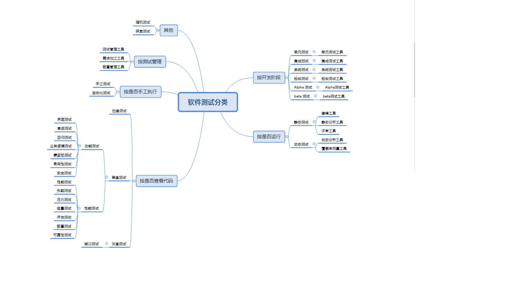

# 6工具支持的測試

**關鍵詞**

數據驅動的測試(data-driven testing)， 關鍵字驅動的測試(keyword-driven testing)，
性能測試工具(performance testing tool)， 測試自動化(test automation)，
測試執行工具(test execution tool)， 測試管理工具(test management tool)

**測試工具的學習目標**

**6.1測試工具的考慮**

FL-6.1.1 (k2)根據其用途和支持的測試活動對測試工具進行分類

FL-6.1.2 (k1)確定測試自動化的收益和風險

FL-6.1.3 (k1)牢記測試執行工具和測試管理工具的特殊考慮

6.2 有效使用工具

FL-6.2.1 (k1)辨識選擇工具的主要原則

FL-6.2.2 (k1)回顧利用試點項目引進工具的目標

FL-6.2.3 (k1)確定組織中評估、實施、部署和持續支持測試工具的成功因素

## *6.1 測試工具的考慮*

### 6.1.1 測試工具分類

工具，顧名思義，是指工作時所需用的器具，後引申為達到、完成或促進某一事物的手段。工具是一個相對概念，因為其概念不是一個具體的物質，所以只要能使物質發生改變的物質，相對於那個能被它改變的物質而言就是工具。

百度百科上的解釋（維基百科、谷歌）

以上，“權威”針對工具給出廣袤而具體的解釋。前面加上“測試”這個修飾語或者說是限定詞，給縮小了工具的範圍。應用於測試相關領域為達到、完成或促進某一事物的手段，即為測試工具，它是一個相對的概念，只要能完成或達到某一效果的“催化劑”或是手段都可以成為工具。

各種文章、測試相關書籍，以及
ISTQB初級、高級（測試管理、測試分析師、技術測試分析師）都含有關於測試工具的介紹。

認識到工具和技術之間的關系非常重要，技術是執行某個操作的過程，而工具是完成某個任務的方法。雖然軟體測試技術有限，但是軟體工具幾乎是無限的。測試人員可以選擇很多軟體工具來完成指定的軟體測試技術，就像木匠使用釘子、螺絲釘或粘合劑將兩塊木頭固定在一起一樣。可見，測試工具在測試執行、管理中的重要性。

引用《軟體測試的有效方法》第三版，第四章第一節部分內容

那麽測試工具究竟都有哪些，是怎麽分類的呢？

工具可以按照多種規則進行分類，例如：目的、商業、免費/付費、開源、共享、使用的技術等。圖6.1.1-1展示了軟體測試工具的多樣性。

圖6.1.1-1 軟體測試工具的類型

本文主要圍繞測試工具所支持的測試活動來進行分類。一些工具提供的支持通常更適合開發人員（例如：在單元和整合測試期間使用的工具）。這些工具在以下各節中以"(D)"進行標識。

**測試和測試件管理的工具支持**

管理工具可適用於整個軟體開發生命周期中的任何測試活動。支持測試和測試件管理的工具的例子包括：

-   測試管理工具和應用生命周期管理工具（ALM）

-   需求管理工具（例如：測試對象的可追溯性）

-   缺陷管理工具

-   配置管理工具

-   持續整合工具(D)

**靜態測試的工具支持**

靜態測試工具與第3章中描述的活動和收益相關聯。這類工具的例子包括：

-   支持評審的工具

-   靜態分析工具(D)

**測試設計與實現的工具支持**

測試設計工具有助於在測試設計和實現中創建可維護的工作產品，包括測試用例、測試規程和測試數據。這類工具的例子包括：

-   測試設計工具

-   基於模型的測試工具

-   測試數據準備工具

-   驗收測試驅動開發（ATDD）和行為驅動開發（BDD）工具

-   測試驅動開發工具(TDD)（D）

在某些情況下，支持測試設計和實現的工具也可能支持測試執行和日志記錄，或者將其輸出直接提供給支持測試執行和日志記錄的其他工具。

**測試執行與記錄的工具支持**

有許多工具可以支持和增強測試執行和日志記錄活動。這些工具的例子包括：

-   測試執行工具（例如：運行回歸測試）

-   覆蓋工具(例如：需求覆蓋、程式碼覆蓋(D))

-   測試用具(D)

-   單元測試框架工具(D)

**性能測量和動態分析的工具支持**

性能測量和動態分析工具對於支持性能和負載測試活動是必不可少的，因為這些活動不能有效地通過手工完成。這些工具的例子包括：

-   性能測試工具

-   監視工具

-   動態分析工具(D)

**特殊測試需要的工具支持**

除了支持一般測試過程的工具外，還有許多其他工具支持更具體的測試事件。其中包括側重於以下方面的工具：

-   數據品質評估

-   數據轉換和遷移

-   易用性測試

-   輔助性測試

-   本地化測試

-   安全性測試

-   可移植性測試（例如：在多個支持的平台上測試軟體）

###  6.1.2 測試自動化的收益與風險

當代社會，付出都要有回報，高大上一點兒的說就是講究一個投資回報率。那麽在投入大量的人工、時間、金錢的情況下，自動化測試的收益如何呢？接下來從企業投入產出的角度來對自動化回歸測試的財務投入和財務產出進行量化的分析，讓大家能夠對自動化回歸測試所帶來的好處有個更直觀的認識和了解。

下面介紹一個自動化收益分析的例子。

https://www.cnblogs.com/shadowicool/articles/1061219.html

*該案例中的自動化回歸測試與手工回歸測試經濟效益分析數據的選取，是基於兩個標準：*

1.  *所有工作量的估算數據都來自於多名5年以上測試經驗工程師的建議。*

2.  *所有工作量的估算方法，都是以基於對廠商有利的原則。如：有意減少目前手工回歸測試的工作量，加大自動化測試開發的時間和成本。希望在此基礎上算出的數據也能讓未開展自動化測試的廠商直觀的看到開展自動化測試上在財務上仍然有著非常高的投入產出回報比。*

*分析數據的取樣標準如下：*

1.  *人力成本估算標準：廠商研發成本計算標準1.5萬人月( RMB )， 一個月的工作日為
    22天。*

2.  *工作量估算標準：模組單元以完成一個DHCP（動態主機設置協議，Dynamic Host
    Configuration
    Protocol）大小模組的工作量為一個模組單元，即1個模組單元的手工回歸測試時間為16個工作小時（不含性能測試）。*

3.  *自動化開發標準：一個自動化測試模組的開發時間為手工測試時間的4倍。假設一個模組可自動化測試部分的手工測試執行時間為8小時。那麽該模組的自動化測試開發時間＝手工測試執行時間8小時＋腳本開發時間
    8小時＋腳本除錯時間16小時。*

*假設一個小型產品線大致有72個模組單元需要進行回歸測試。*

*如果都是手工執行，完成一輪較全面的回歸測試的成本：需要投入[(72個模組單元×16小時)/8]/22=6.5人月，對應的人力成本為6.5×1.5萬＝9.75萬。*

-   *如果有2人專門從事手工回歸測試，完成一次較全面的回歸測試需要3.25個月，一年可執行約4次全面回歸測試。*

-   *如果有3人專門從事手工回歸測試，完成一次較全面的回歸測試需要2.17個月，一年可執行約6次全面回歸測試。*

-   *如果有4人專門從事手工回歸測試，完成一次較全面的回歸測試需要1.625個月，一年可執行7次全面回歸測試。*

*假設一半的功能可以轉化為自動化測試，從測試執行的人力投入上可以從6.5個人月減少到3.25個人月。那麽每次全面回歸測試需要投入費用也減少3.25×1.5=4.875萬。*

*此時完成一次較全面的回歸測試：*

-   *如果有2人專門從事剩余的手工回歸測試，需要約1.6個月，一年執行約7次全面回歸測試。較未自動化測試前可多測試3次，同時人均生產率提高了約75％。*

-   *如果有3人專門從事剩余的手工回歸測試，需要1個月，一年執行12次全面回歸測試。較未自動化測試前可多測試6次，同時人均生產率提高了約50％。*

-   *如果有4人專門從事剩余的手工回歸測試，需要0.8個月，一年執行15次全面回歸測試。較未自動化測試前可多測試8次，同時人均生產率提高了約110％。*

*自動化測試開發成本計算（每個單元只有一半轉化為自動化）：*

>   *總開發時間=72個模組單元×8×4/2＝1152小時＝288天/22＝6.5人月*

>   *自動化測試開發成本=6.5×1.5萬＝9.75萬*

*自動化測試過後，每輪手工回歸測試直接節省的成本為原全手工測試成本的一半即每輪回歸測試可節省9.75/2=4.875萬。*

*因此兩輪較全面的回歸測試就可以收回所有的自動化測試的開發成本。*

總的規律是：一年中進行的全面手工回歸測試的次數越多，自動化測試的投入產出比越高。以目前某頂尖網絡設備企業為例，它的自動化回歸測試程度可以達到一周2輪全面回歸測試來保證產品的品質，48小時完成一輪回歸測試，72小時輸出所有報表。從而大大解放了測試工程師的生產力，讓其可以專註於新模組和新方法的測試，同時不用擔心老模組的品質問題。

在闡述自動化測試的優劣勢和風險之前，先來說下對自動化測試的理解上的一些誤區；

-   是不是所有測試用例都可以自動化：不是所有的測試用例和測試步驟都可以轉化為自動化測試。在自動化測試投入較多的行業領先企業其自動化測試率有的能達到80％左右，但仍有20％左右的測試用例需要手工來進行測試。在國外通常從開發第一版測試用例時，就同步進行自動化測試腳本的開發。

-   自動化測試找不到bug：自動化測試不直接找bug，而是通過解放有經驗的測試工程師的生產力，讓其從重覆的回歸測試中解放出來，從事新測試方法和測試手段的研究。通過自動化測試解放出的生產力來間接找到更多更深層次的新bug，將產品品質再提高一個檔次。

-   自動化測試一定會馬上大量減少測試人員數量：自動化測試不會大量減少測試人員數量。因為開展自動化測試初期需要投入一定的人力進行自動化測試腳本開發，並逐漸將自動化測試腳本用於日常的測試中，逐步減少手工測試人員從事重覆勞動的時間和人數。為了縮短自動化測試腳本的開發時間，可考慮將自動化測試腳本的開發工作借助外包的力量來早日實現大規模的自動化測試。

-   自動化測試能代替手工測試：自動化測試不適合新功能測試，而是適合用於軟體品質穩定且經常需要被測試的模組。

-   只有性能測試才需要自動化：自動化測試不光進行性能測試，更被大量應用於功能測試驗證，超過半數的自動化測試腳本都是用於功能驗證測試。

通常自動化回歸測試較手工回歸測試有如下優勢：

1.  大大縮短回歸測試項目的時間，在減少了人力投入的同時，更能保證研發項目能按時市場發布。甚至能縮短研發周期，提前發布產品。

2.  在同樣的產品研發時間內，能對產品進行更全面的多次測試，將新引入的問題盡可能的在產品發布前挖掘出來。

3.  能保障回歸測試的品質。因為每次自動化回歸測試都是保持同一個標準的步驟、環境和測試方法。所以測試結果具有一致性。

4.  讓更有經驗的測試工程師從回歸測試中解放出來，專註於新的測試方法的研究，來發現更多產品深層次的問題。

5.  減少測試工程師人數，降低研發成本。因為實施自動化回歸測試後，廠商就不用像以前一樣保留大量的人力來專職進行回歸測試。

6.  能避免測試人力和時間的緊張，而降低了回歸測試的品質要求，導致引入了新問題而未被發現。

7.  沒有在手工回歸測試中因為測試工作的重覆性和測試工程師對已測過功能的過於自信，而導致測試覆蓋面不全，新引入問題沒被發現的人為隱患。

8.  避免了部分工程師非主觀的疏忽大意，沒有發現新引入的問題。

9.  對程式的回歸測試更方便。這可能是自動化測試最主要的任務，特別是在程式修改比較頻繁時，效果是非常明顯的。由於回歸測試的動作和用例是完全設計好的，測試期望的結果也是完全可以預料的，將回歸測試自動運行，可以極大提高測試效率，可以極大提高測試效率，縮短回歸測試時間。

10. 可以運行更多更繁瑣的測試。自動化的一個明顯的好處是可以在較少的時間內運行更多的測試。

11. 可以執行一些手工測試困難或不可能進行的測試。比如，對於模擬大量用戶的測試，不可能同時讓足夠多的測試人員同時進行測試，但是卻可以通過自動化測試模擬同時有許多用戶，從而達到測試的目的。

12. 更好地利用資源，將繁瑣的任務自動化，可以提高準確性和測試人員的積極性，將測試技術人員解脫出來投入更多精力設計更好的測試用例。有些測試不適合於自動化測試，僅適用於手工測試，將可自動測試的測試自動化後，可以讓測試人員專註於手工測試部分，提高手工測試的效率。

13. 測試具有一致性和可重覆性。由於測試是自動執行的，每次測試的結果和執行的內容的一致性是可以得到保障的，從而達到測試的可重覆的效果。

14. 測試的覆用性。由於自動化測試通常採用腳本技術，這樣就有可能只需要做少量的甚至不做修改，實現在不同的測試過程中使用相同的用例。

15. 增加軟體信任度。由於測試是自動執行的，所以不存在執行過程中的疏忽和錯誤，完全取決於測試的設計品質。一旦軟體通過了強有力的自動測試後，軟體的信任度自然會增加。

自動化測試的缺點：  

1.  不能取代手工測試，有很多需要人腦判斷結果的測試用例無法用自動工具實現，或者代價太大；

2.  手工測試比自動化測試發現的缺陷更多； 

3.  對測試品質的依懶性極大；

4.  測試自動化不能提高有效性；

5.  測試自動化可能會制約軟體開發，由於自動測試比手動測試更脆弱，所以維護會受到限制，從而制約軟體的開發；

6.  工具本身並無想象力。

綜上所述，自動化測試完成不了的，手工測試可以彌補，兩者有效的結合是測試品質保證的關鍵。 

### 6.1.3 測試執行與測試管理工具的特殊考慮

採用什麽樣的自動化測試方案，需要考慮以下幾個方面的因素：

-   項目的影響：自動化測試能否對項目的進度、覆蓋率、風險有所幫助，或者讓開發更敏捷？

-   覆雜度：自動化是否容易實現，包括數據和其他環境的影響。

-   時間：自動化測試的實現需要多少時間？

-   早期需求和程式碼的穩定性：需求或早期的程式碼是否能證明是在範圍內變化的？

-   維護工作量：程式碼是否能長期保持相對穩定？功能特性是否會進化？

-   覆蓋率：自動化測試能否覆蓋程式的關鍵特性和功能？

-   資源：測試組是否擁有足夠的人力資源、硬體資源和數據資源來運行自動化測試。

-   自動化測試的執行：負責執行自動化測試的小組是否擁有足夠的技能和時間去運行自動化測試？

採用不同的項目開發模型對自動化測試有不同的影響。

-   瀑布模型：瀑布模型在需求定義方面做得很好，這對自動化測試是有益的，包括可以盡早選擇合適的自動化測試策略，讓自動化測試可以從高層次、整體進行計劃。

-   增量叠代模型：意味著頻繁的變更，自動化測試需要與開發策略緊密結合，關注早期構建、叠代的速度、風險、覆蓋目標等。

Bob Galen，Sizing up Automation Candidates – Selecting Which Tests，When To
Automate Them，and Which To Take Off the Ticket Entirely

為了順利和成功地實現自動化測試，在選擇和整合測試執行和測試管理工具到組織中時，有許多事情需要考慮。

**測試執行工具**

測試執行工具使用自動化測試腳本執行測試對象。這類工具往往需要付出巨大的工作量，才能取得顯著的收益。

通過記錄手動測試人員的動作來捕獲測試似乎很有吸引力，但是這種方法無法應用到大量測試腳本的情況。捕獲的腳本是作為每個腳本一部分的帶有特定數據和動作的線性表示。當不可預料的事件發生時，這種類型的腳本是不穩定的。最新一代的工具利用了"智能"圖像捕捉技術，增強了這類工具的效用，盡管生成的腳本仍然需要隨著系統用戶界面的發展不斷進行維護。

數據驅動的測試方法將測試輸入和預期結果分離出來，通常放入電子表格中，並使用更通用的測試腳本，通過讀取輸入數據並使用不同的數據執行相同的測試腳本。不熟悉腳本語言的測試人員可以為這些預先定義的腳本創建新的測試數據。

在關鍵字驅動的測試方法中，通用腳本處理描述要采取的動作的關鍵字（也稱為動作詞），然後調用關鍵字腳本處理相關的測試數據。測試人員（即使他們不熟悉腳本語言）可以使用關鍵字和相關數據定義測試，這些關鍵字和相關數據可以根據正在測試的應用程式進行裁剪。數據驅動和關鍵字驅動的測試方法的進一步細節和例子，可以參考ISTQB-TAE高級測試自動化工程師大綱。

上述方法需要有人具備腳本語言的專門知識（測試人員、開發人員或測試自動化方面的專家）。無論使用何種腳本技術，每個測試的預期結果都需要與測試的實際結果進行比較，或者是動態的（在測試運行時），或者是存儲供以後（執行後）比較。

基於模型的測試（MBT）工具能夠以模型的形式捕獲功能規格說明，例如活動圖。此任務通常由系統設計人員執行。MBT工具解釋模型以創建測試用例規格說明，然後保存在測試管理工具中和/或通過測試執行工具執行（見ISTQB-MBT基礎層級基於模型的測試大綱）。

**測試管理工具**

測試管理工具經常由於各種原因需要與其他工具或電子表格相互交互，包括：

-   以適合本組織要求的格式提供有用的信息

-   對需求管理工具中的需求保持一致的可追溯性

-   在配置管理工具中與測試對象版本信息鏈接

## *6.2有效使用工具*

### 6.2.1 工具選擇的主要原則

>   **1、適用**

在選擇工具的過程中，並不是說功能越多越好，適用才是根本，工具越適合於需完成的任務
，測試的過程就越有效。即主要考慮與測試對象進行交互的品質。主要考慮的因素包括：

-   能尋找測試對象的缺陷

-   節省測試時間

-   協助問題的診斷

-   能改進測試的機會

>   **2、工具引入的一致性**

了解測試對象使用的技術，選擇與該技術兼容的工具。該工具是否適用於測試對象和開發環境？

要選擇適合軟體生命周期各階段的測試工具。如：

-   基於嵌入式的測試可選擇LDRA Testbed、GESTE、Logiscope等；

-   程式編碼階段可選擇Tele2logic 公司的Logiscope 軟體、Rational
    公司的Purify系列等;

-   測試和維護階段可選擇Compuware 的Dev2Partner 和Telelogic 的Logiscope 等。

>   **3、與現有開發環境的持續整合性**

考慮與已經使用的構建和其他工具持續整合的可能性。確保工具之間的兼容性和整合性。如果想避免自動化測試產生的延遲，團隊最終會把工具放入持續整合的進程中。持續整合下的測試產生一個新的需求：測試需要對程式碼進行版本化。當創建新的程式碼分支時，我們會創建一個新的測試分支。這樣，具有多個"正確"定義的多個持續整合管道可以同時運行。

>   **4、組織的能力**

主要從工具使用人員的技術能力、組織的資金、組織成熟度方面的優勢、弱勢等方面考慮。

-   考慮工具使用人員的技術能力，選擇成熟度好、易於測試人員使用、方便上手、易於搭建的工具；

-   組織的資金，考慮購買成本、相關的培訓、輔導費用。

>   **5、工具輸出報告**

若測試工具沒有對使用者輸出有意義的東西，那它就是一項糟糕的投資。除非團隊想要把測試結果推到另一個系統以獲取更好的測試報告，否則輸出的各種圖表功能可能就沒用。

隨著時間的推移，跟蹤測試也可能是一個非常強大的功能。不同層次的領導關心不同的結果。高水平的主管可能並不想知道成功失敗比率的走向；中層管理人員希望了解工作流程；技術人員希望深入了解特定測試中出錯的細節，如果可能的話，觀看執行的視頻。

>   **6、工具製造商的服務、可靠性、維護成本、價格以及使用期限**

如果長期使用，考慮成熟穩定的供應商提供的工具，供應商的支持人員能夠正確解答各種疑難問題；如果短期使用，考慮開源的非商業工具的支持，此時註重完成測試的符合度。最重要的是工具帶來的預期收益要大於購買和培訓工具使用的費用。

### 6.2.2 組織內引入工具的試點項目

完成工具選擇的理論分析後，要付諸實踐，需要將該工具引入公司。為此要實施一個試點項目，以驗證在實際的項目環境下是否確實能實現預期的優勢和利益。試驗項目不應該由參與評估的人員來進行，以防在解釋評估結果時可能產生的利益衝突。

在工具的引入開始階段，需要工具用戶和相關人員大量且不斷的投入，產生額外的工作量。因此在公司上下大範圍內宣揚工具是不合適的，一般指導和培訓有助於給將來的使用者帶來信心。

運行試點項目，可以獲取有關工具技術細節的信息、工具的實際使用經驗、有關應用環境的經驗，以及明確是否進行大範圍的培訓，培訓到什麽程度等問題。此外，還應該制定廣泛使用工具的規範和規則。同時判定構建測試庫是否合理，以便促進其他項目中的重要模組。

工具引入試點項目的成功因素有以下幾點：

-   逐步引入。深入了解該工具，了解其優點和缺點

-   將工具整合到過程中，驗證該工具在實際使用中與預期的符合度，並確定需要改變的地方

-   制定應用工具的規則並提供建議

-   接受培訓和持續指導

-   收集使用經驗並傳授給所有用戶相關的方法和技巧

-   監測工具的接受度並收集和評估成本效益數據。

一般的引入步驟：

1.  開展試點項目

2.  評估試點項目經驗

3.  調整過程並制定使用規則

4.  接受培訓

5.  逐步引入工具

6.  提供相應指導

### 6.2.3 使用工具的成功因素

如何讓工具在組織內成功使用起來，使工具發揮其真正價值，給組織帶來收益呢？正確的對工具進行評價、執行、部署以及持續支持等方面的工作。從以下幾個方面考慮：

-   明確使用目標，並把目標細化，確保在技術和組織上能整合到組織的軟體開發生命周期中，有助於工具使用的實施。

-   得到高層的支持，推廣並使用起來，使參與者都積極參與進來。

-   使用過程中，調整、改進相關過程和規範，以適用工具的使用。

-   推廣使用過程中，對工具進行培訓和輔導。確保使用初期對工具能快速上手，快速掌握。使用過程中，遇到問題，及時輔導，消除使用過程中的障礙，提高使用信心。

-   在實際使用過程中，收集使用者的反饋信息。

-   對使用過程進行監視，對其收益隨時進行預估和評價

-   收集使用經驗和教訓，整理，共享，使成為組織的過程資產。